# Archive/OldApp Process Flow Comparison

> Analysis of architectural flow patterns between v5 (archive/oldapp) and v6 codebases.

## Executive Summary

The v5 to v6 migration introduced significant architectural improvements in process flow, moving from a route-centric architecture to a service-oriented architecture with clear separation of concerns.

---

## 1. Request Processing Flow

### 1.1 API Request Flow Comparison

#### v5 Request Flow (Route-Centric)

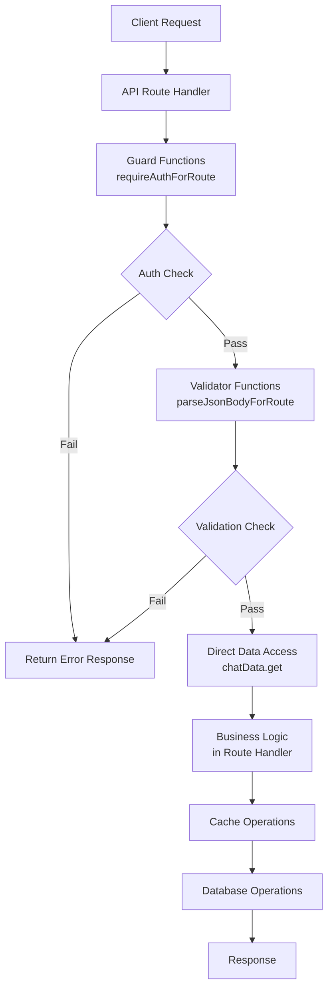

**v5 Characteristics**:
- Business logic embedded in route handlers
- Guard functions return `Response | Result` pattern
- Direct data access from routes
- Cache operations scattered across files

#### v6 Request Flow (Service-Oriented)

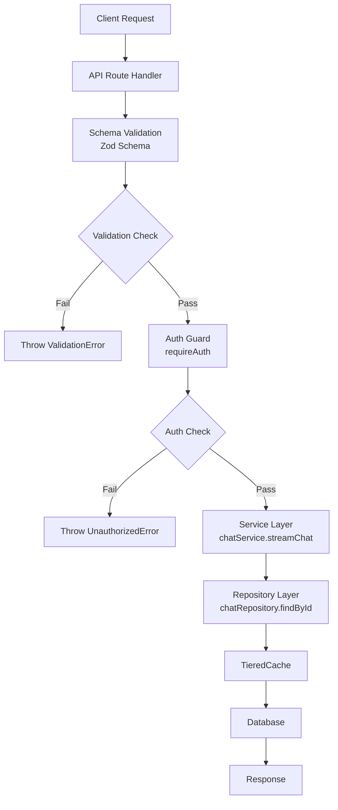

**v6 Characteristics**:
- Slim route handlers delegate to services
- Throw-based guards (no Response returns)
- Repository pattern for data access
- TieredCache with memory + Redis

### 1.2 Code Comparison

#### v5 Route Handler Pattern

```typescript
// archive/oldapp/app/(chat)/api/chat/route.ts
export async function POST(request: Request) {
  // 1. Parse body with return-based validation
  const bodyResult = await parseJsonBodyForRoute(request, schema, "chat");
  if (bodyResult instanceof Response) {
    return bodyResult; // Early return pattern
  }
  
  // 2. Auth check with return-based guard
  const authResult = await requireAuthForRoute("chat");
  if (authResult instanceof Response) {
    return authResult; // Another early return
  }
  const { session, ctx } = authResult;
  
  // 3. Rate limit check
  const rateLimitResult = await requireRateLimitForRoute(/*...*/);
  if (rateLimitResult instanceof Response) {
    return rateLimitResult;
  }
  
  // 4. Direct data access
  const chat = await chatData.get(id, ctx);
  
  // 5. Business logic in route (many lines...)
  // ... streaming logic, title generation, etc.
}
```

#### v6 Route Handler Pattern

```typescript
// app/api/chat/route.ts
export async function POST(request: Request) {
  // 1. Schema validation (throws on failure)
  const body = ChatRouteRequestSchema.parse(await request.json());
  
  // 2. Auth guard (throws on failure)
  const { session, userId } = await requireAuth();
  
  // 3. Rate limit (throws on failure)
  await checkChatLimit(userId);
  
  // 4. Delegate to service
  return chatService.streamChat({
    chatId: body.id,
    message: body.message,
    modelId: body.selectedChatModel,
    userId,
  });
}
```

**Key Improvement**: v6 route handlers are ~50 lines vs v5's ~400+ lines.

---

## 2. Data Access Flow

### 2.1 v5 Data Access Pattern

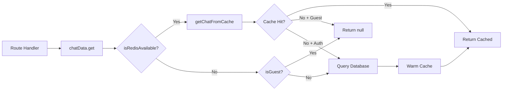

**v5 Issues**:
- Cache logic mixed with data access
- Different code paths for guest vs auth
- Manual cache warming scattered in operations

### 2.2 v6 Data Access Pattern

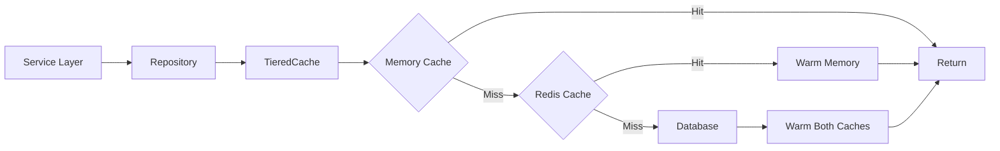

**v6 Improvements**:
- Repository abstracts cache logic
- TieredCache handles memory + Redis automatically
- Service layer handles business logic
- Consistent flow regardless of user type

### 2.3 Code Comparison

#### v5 Data Access

```typescript
// archive/oldapp/lib/data/chat.ts
export const chatData = {
  get: async (chatId: string, ctx: DataContext): Promise<Chat | null> => {
    try {
      if (isRedisAvailable()) {
        try {
          const cached = await getChatFromCache(chatId, ctx.userId);
          if (cached) {
            return { id: cached.id, userId: cached.userId, /*...*/ };
          }
        } catch (cacheError) {
          logError("Cache error", cacheError);
        }
      }
      
      // Cache miss - different behavior for guest vs auth
      if (ctx.isGuest) {
        return null; // No DB for guests
      }
      
      // Query database
      const [result] = await db.select().from(chat).where(eq(chat.id, chatId));
      
      // Warm cache in background
      if (result) {
        warmChatCache(result, ctx.userId).catch(/*...*/);
      }
      
      return result ?? null;
    } catch (error) {
      throw toDatabaseError("get chat", error);
    }
  },
  // ... 1000+ more lines
};
```

#### v6 Data Access

```typescript
// lib/data/repositories/chat.repository.ts
export class ChatRepository extends BaseRepository<Chat, NewChat, UpdateChat> {
  async findById(id: string, ctx: RepositoryContext): Promise<Chat | null> {
    // TieredCache handles memory + Redis automatically
    const cached = await this.cache.get(this.cacheKey(id));
    if (cached) return cached;
    
    // Single database query
    const result = await this.db
      .select()
      .from(this.table)
      .where(eq(this.table.id, id))
      .limit(1);
    
    const chat = result[0] ?? null;
    
    // Cache warming is automatic in TieredCache
    if (chat) {
      await this.cache.set(this.cacheKey(id), chat);
    }
    
    return chat;
  }
}
```

---

## 3. Authentication Flow

### 3.1 v5 Auth Flow

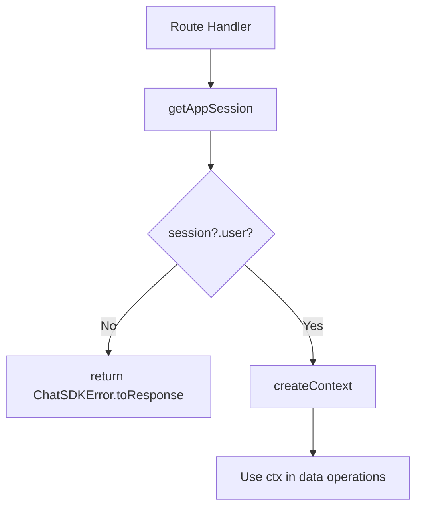

### 3.2 v6 Auth Flow

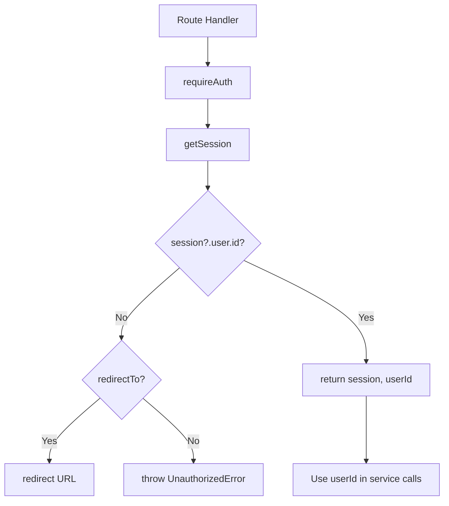

### 3.3 Guard Function Evolution

#### v5 Guard Pattern (Return-Based)

```typescript
// archive/oldapp/lib/api/guards.ts
export async function requireAuthForRoute(
  surface: Surface
): Promise<AuthResult | Response> {
  try {
    return await requireAuth(surface);
  } catch (error) {
    if (error instanceof ChatSDKError) {
      return error.toResponse(); // Returns Response
    }
    return new ChatSDKError(/*...*/).toResponse();
  }
}

// Usage requires checking for Response
const authResult = await requireAuthForRoute("chat");
if (authResult instanceof Response) return authResult;
const { session, ctx } = authResult;
```

#### v6 Guard Pattern (Throw-Based)

```typescript
// lib/auth/guards.ts
export async function requireAuth(
  options: GuardOptions = {},
): Promise<{ session: AppSession; userId: string }> {
  const session = await getSession();
  
  if (!session?.user.id) {
    if (options.redirectTo) {
      redirect(options.redirectTo); // Server component redirect
    }
    throw new UnauthorizedError("Authentication required"); // Throws
  }
  
  return { session, userId: session.user.id };
}

// Usage is cleaner
const { session, userId } = await requireAuth();
// No Response checking needed - errors propagate automatically
```

**Benefits of Throw-Based Guards**:
1. Cleaner code flow (no `instanceof Response` checks)
2. Consistent error handling via error boundaries
3. Works with Next.js error.tsx files
4. Type-safe return values

---

## 4. Error Handling Flow

### 4.1 v5 Error Flow

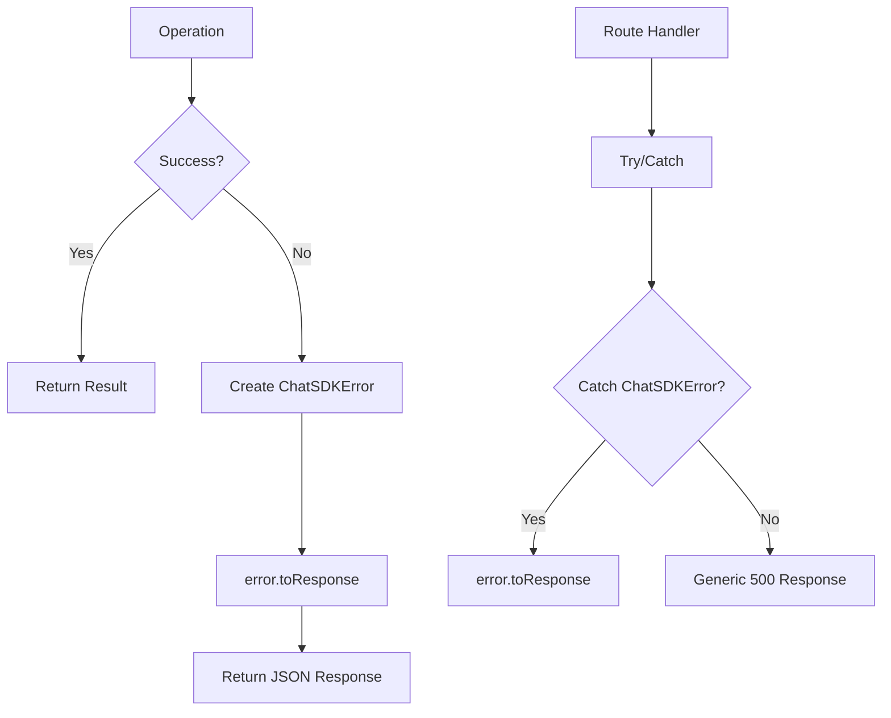

### 4.2 v6 Error Flow

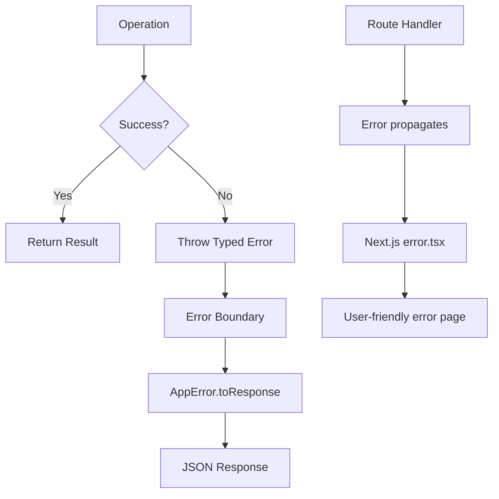

### 4.3 Error Type Hierarchy

#### v5 Single Error Class

```typescript
// archive/oldapp/lib/errors.ts
export class ChatSDKError extends Error {
  type: ErrorType;
  surface: Surface;
  statusCode: number;
  code: ErrorCode; // String literal like "bad_request:chat:missing_id"
  
  constructor(errorCode: ErrorCode, cause?: string) {
    super();
    const [type, surface] = errorCode.split(":");
    this.type = type as ErrorType;
    this.surface = surface as Surface;
    this.message = getMessageByErrorCode(errorCode);
    this.statusCode = getStatusCodeByType(this.type);
  }
}
```

#### v6 Error Hierarchy

```typescript
// lib/errors.ts
export class AppError extends Error {
  readonly code: ErrorCode;
  readonly statusCode: number;
  readonly details?: Record<string, unknown>;
  
  toApiError(): ApiError { /*...*/ }
  toApiResponse<T>(): ApiResponse<T> { /*...*/ }
  toResponse(): Response { /*...*/ }
}

export class ValidationError extends AppError { /* 400 */ }
export class UnauthorizedError extends AppError { /* 401 */ }
export class ForbiddenError extends AppError { /* 403 */ }
export class NotFoundError extends AppError { /* 404 */ }
export class RateLimitError extends AppError { /* 429 */ }
export class InternalServerError extends AppError { /* 500 */ }
export class ServiceUnavailableError extends AppError { /* 503 */ }
```

**Benefits of v6 Hierarchy**:
1. Type-safe error construction
2. IDE autocomplete for error codes
3. Consistent `details` field for context
4. Standardized response conversion

---

## 5. Cache Flow

### 5.1 v5 Cache Architecture

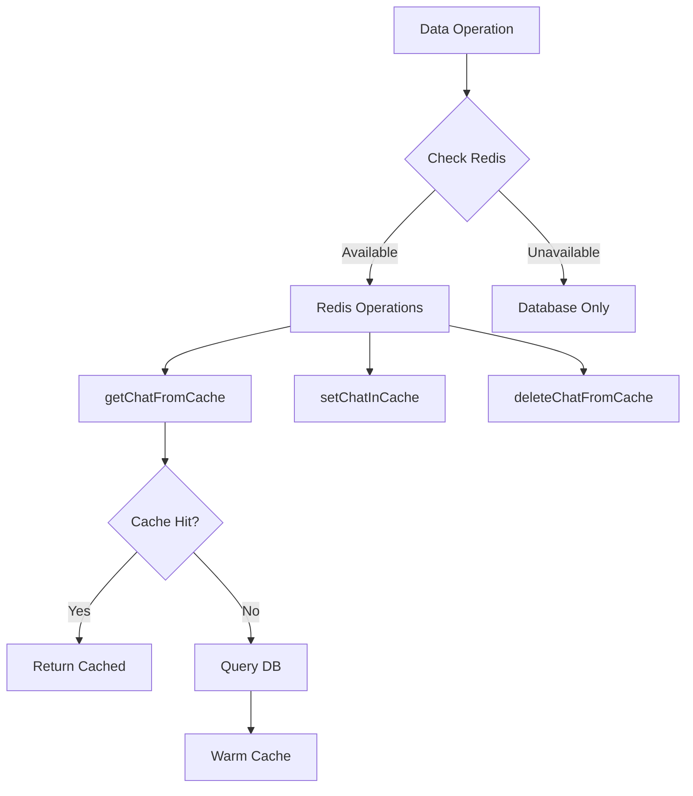

**v5 Cache Files**:
- `lib/cache/operations.ts` (29KB) - Individual cache functions
- `lib/cache/batch-operations.ts` (9KB) - Batch operations
- `lib/cache/helpers.ts` (5KB) - Conversion helpers
- `lib/cache/redis.ts` (823 bytes) - Redis client

### 5.2 v6 Cache Architecture

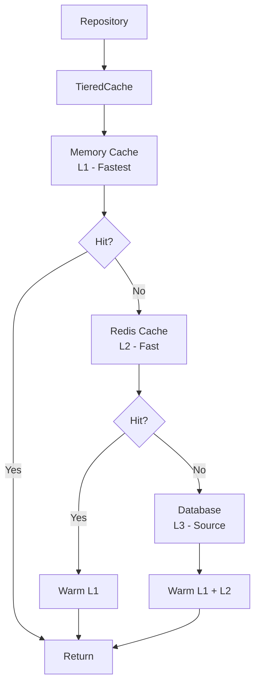

**v6 Cache Files**:
- `lib/cache/tiered-cache.ts` (14KB) - Unified tiered cache
- `lib/cache/memory-cache.ts` (9KB) - L1 memory cache
- `lib/cache/client.ts` (5KB) - Redis client
- `lib/cache/strategies.ts` (12KB) - Caching strategies
- `lib/cache/invalidation.ts` (15KB) - Cache invalidation

### 5.3 Cache Operation Comparison

#### v5 Cache Operations

```typescript
// archive/oldapp/lib/cache/operations.ts
export async function getChatFromCache(
  chatId: string,
  userId: string,
): Promise<CachedChat | null> {
  if (!isRedisAvailable()) return null;
  
  const redis = getRedisClient();
  const key = CacheKeys.chat(chatId, userId);
  const data = await redis.get(key);
  
  if (!data) return null;
  
  return JSON.parse(data) as CachedChat;
}

export async function setChatInCache(
  chatId: string,
  userId: string,
  chat: CachedChat,
): Promise<void> {
  if (!isRedisAvailable()) return;
  
  const redis = getRedisClient();
  const key = CacheKeys.chat(chatId, userId);
  await redis.set(key, JSON.stringify(chat), { ex: CACHE_TTL });
}

// Many more individual functions...
```

#### v6 TieredCache

```typescript
// lib/cache/tiered-cache.ts
export class TieredCache<T> {
  async get(key: string): Promise<T | null> {
    // L1: Memory cache
    const memoryResult = this.memoryCache.get(key);
    if (memoryResult !== undefined) {
      return memoryResult;
    }
    
    // L2: Redis cache
    const redisResult = await this.redis.get(key);
    if (redisResult !== null) {
      // Warm L1
      this.memoryCache.set(key, redisResult);
      return redisResult;
    }
    
    return null;
  }
  
  async set(key: string, value: T, ttl?: number): Promise<void> {
    // Set in both layers
    this.memoryCache.set(key, value, ttl);
    await this.redis.set(key, value, ttl);
  }
}
```

---

## 6. Streaming Flow

### 6.1 Chat Streaming Comparison

#### v5 Streaming

```typescript
// archive/oldapp/app/(chat)/api/chat/route.ts
export async function POST(request: Request) {
  // ... auth and validation ...
  
  const stream = createUIMessageStream({
    execute: async (dataStream) => {
      // All streaming logic inline
      const result = await executeChatCompletion({
        messages,
        modelId: selectedChatModel,
        onChunk: ({ content, reasoning }) => {
          if (content) {
            dataStream.write({ type: "text-delta", content });
          }
          if (reasoning) {
            dataStream.write({ type: "reasoning", content: reasoning });
          }
        },
        onFinish: async ({ content, usage }) => {
          // Save message
          await saveChat({ id, message, userId });
          // Update title if first message
          if (isNewChat) {
            const title = await generateTitleFromUserMessage(message);
            await updateChatTitle(id, title);
          }
        },
      });
    },
  });
  
  return stream.toResponse();
}
```

#### v6 Streaming

```typescript
// app/api/chat/route.ts
export async function POST(request: Request) {
  // ... auth and validation (delegated) ...
  
  // Service handles all streaming logic
  return chatService.streamChat({
    chatId: body.id,
    message: body.message,
    modelId: body.selectedChatModel,
    userId,
    visibility: body.selectedVisibilityType,
  });
}

// lib/data/services/chat.service.ts
async streamChat(params: StreamChatParams): Promise<Response> {
  const stream = createUIMessageStream({
    execute: async (dataStream) => {
      // Business logic encapsulated in service
      await this.executeStream(params, dataStream);
    },
  });
  
  return new Response(stream.pipeThrough(new JsonToSseTransformStream()), {
    headers: { "Content-Type": "text/event-stream" },
  });
}
```

---

## 7. Feature Module Flow

### 7.1 v5 Feature Organization (Scattered)

```mermaid
flowchart TD
    A[Feature: Chat] --> B[components/chat.tsx]
    A --> C[app/(chat)/api/chat/route.ts]
    A --> D[lib/data/chat.ts]
    A --> E[hooks/use-chat.ts]
    
    F[Feature: Artifact] --> G[components/artifact.tsx]
    F --> H[artifacts/actions.ts]
    F --> I[lib/artifacts/server.ts]
```

### 7.2 v6 Feature Organization (Co-located)

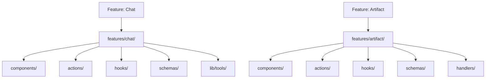

### 7.3 Feature Module Structure

```
features/<feature>/
  index.ts           # Public exports
  types.ts           # Type definitions
  actions/           # Server actions
    index.ts
    <action>.action.ts
  components/        # React components
    index.ts
    <component>.tsx
  hooks/             # React hooks
    index.ts
    use-<hook>.ts
  schemas/           # Zod schemas
    index.ts
    <feature>.schema.ts
  lib/               # Feature-specific utilities
    <utility>.ts
```

---

## 8. Migration Patterns Summary

### 8.1 Architectural Patterns Migrated

| Pattern | v5 Implementation | v6 Implementation | Status |
|---------|-------------------|-------------------|--------|
| Route Handlers | Business logic in routes | Slim routes + services | **Improved** |
| Data Access | Direct `chatData` object | Repository pattern | **Improved** |
| Error Handling | Single `ChatSDKError` | Typed hierarchy | **Improved** |
| Auth Guards | Return-based | Throw-based | **Improved** |
| Caching | Individual functions | `TieredCache` class | **Improved** |
| Validation | Route-level schemas | Feature co-located schemas | **Improved** |
| State Management | SWR in components | Feature hooks | **Improved** |

### 8.2 Flow Improvements

1. **Request Flow**: Routes delegate to services (separation of concerns)
2. **Data Flow**: Repository pattern abstracts caching
3. **Error Flow**: Typed errors with automatic propagation
4. **Auth Flow**: Throw-based guards with cleaner code paths
5. **Cache Flow**: Tiered caching with automatic layer management

---

*Generated: 2026-02-18*
*Analyzer: Code Simplifier*