# Components Process Flow

## Overview

This document maps the data flow, event handling, and composition patterns for components in the `components/` directory.

---

## Component Composition Patterns

### 1. Compound Component Pattern

Used extensively for complex UI components that need flexible composition.

#### Example: Dialog Component

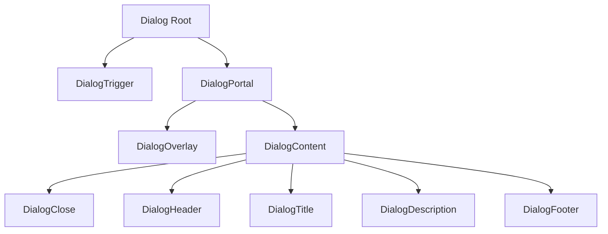

**Usage:**
```tsx
<Dialog>
  <DialogTrigger>Open</DialogTrigger>
  <DialogContent>
    <DialogHeader>
      <DialogTitle>Title</DialogTitle>
      <DialogDescription>Description</DialogDescription>
    </DialogHeader>
    <DialogFooter>Actions</DialogFooter>
  </DialogContent>
</Dialog>
```

#### Example: Sidebar Component

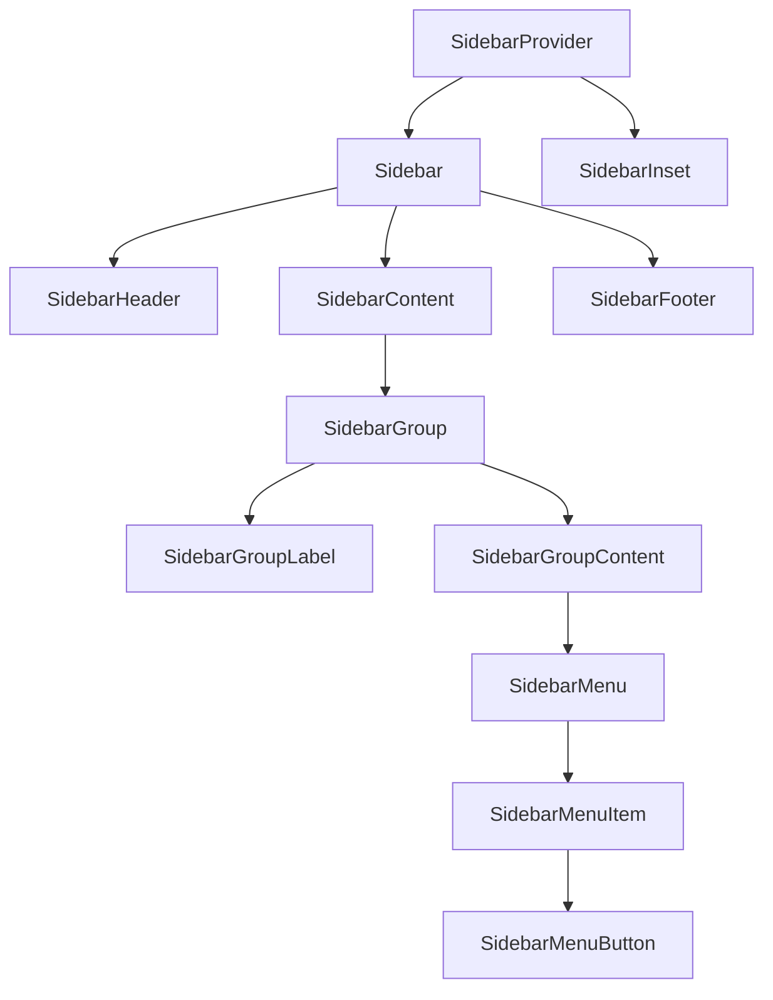

**Context Flow:**
```typescript
// SidebarProvider creates context
const SidebarContext = createContext<SidebarContextProps | null>(null)

// Child components consume context
function useSidebar() {
  const context = useContext(SidebarContext)
  if (!context) {
    throw new AppError("useSidebar must be used within SidebarProvider")
  }
  return context
}
```

### 2. Provider Pattern

Used for state management across component trees.

#### PromptInput Provider

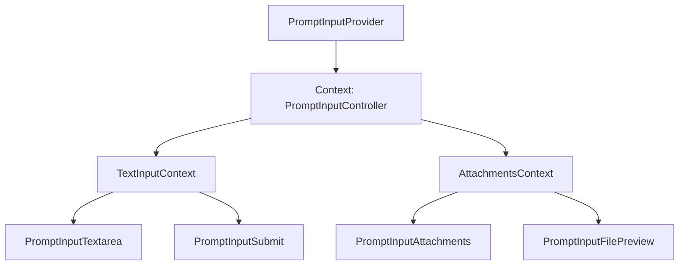

**Context Structure:**
```typescript
type PromptInputControllerProps = {
  textInput: TextInputContext      // value, setInput, clear
  attachments: AttachmentsContext  // files, add, remove, clear
  __registerFileInput: (ref, open) => void
}

// Usage
const { textInput, attachments } = usePromptInputController()
```

### 3. Wrapper Pattern

AI components use a two-layer architecture:

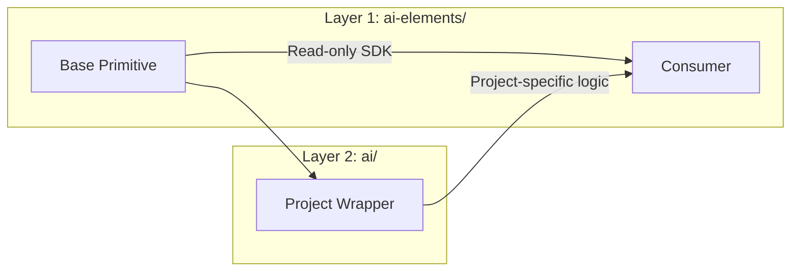

**Example: Message Component**

```typescript
// Layer 1: ai-elements/message.tsx (primitive)
export const Message = ({ className, from, ...props }: MessageProps) => (
  <div className={cn("group flex w-full...", from === "user" ? "is-user" : "is-assistant")}>
    {children}
  </div>
)

// Layer 2: ai/chat/message.tsx (wrapper)
export const AIMessage = memo(({ message, vote, isLoading, chatId, ... }) => {
  return (
    <AIMessageBase from={message.role} className="group/message relative">
      {/* Project-specific: role-based styling, avatar, actions */}
      <SparklesIcon />
      <AIMessageContentBase>{message.parts}</AIMessageContentBase>
    </AIMessageBase>
  )
})
```

---

## Data Flow Patterns

### 1. Props Drilling vs Context

| Component | Pattern | Reason |
|-----------|---------|--------|
| `Sidebar` | Context | Deep nesting, shared state |
| `Dialog` | Props | Shallow composition |
| `PromptInput` | Context | Complex state, multiple consumers |
| `Message` | Props | Simple, single-level |
| `Conversation` | Props + Hook | External control needed |

### 2. Message Data Flow

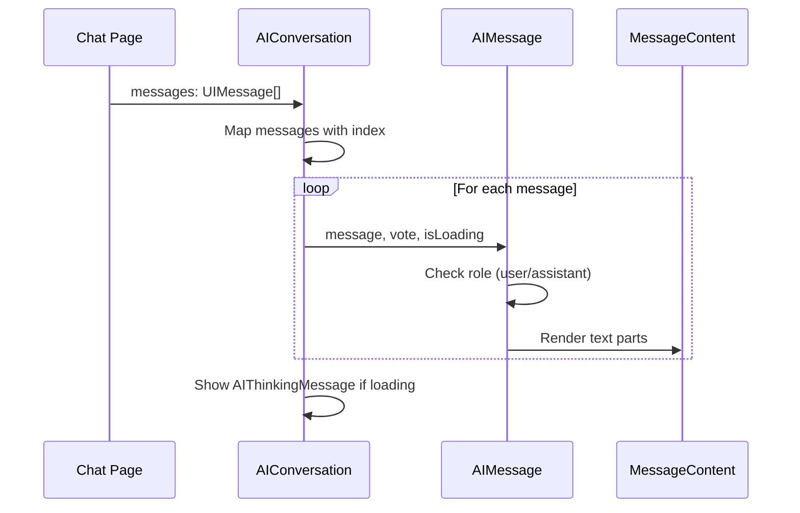

### 3. Input Data Flow

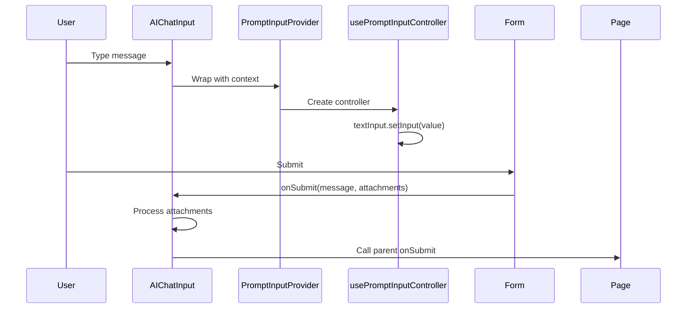

### 4. Sidebar State Flow

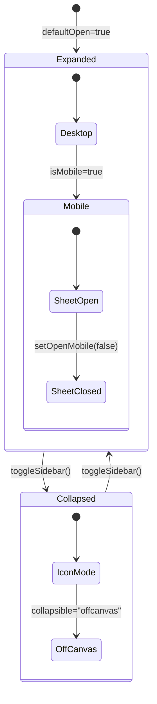

**State Management:**
```typescript
// Desktop: cookie-persisted state
useEffect(() => {
  document.cookie = `sidebar_state=${_open}; path=/; max-age=${60*60*24*365}`
}, [_open])

// Mobile: transient state
const [openMobile, setOpenMobile] = useState(false)

// Keyboard shortcut
useEffect(() => {
  const handleKeyDown = (e) => {
    if (e.key === 'b' && (e.metaKey || e.ctrlKey)) {
      toggleSidebar()
    }
  }
  window.addEventListener('keydown', handleKeyDown)
}, [toggleSidebar])
```

---

## Event Handling Patterns

### 1. Callback Props Pattern

Standard React pattern for child-to-parent communication.

```typescript
// Button with click handling
<Button onClick={(event) => {
  onClick?.(event)      // User callback
  toggleSidebar()       // Internal action
}}>

// Form submission
<PromptInput onSubmit={(message, event) => {
  event.preventDefault()
  if (!message.text.trim()) return
  onSubmit?.(message)
}}>
```

### 2. Action Registry Pattern

Used for tool handling in AI components.

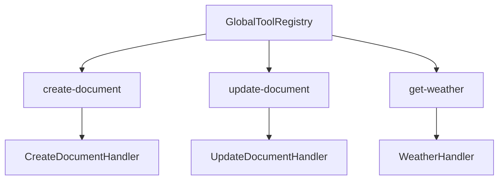

**Implementation:**
```typescript
// ai/tools/registry.tsx
type ToolHandler = {
  name: string
  render: (props: ToolRendererProps) => ReactNode
  execute?: (args: Record<string, unknown>) => Promise<unknown>
}

const globalToolRegistry = new Map<string, ToolHandler>()

export function registerTool(handler: ToolHandler) {
  globalToolRegistry.set(handler.name, handler)
}

export function useToolRegistry() {
  return {
    getTool: (name: string) => globalToolRegistry.get(name),
    renderTool: (name: string, props: ToolRendererProps) => {
      const tool = globalToolRegistry.get(name)
      return tool?.render(props)
    }
  }
}
```

### 3. Event Delegation Pattern

Used in message actions for performance.

```typescript
// Message actions container
<div className="flex items-center gap-1 opacity-0 group-hover/message:opacity-100">
  {/* Actions rendered here - visibility controlled by CSS */}
</div>

// Individual action with tooltip
<MessageAction
  tooltip="Copy message"
  onClick={() => navigator.clipboard.writeText(message.content)}
>
  <CopyIcon />
</MessageAction>
```

---

## State Management Patterns

### 1. Local State

| Component | State | Purpose |
|-----------|-------|---------|
| `Dialog` | `open` | Control visibility |
| `Sheet` | `open` | Control visibility |
| `SidebarProvider` | `open`, `openMobile` | Sidebar state |
| `PromptInputProvider` | `textInput`, `attachments` | Input state |
| `SettingsButton` | `open` | Sheet visibility |

### 2. Derived State

```typescript
// Sidebar: derived from open state
const state = open ? "expanded" : "collapsed"

// Message: derived from role
const isUser = message.role === "user"
const isAssistant = message.role === "assistant"

// Conversation: derived from messages length
const isEmpty = messages.length === 0
const isLastMessage = index === messages.length - 1
```

### 3. Memoization Strategy

```typescript
// AIMessage: memo with custom comparison
export const AIMessage = memo(AIMessageComponent, (prev, next) => {
  // Always re-render during streaming
  if (prevProps.isLoading || nextProps.isLoading) return false
  
  // Compare by ID
  if (prevProps.message.id !== nextProps.message.id) return false
  
  // Deep compare parts (JSON for simplicity)
  if (JSON.stringify(prevProps.message.parts) !== 
      JSON.stringify(nextProps.message.parts)) return false
  
  return true
})

// DocumentToolResult: never re-render
export const DocumentToolResult = memo(PureDocumentToolResult, () => true)
```

---

## Rendering Patterns

### 1. Conditional Rendering

```typescript
// Role-based rendering
{message.role === "assistant" && (
  <div className="avatar">
    <SparklesIcon />
  </div>
)}

// State-based rendering
{isLoading && showThinking && messages.length === 0 && (
  <AIThinkingMessage />
)}

// Mobile vs Desktop
{isMobile ? (
  <Sheet>Mobile sidebar</Sheet>
) : (
  <div>Desktop sidebar</div>
)}
```

### 2. List Rendering

```typescript
// Message list with key optimization
{messages.map((message, index) => {
  const isLastMessage = index === messages.length - 1
  return (
    <AIMessage
      key={message.id}  // Stable key
      message={message}
      isLoading={isLoading && isLastMessage}
    />
  )
})}

// Parts rendering with index-based keys
{message.parts?.map((part, index) => {
  if (part.type === "text" && "text" in part) {
    return (
      <AIMessageContentBase
        key={`message-${message.id}-part-${index}`}
      >
        {part.text}
      </AIMessageContentBase>
    )
  }
  return null
})}
```

### 3. Portal Rendering

Used for overlays that need to escape container constraints.

```typescript
// Dialog uses Radix Portal
<DialogPortal>
  <DialogOverlay />  // Backdrop
  <DialogContent>    // Content
    {children}
  </DialogContent>
</DialogPortal>

// Sheet uses Radix Portal
<SheetPortal>
  <SheetOverlay />
  <SheetContent side={side}>{children}</SheetContent>
</SheetPortal>
```

---

## Auto-Scroll Pattern

The conversation component uses `use-stick-to-bottom` for smooth scrolling:

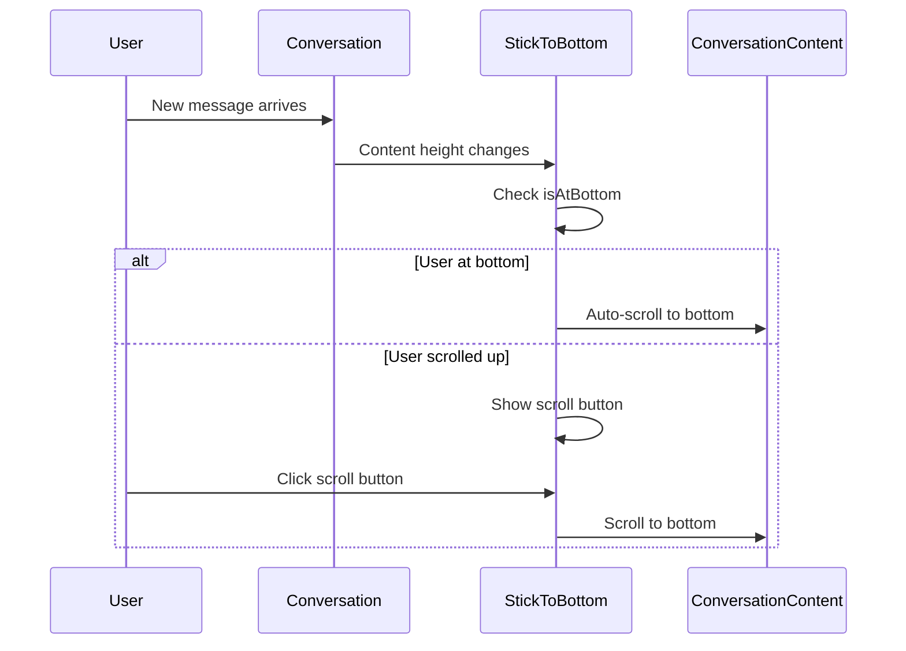

**Implementation:**
```typescript
// ai-elements/conversation.tsx
export const Conversation = ({ className, ...props }: ConversationProps) => (
  <StickToBottom
    className="relative flex-1 overflow-y-hidden"
    initial="smooth"
    resize="smooth"
    role="log"
  />
)

export const ConversationScrollButton = () => {
  const { isAtBottom, scrollToBottom } = useStickToBottomContext()
  
  return !isAtBottom && (
    <Button onClick={() => scrollToBottom()}>
      <ArrowDownIcon />
    </Button>
  )
}
```

---

## File Attachment Flow

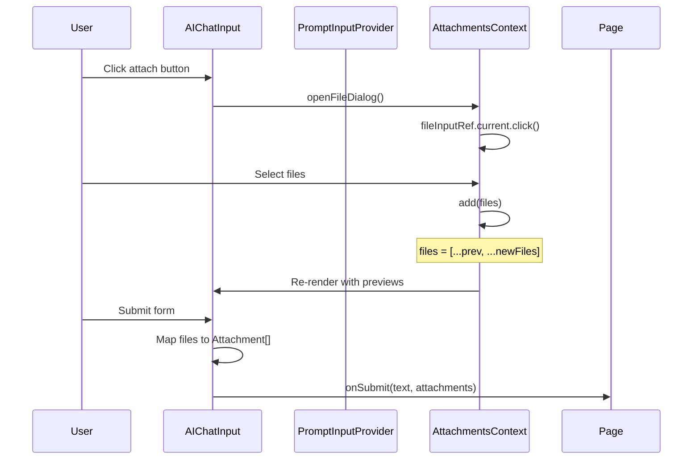

**Attachment Processing:**
```typescript
const handleFormSubmit = async (message, event) => {
  event.preventDefault()
  
  const attachments: Attachment[] = files.map((f) => ({
    name: f.filename || "file",
    url: f.url || "",
    contentType: f.mediaType || "application/octet-stream",
  }))
  
  await onSubmit?.(message.text.trim(), attachments)
}
```

---

## Theme Integration

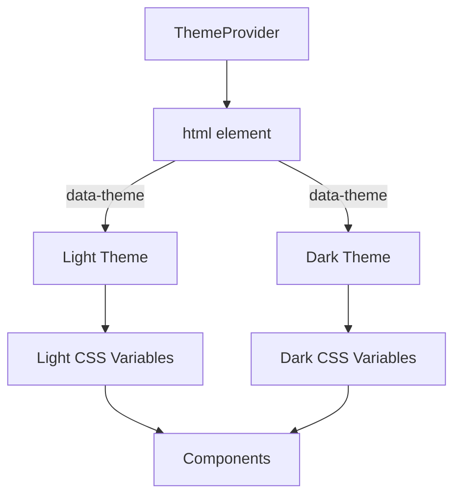

**Implementation:**
```typescript
// components/theme-provider.tsx
import { ThemeProvider as NextThemesProvider } from "next-themes"

export function ThemeProvider({ children, ...props }) {
  return <NextThemesProvider {...props}>{children}</NextThemesProvider>
}

// Usage in layout
<ThemeProvider
  attribute="class"
  defaultTheme="system"
  enableSystem
  disableTransitionOnChange
>
  {children}
</ThemeProvider>
```

---

## Summary

| Pattern | Components | Use Case |
|---------|------------|----------|
| Compound | Dialog, Sidebar, Sheet | Flexible composition |
| Provider | Sidebar, PromptInput | Shared state across tree |
| Wrapper | AI components | Project-specific logic over primitives |
| Memoization | AIMessage, DocumentToolResult | Performance optimization |
| Portal | Dialog, Sheet | Escape container constraints |
| Context | Sidebar, PromptInput | Avoid prop drilling |
| Registry | Tool handlers | Extensible tool system |