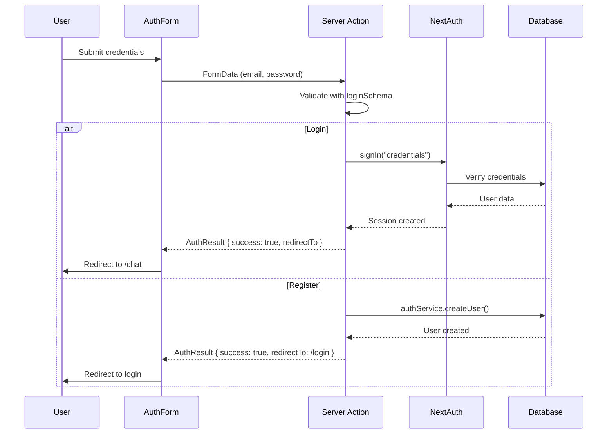
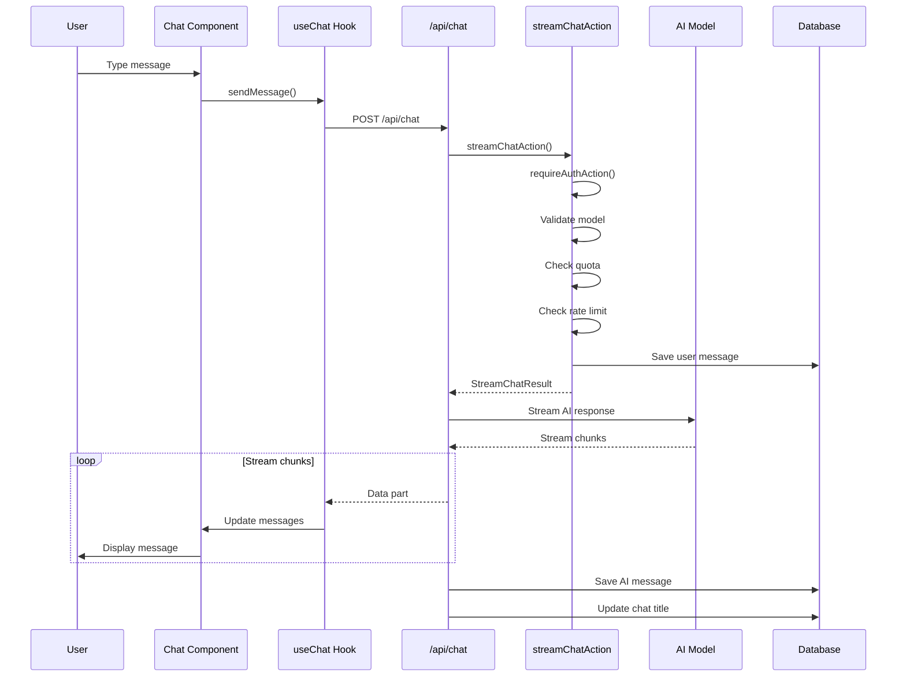
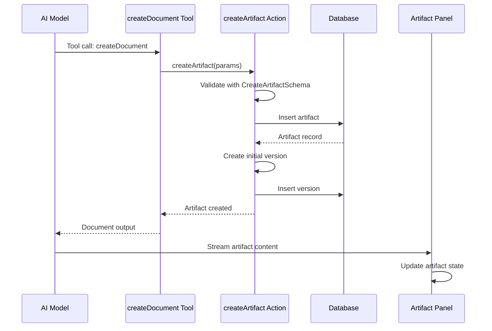
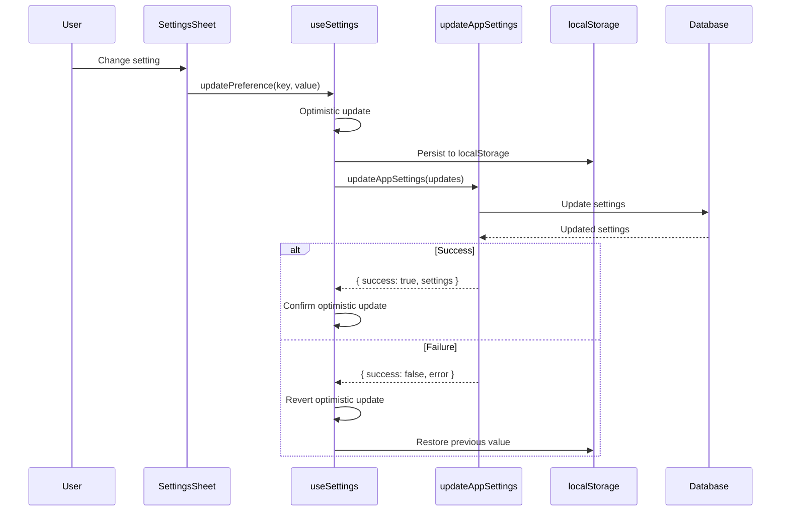
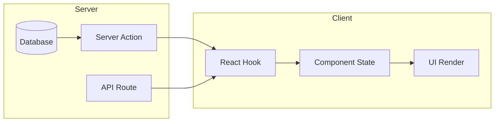
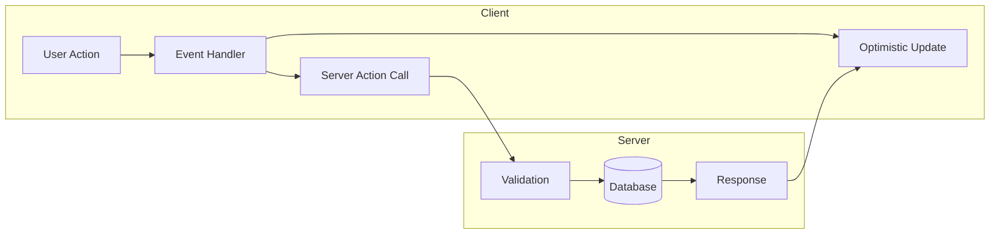
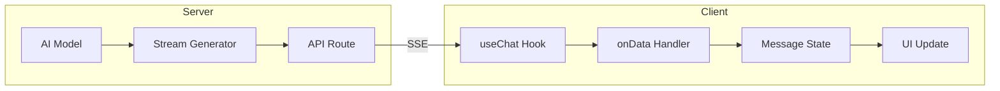

# Feature Modules Process Flow

## Overview

This document details the process flows within feature modules, including server action flows, component hierarchies, and state management patterns.

---

## 1. Server Action Flows

### 1.1 Authentication Flow



#### Login Action Code Flow

```typescript
// features/auth/actions/login.action.ts
export async function login(formData: FormData, callbackUrl?: string): Promise<AuthResult> {
  // 1. Extract credentials
  const email = formData.get("email")
  const password = formData.get("password")
  
  // 2. Validate input
  const parsed = loginSchema.safeParse({ email, password })
  if (!parsed.success) {
    return { success: false, error: "Please provide a valid email and password." }
  }
  
  // 3. Attempt sign in
  try {
    await signIn("credentials", {
      email: parsed.data.email,
      password: parsed.data.password,
      redirect: false,
    })
    return { success: true, redirectTo: callbackUrl || "/chat" }
  } catch (error) {
    // 4. Handle errors
    if (error instanceof AuthError) {
      switch (error.type) {
        case "CredentialsSignin":
          return { success: false, error: "Invalid email or password." }
        default:
          return { success: false, error: "An error occurred during sign in." }
      }
    }
    throw error
  }
}
```

### 1.2 Chat Streaming Flow



#### Stream Chat Action Code Flow

```typescript
// features/chat/actions/stream-chat.action.ts
export async function streamChatAction(input: StreamChatInput): Promise<StreamChatResult> {
  // 1. Authenticate
  const userId = await requireAuthAction()
  const session = await getSession()
  
  // 2. Validate model entitlements
  if (input.selectedModel) {
    if (!isValidModelId(input.selectedModel)) {
      return { success: false, error: "Invalid model ID" }
    }
    if (!entitlements.availableChatModelIds.includes(input.selectedModel)) {
      return { success: false, error: "Model not available" }
    }
  }
  
  // 3. Check daily quota
  const quotaResult = await checkMessageQuota(userId, entitlements.maxMessagesPerDay)
  if (!quotaResult.allowed) {
    throw new RateLimitError("Daily message limit reached")
  }
  
  // 4. Check rate limit
  const rateLimitResult = await checkChatLimit(userId)
  if (!rateLimitResult.success) {
    throw new RateLimitError("Too many requests")
  }
  
  // 5. Save messages
  await chatService.saveChat(saveParams, ctx)
  
  // 6. Revalidate
  revalidatePath(`/chat/${input.chatId}`)
  
  return { success: true, chatId: input.chatId }
}
```

### 1.3 Artifact Creation Flow



### 1.4 Settings Update Flow



---

## 2. Component Hierarchies

### 2.1 Chat Component Hierarchy

```
Chat (container)
  |
  +-- ChatHeader
  |     |
  |     +-- VisibilitySelector
  |     +-- ModelSelector (from settings)
  |
  +-- Messages (virtualized list)
  |     |
  |     +-- Message (per message)
  |     |     |
  |     |     +-- MessageReasoning (collapsible)
  |     |     +-- MessageParts
  |     |     |     +-- TextPart
  |     |     |     +-- FilePart
  |     |     |     +-- ToolInvocation
  |     |     |
  |     |     +-- MessageActions
  |     |           +-- VoteButtons
  |     |           +-- EditButton
  |     |           +-- CopyButton
  |     |
  |     +-- ThinkingMessage (loading state)
  |     +-- Greeting (empty state)
  |
  +-- DataStreamHandler
  |     |
  |     +-- Artifact stream processing
  |     +-- Usage tracking
  |     +-- Title updates
  |
  +-- MultimodalInput (from input feature)
        |
        +-- AttachmentPreview
        +-- SuggestedActions
        +-- SubmitButton
```

### 2.2 Artifact Component Hierarchy

```
ArtifactPanel
  |
  +-- ArtifactActions (toolbar)
  |     |
  |     +-- Version navigation
  |     +-- Mode toggle (edit/diff)
  |     +-- Artifact-specific actions
  |
  +-- ArtifactErrorBoundary
  |     |
  |     +-- Editor components (based on kind)
  |           |
  |           +-- CodeEditor (code artifacts)
  |           |     +-- Monaco Editor
  |           |     +-- Syntax highlighting
  |           |
  |           +-- TextEditor (text artifacts)
  |           |     +-- Rich text editor
  |           |
  |           +-- ImageEditor (image artifacts)
  |           |     +-- Image preview
  |           |
  |           +-- SheetEditor (sheet artifacts)
  |                 +-- Spreadsheet view
  |
  +-- Console (output panel)
  |     +-- Execution results
  |     +-- Error display
  |
  +-- ArtifactMessages (chat in artifact context)
        +-- Message list
        +-- Input (for artifact-specific chat)
```

### 2.3 Sidebar Component Hierarchy

```
AppSidebar
  |
  +-- SidebarHeader
  |     +-- New Chat button
  |
  +-- SidebarContent
  |     |
  |     +-- SidebarHistory
  |     |     |
  |     |     +-- ChatGroup (today)
  |     |     |     +-- SidebarItem (per chat)
  |     |     |           +-- Chat link
  |     |     |           +-- Delete button
  |     |     |
  |     |     +-- ChatGroup (yesterday)
  |     |     +-- ChatGroup (last week)
  |     |     +-- ChatGroup (older)
  |     |     |
  |     |     +-- OptimisticChats (pending)
  |     |
  |     +-- SidebarSkeleton (loading)
  |
  +-- SidebarFooter
        |
        +-- SidebarUserNav
              +-- User avatar
              +-- User email
              +-- Settings button
              +-- Logout button
```

### 2.4 Settings Component Hierarchy

```
SettingsSheet (Radix Sheet)
  |
  +-- SheetHeader
  |     +-- Title
  |     +-- Description
  |
  +-- SheetContent
        |
        +-- ModelSelector
        |     +-- Model list
        |     +-- Capability badges
        |
        +-- ThemeToggle
        |     +-- Light/Dark/System options
        |
        +-- SamplingSettings
        |     +-- Temperature slider
        |     +-- Top P slider
        |     +-- Max tokens input
        |
        +-- SystemPrompt
        |     +-- Textarea
        |
        +-- DataManagement
              +-- Clear data button
              +-- Export data button
```

---

## 3. State Management Patterns

### 3.1 Auth State Pattern (Context + BroadcastChannel)

```typescript
// Multi-tab synchronization pattern
interface AuthContextValue {
  session: AppSession | null
  status: AuthStatus
  isNewSession: boolean
  setSession: (session: AppSession | null) => void
  clearNewSessionFlag: () => void
}

// Implementation uses:
// 1. React Context for component tree
// 2. BroadcastChannel for cross-tab sync
// 3. Storage events for fallback

// Cross-tab sync
useEffect(() => {
  const channel = new BroadcastChannel("auth-state-channel")
  channel.onmessage = (event) => {
    switch (event.data.type) {
      case "login":
        // Refresh session from server
        break
      case "logout":
        setSession(null)
        break
    }
  }
  return () => channel.close()
}, [])
```

### 3.2 Chat State Pattern (AI SDK + SWR)

```typescript
// AI SDK useChat wrapper pattern
interface UseChatReturn {
  messages: ChatMessage[]
  setMessages: (messages: ChatMessage[]) => void
  sendMessage: (message: { content: string; attachments?: Attachment[] }) => Promise<void>
  status: "ready" | "submitted" | "streaming" | "error"
  stop: () => void
  regenerate: () => Promise<void>
  error: Error | null
  modelId: string
  setModelId: (modelId: string) => void
}

// Uses AI SDK's useChat with custom transport
const chat = useAIChat({
  id: chatId,
  messages: initialMessages,
  transport: new DefaultChatTransport({
    api: "/api/chat",
    prepareSendMessagesRequest(request) {
      return {
        body: {
          id: request.id,
          message: request.messages.at(-1),
          selectedChatModel: modelIdRef.current,
        },
      }
    },
  }),
})

// SWR for votes (server-provided, no client fetch)
const { data: votes } = useSWR<UserVote[]>(
  `/api/vote?chatId=${id}`,
  null, // No fetcher
  { fallbackData: initialVotes || [] }
)
```

### 3.3 Artifact State Pattern (SWR + Selector)

```typescript
// SWR-based state with selector pattern
interface UIArtifact {
  title: string
  documentId: string
  kind: ArtifactKind
  content: string
  isVisible: boolean
  status: ArtifactStatus
  boundingBox: ArtifactBoundingBox
}

// SWR for persistence
const { data: localArtifact, mutate: setLocalArtifact } = useSWR<UIArtifact>(
  "artifact",
  null,
  { fallbackData: initialArtifactData }
)

// Selector hook for optimized reads
function useArtifactSelector<Selected>(selector: (state: UIArtifact) => Selected) {
  const { data: localArtifact } = useSWR<UIArtifact>("artifact", null, {
    fallbackData: initialArtifactData,
  })
  
  return useMemo(() => selector(localArtifact ?? initialArtifactData), [localArtifact, selector])
}

// Usage
const isVisible = useArtifactSelector((state) => state.isVisible)
```

### 3.4 Settings State Pattern (Zustand-like + localStorage)

```typescript
// SettingsProvider pattern with zustand-like API
interface SettingsStore {
  // State
  selectedModelId: string
  sampling: SamplingSettings
  systemPrompt: string
  enableReasoning: boolean
  streamArtifacts: boolean
  autoScroll: boolean
  
  // Actions
  setSelectedModelId: (id: string) => void
  setSampling: (sampling: Partial<SamplingSettings>) => void
  setSystemPrompt: (prompt: string) => void
  toggleReasoning: () => void
  toggleStreamArtifacts: () => void
  toggleAutoScroll: () => void
  reset: () => void
}

// Usage hooks
function useSettingsModelSelection() {
  const selectedModelId = useSettingsSnapshot().selectedModelId
  const setSelectedModelId = useSettingsStore((s) => s.setSelectedModelId)
  return { selectedModelId, setSelectedModelId }
}
```

### 3.5 Optimistic Updates Pattern (Context + Ref)

```typescript
// Optimistic chats pattern with O(1) duplicate detection
interface OptimisticChat {
  id: string
  title: string
  createdAt: Date
}

function OptimisticChatsProvider({ children }) {
  const [optimisticChats, setOptimisticChats] = useState<OptimisticChat[]>([])
  
  // O(1) duplicate detection using Set
  const optimisticChatIdsRef = useRef(new Set<string>())
  
  const addOptimisticChat = useCallback((chatId: string, initialTitle?: string) => {
    // O(1) duplicate check
    if (optimisticChatIdsRef.current.has(chatId)) return
    optimisticChatIdsRef.current.add(chatId)
    
    setOptimisticChats((prev) => {
      const updated = [{ id: chatId, title: initialTitle || "New Chat", createdAt: new Date() }, ...prev]
      
      // Memory bounded (max 50)
      if (updated.length > MAX_OPTIMISTIC_CHATS) {
        const removed = updated.slice(MAX_OPTIMISTIC_CHATS)
        for (const chat of removed) {
          optimisticChatIdsRef.current.delete(chat.id)
        }
        return updated.slice(0, MAX_OPTIMISTIC_CHATS)
      }
      return updated
    })
  }, [])
  
  return <OptimisticChatsContext.Provider value={{ optimisticChats, addOptimisticChat, ... }}>
    {children}
  </OptimisticChatsContext.Provider>
}
```

### 3.6 Input State Pattern (localStorage + Debounce)

```typescript
// Input persistence pattern
function useInput(options: UseInputOptions): UseInputReturn {
  const { chatId, initialValue = "", debounceDelay = 500 } = options
  
  const [value, setValue] = useState(initialValue)
  const [localStorageInput, setLocalStorageInput] = useLocalStorage(`input-${chatId}`, "", {
    initializeWithValue: false,
  })
  
  // Debounce localStorage writes
  const debouncedSetLocalStorageInput = useDebounceCallback(setLocalStorageInput, debounceDelay)
  
  // Hydration effect
  useEffect(() => {
    if (textareaRef.current) {
      const finalValue = textareaRef.current.value || localStorageInput || ""
      setValue(finalValue)
    }
  }, [localStorageInput])
  
  // Sync to localStorage
  useEffect(() => {
    debouncedSetLocalStorageInput(value)
  }, [value, debouncedSetLocalStorageInput])
  
  return { value, setValue, ... }
}
```

---

## 4. Data Flow Patterns

### 4.1 Server-to-Client Data Flow



### 4.2 Client-to-Server Data Flow



### 4.3 Streaming Data Flow



---

## 5. Error Handling Patterns

### 5.1 Server Action Error Handling

```typescript
// Consistent error handling pattern
export async function someAction(input: SomeInput): Promise<ActionResult> {
  try {
    // 1. Validate input
    const parsed = schema.safeParse(input)
    if (!parsed.success) {
      return { success: false, error: "Validation failed" }
    }
    
    // 2. Auth check
    const userId = await requireAuthAction()
    
    // 3. Business logic
    await doSomething(parsed.data)
    
    return { success: true }
  } catch (error) {
    // 4. Handle known errors
    if (error instanceof RateLimitError) {
      return { success: false, error: "Rate limit exceeded" }
    }
    if (error instanceof NotFoundError) {
      return { success: false, error: "Resource not found" }
    }
    
    // 5. Log unknown errors
    console.error("Action error:", error)
    return { success: false, error: "An unexpected error occurred" }
  }
}
```

### 5.2 Component Error Boundaries

```typescript
// Artifact error boundary pattern
export function ArtifactErrorBoundary({ children, fallback }: ArtifactErrorBoundaryProps) {
  return (
    <ErrorBoundary
      fallbackRender={({ error, resetErrorBoundary }) => (
        <div className="error-container">
          <p>Failed to render artifact</p>
          <button onClick={resetErrorBoundary}>Retry</button>
        </div>
      )}
    >
      {children}
    </ErrorBoundary>
  )
}
```

---

## Summary

| Pattern | Features Used | Purpose |
|---------|---------------|---------|
| Context + BroadcastChannel | Auth | Multi-tab state sync |
| AI SDK + SWR | Chat | Streaming + caching |
| SWR + Selector | Artifact | Optimized state reads |
| Zustand-like + localStorage | Settings | Persistent settings |
| Context + Ref | Sidebar | Optimistic updates |
| localStorage + Debounce | Input | Input persistence |
| Error Boundary | All | Error isolation |