# Process Flow: Hooks & Utilities

This document describes the lifecycle patterns, data flows, and operational processes for hooks, utilities, types, errors, and cache systems.

## Hook Lifecycle Patterns

### 1. useDebounce Hook Flow

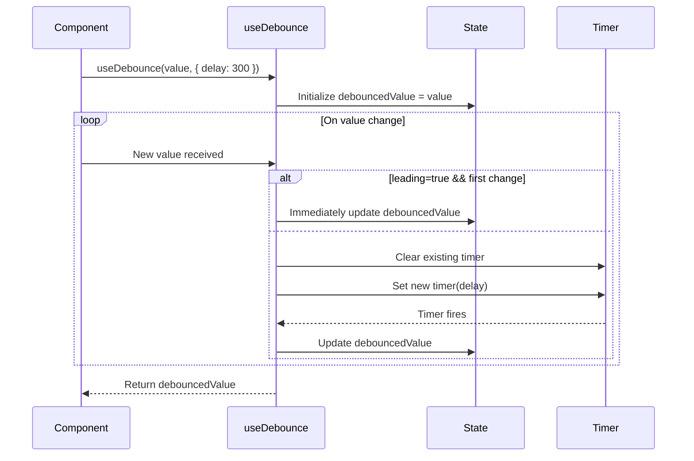
```mermaid
sequenceDiagram
    participant C as Component
    participant H as useDebounce
    participant S as State
    participant T as Timer

    C->>H: useDebounce(value, { delay: 300 })
    H->>S: Initialize debouncedValue = value
    
    loop On value change
        C->>H: New value received
        alt leading=true && first change
            H->>S: Immediately update debouncedValue
        else
            H->>T: Clear existing timer
            H->>T: Set new timer(delay)
            T-->>H: Timer fires
            H->>S: Update debouncedValue
        end
    end
    
    H-->>C: Return debouncedValue
```

**Key Implementation Details:**
- Uses `useRef` for timer management across renders
- `leadingRef` tracks first change for leading edge behavior
- Cleanup on unmount prevents memory leaks

### 2. useLocalStorage Hook Flow

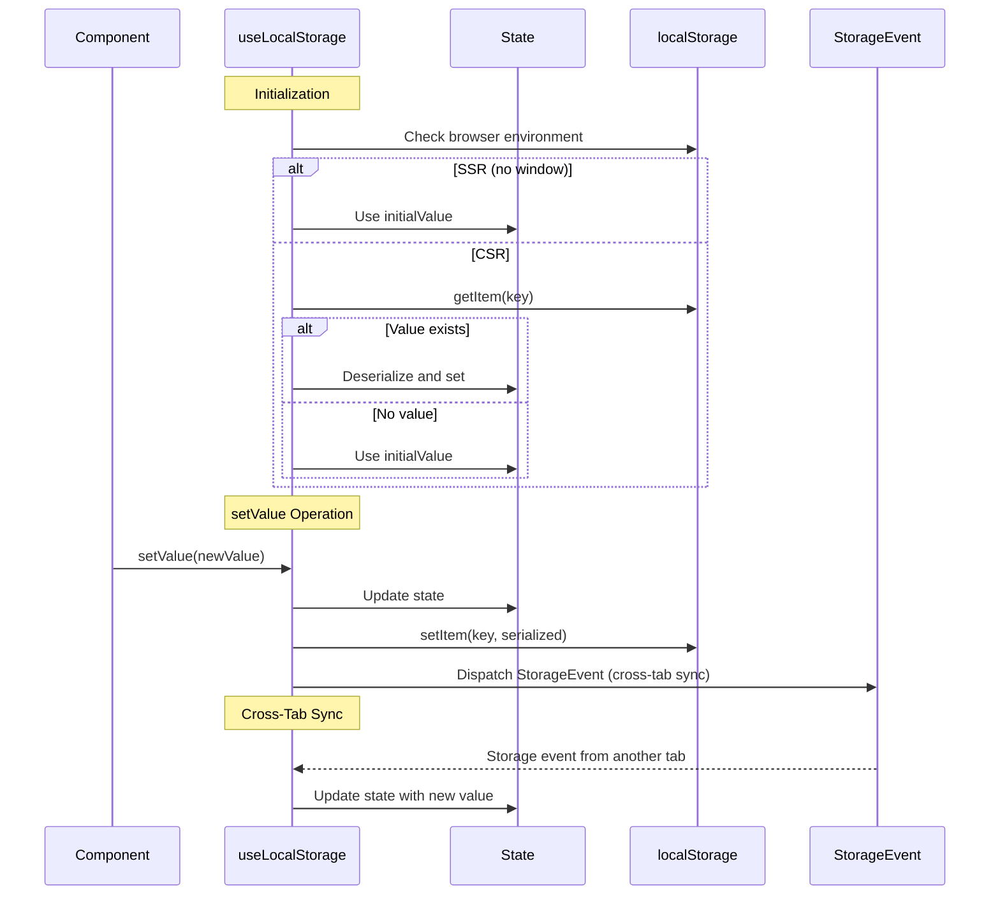
```mermaid
sequenceDiagram
    participant C as Component
    participant H as useLocalStorage
    participant S as State
    participant LS as localStorage
    participant E as StorageEvent

    Note over H: Initialization
    H->>LS: Check browser environment
    alt SSR (no window)
        H->>S: Use initialValue
    else CSR
        H->>LS: getItem(key)
        alt Value exists
            H->>S: Deserialize and set
        else No value
            H->>S: Use initialValue
        end
    end

    Note over H: setValue Operation
    C->>H: setValue(newValue)
    H->>S: Update state
    H->>LS: setItem(key, serialized)
    H->>E: Dispatch StorageEvent (cross-tab sync)

    Note over H: Cross-Tab Sync
    E-->>H: Storage event from another tab
    H->>S: Update state with new value
```

**SSR Safety Pattern:**
```typescript
const isBrowser = typeof window !== "undefined"

const getStoredValue = useCallback((): T => {
    if (!isBrowser) return initialValue
    // ... browser-only logic
}, [initialValue, isBrowser, key, deserializer])
```

### 3. useMediaQuery Hook Flow

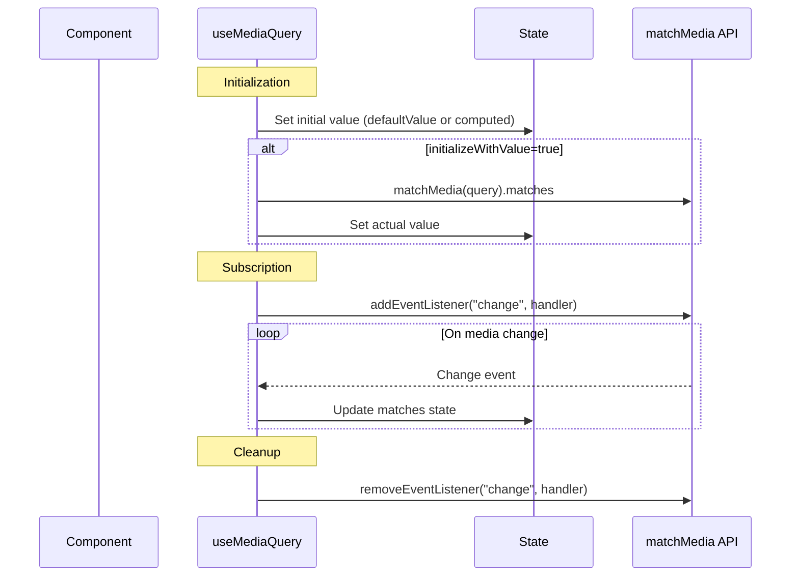
```mermaid
sequenceDiagram
    participant C as Component
    participant H as useMediaQuery
    participant S as State
    participant M as matchMedia API

    Note over H: Initialization
    H->>S: Set initial value (defaultValue or computed)
    
    alt initializeWithValue=true
        H->>M: matchMedia(query).matches
        H->>S: Set actual value
    end

    Note over H: Subscription
    H->>M: addEventListener("change", handler)
    
    loop On media change
        M-->>H: Change event
        H->>S: Update matches state
    end

    Note over H: Cleanup
    H->>M: removeEventListener("change", handler)
```

### 4. useScrollToBottom Hook Flow

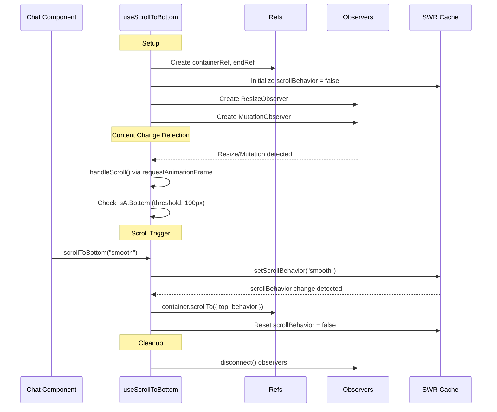
```mermaid
sequenceDiagram
    participant C as Chat Component
    participant H as useScrollToBottom
    participant R as Refs
    participant O as Observers
    participant SWR as SWR Cache

    Note over H: Setup
    H->>R: Create containerRef, endRef
    H->>SWR: Initialize scrollBehavior = false
    H->>O: Create ResizeObserver
    H->>O: Create MutationObserver

    Note over H: Content Change Detection
    O-->>H: Resize/Mutation detected
    H->>H: handleScroll() via requestAnimationFrame
    H->>H: Check isAtBottom (threshold: 100px)

    Note over H: Scroll Trigger
    C->>H: scrollToBottom("smooth")
    H->>SWR: setScrollBehavior("smooth")
    SWR-->>H: scrollBehavior change detected
    H->>R: container.scrollTo({ top, behavior })
    H->>SWR: Reset scrollBehavior = false

    Note over H: Cleanup
    H->>O: disconnect() observers
```

**Observer Configuration:**
```typescript
mutationObserver.observe(container, {
    childList: true,
    subtree: true,
    attributes: true,
    attributeFilter: ["style", "class", "data-state"],
})
```

### 5. useChatVisibility Hook Flow

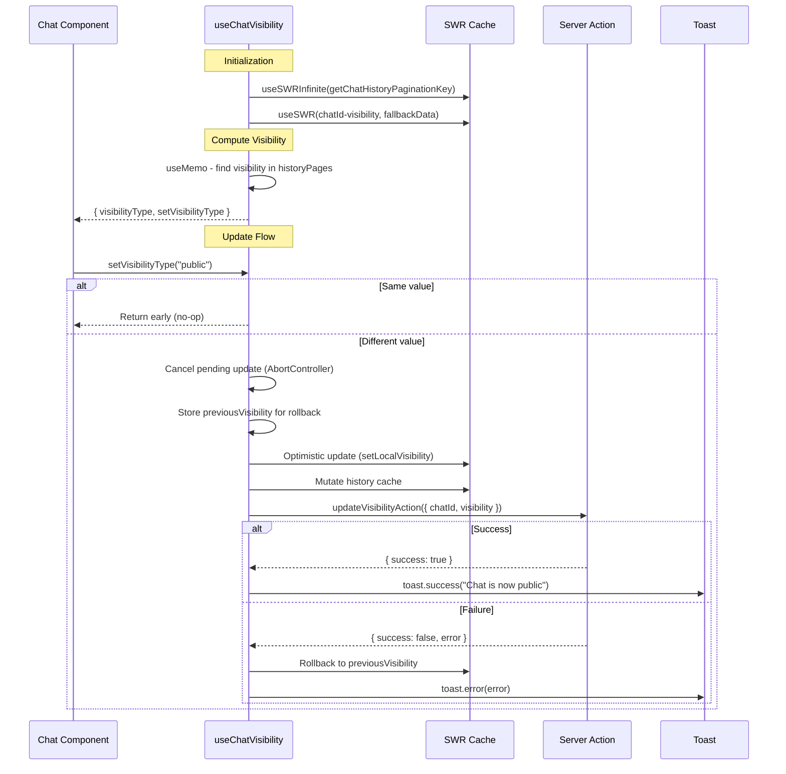
```mermaid
sequenceDiagram
    participant C as Chat Component
    participant H as useChatVisibility
    participant SWR as SWR Cache
    participant SA as Server Action
    participant T as Toast

    Note over H: Initialization
    H->>SWR: useSWRInfinite(getChatHistoryPaginationKey)
    H->>SWR: useSWR(chatId-visibility, fallbackData)

    Note over H: Compute Visibility
    H->>H: useMemo - find visibility in historyPages
    H-->>C: { visibilityType, setVisibilityType }

    Note over H: Update Flow
    C->>H: setVisibilityType("public")
    
    alt Same value
        H-->>C: Return early (no-op)
    else Different value
        H->>H: Cancel pending update (AbortController)
        H->>H: Store previousVisibility for rollback
        H->>SWR: Optimistic update (setLocalVisibility)
        H->>SWR: Mutate history cache
        
        H->>SA: updateVisibilityAction({ chatId, visibility })
        
        alt Success
            SA-->>H: { success: true }
            H->>T: toast.success("Chat is now public")
        else Failure
            SA-->>H: { success: false, error }
            H->>SWR: Rollback to previousVisibility
            H->>T: toast.error(error)
        end
    end
```

---

## Utility Function Flows

### 1. SWR Fetcher Flow

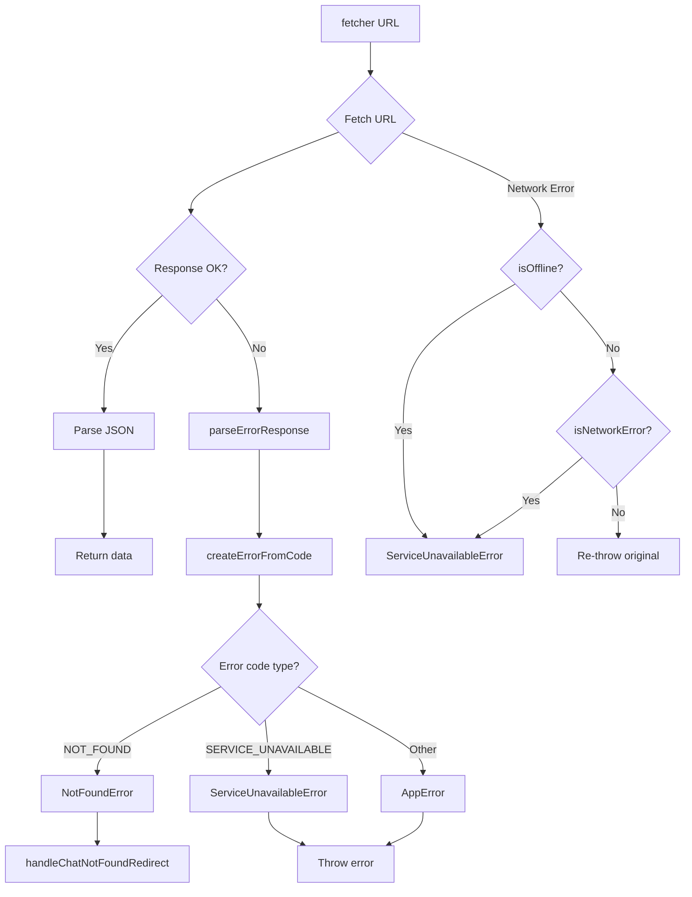
```mermaid
flowchart TD
    A[fetcher URL] --> B{Fetch URL}
    B --> C{Response OK?}
    
    C -->|Yes| D[Parse JSON]
    D --> E[Return data]
    
    C -->|No| F[parseErrorResponse]
    F --> G[createErrorFromCode]
    G --> H{Error code type?}
    
    H -->|NOT_FOUND| I[NotFoundError]
    H -->|SERVICE_UNAVAILABLE| J[ServiceUnavailableError]
    H -->|Other| K[AppError]
    
    I --> L[handleChatNotFoundRedirect]
    J --> M[Throw error]
    K --> M
    
    B -->|Network Error| N{isOffline?}
    N -->|Yes| O[ServiceUnavailableError]
    N -->|No| P{isNetworkError?}
    P -->|Yes| O
    P -->|No| Q[Re-throw original]
```

### 2. File Validation Flow

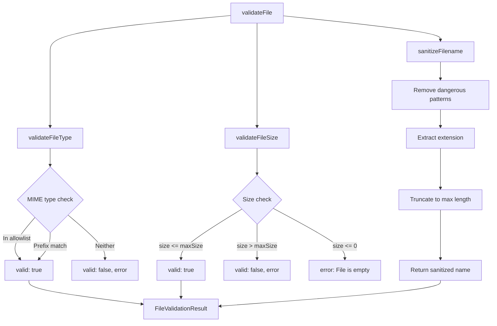
```mermaid
flowchart TD
    A[validateFile] --> B[validateFileType]
    A --> C[validateFileSize]
    A --> D[sanitizeFilename]
    
    B --> E{MIME type check}
    E -->|In allowlist| F[valid: true]
    E -->|Prefix match| F
    E -->|Neither| G[valid: false, error]
    
    C --> H{Size check}
    H -->|size <= maxSize| I[valid: true]
    H -->|size > maxSize| J[valid: false, error]
    H -->|size <= 0| K[error: File is empty]
    
    D --> L[Remove dangerous patterns]
    L --> M[Extract extension]
    M --> N[Truncate to max length]
    N --> O[Return sanitized name]
    
    F --> P[FileValidationResult]
    I --> P
    O --> P
```

### 3. Secure IP Extraction Flow

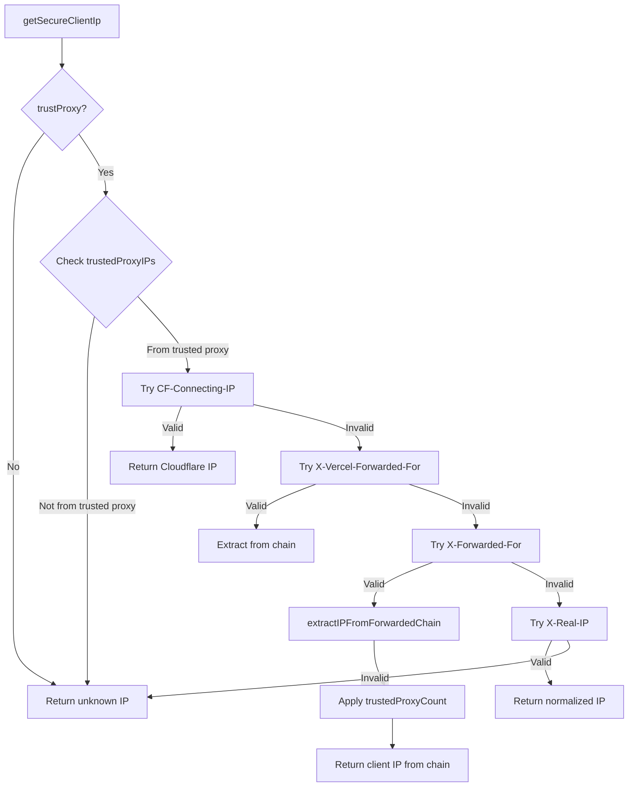
```mermaid
flowchart TD
    A[getSecureClientIp] --> B{trustProxy?}
    
    B -->|No| C[Return unknown IP]
    
    B -->|Yes| D{Check trustedProxyIPs}
    D -->|Not from trusted proxy| C
    
    D -->|From trusted proxy| E[Try CF-Connecting-IP]
    E -->|Valid| F[Return Cloudflare IP]
    
    E -->|Invalid| G[Try X-Vercel-Forwarded-For]
    G -->|Valid| H[Extract from chain]
    
    G -->|Invalid| I[Try X-Forwarded-For]
    I -->|Valid| J[extractIPFromForwardedChain]
    
    I -->|Invalid| K[Try X-Real-IP]
    K -->|Valid| L[Return normalized IP]
    
    K -->|Invalid| C
    
    J --> M[Apply trustedProxyCount]
    M --> N[Return client IP from chain]
```

---

## Error Handling Flow

### 1. Error Creation and Propagation

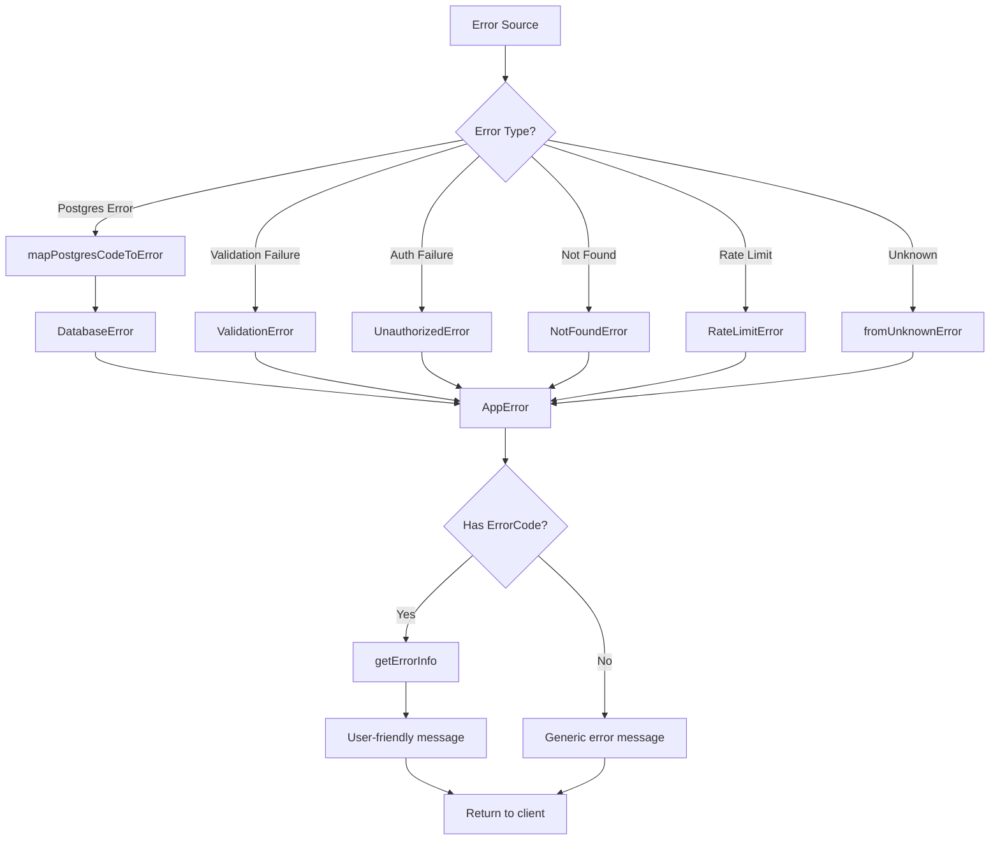
```mermaid
flowchart TD
    A[Error Source] --> B{Error Type?}
    
    B -->|Postgres Error| C[mapPostgresCodeToError]
    C --> D[DatabaseError]
    
    B -->|Validation Failure| E[ValidationError]
    B -->|Auth Failure| F[UnauthorizedError]
    B -->|Not Found| G[NotFoundError]
    B -->|Rate Limit| H[RateLimitError]
    B -->|Unknown| I[fromUnknownError]
    
    D --> J[AppError]
    E --> J
    F --> J
    G --> J
    H --> J
    I --> J
    
    J --> K{Has ErrorCode?}
    K -->|Yes| L[getErrorInfo]
    L --> M[User-friendly message]
    
    K -->|No| N[Generic error message]
    
    M --> O[Return to client]
    N --> O
```

### 2. Database Error Mapping

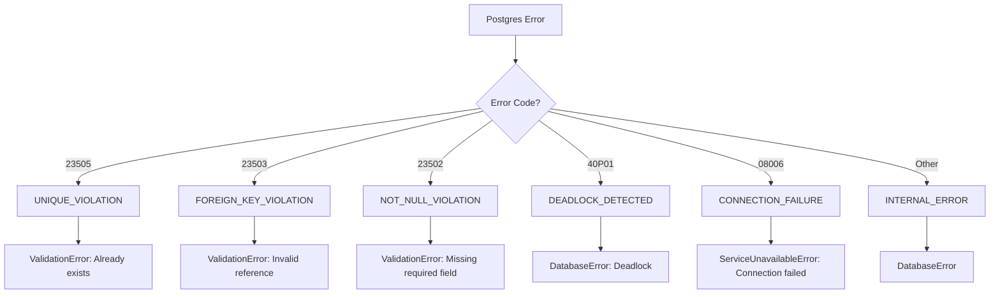
```mermaid
flowchart TD
    A[Postgres Error] --> B{Error Code?}
    
    B -->|23505| C[UNIQUE_VIOLATION]
    B -->|23503| D[FOREIGN_KEY_VIOLATION]
    B -->|23502| E[NOT_NULL_VIOLATION]
    B -->|40P01| F[DEADLOCK_DETECTED]
    B -->|08006| G[CONNECTION_FAILURE]
    B -->|Other| H[INTERNAL_ERROR]
    
    C --> I[ValidationError: Already exists]
    D --> J[ValidationError: Invalid reference]
    E --> K[ValidationError: Missing required field]
    F --> L[DatabaseError: Deadlock]
    G --> M[ServiceUnavailableError: Connection failed]
    H --> N[DatabaseError]
```

### 3. Legacy Error Code Compatibility

```mermaid
flowchart TD
    A[Legacy Error Code] --> B[mapLegacyToNewCode]
    B --> C{Lookup in LegacyToNewCodeMap}
    
    C -->|Found| D[New AppError Code]
    C -->|Not Found| E[VALIDATION_ERROR default]
    
    D --> F[Create AppError instance]
    E --> F
    
    F --> G[Return to client]
    
    Note1[Example: "bad_request:api:invalid_uuid_format"]
    Note1 --> B
    Note2[Maps to: "INVALID_FORMAT"]
    Note2 --> D
```

---

## Cache Flow

### 1. Tiered Cache Read Flow

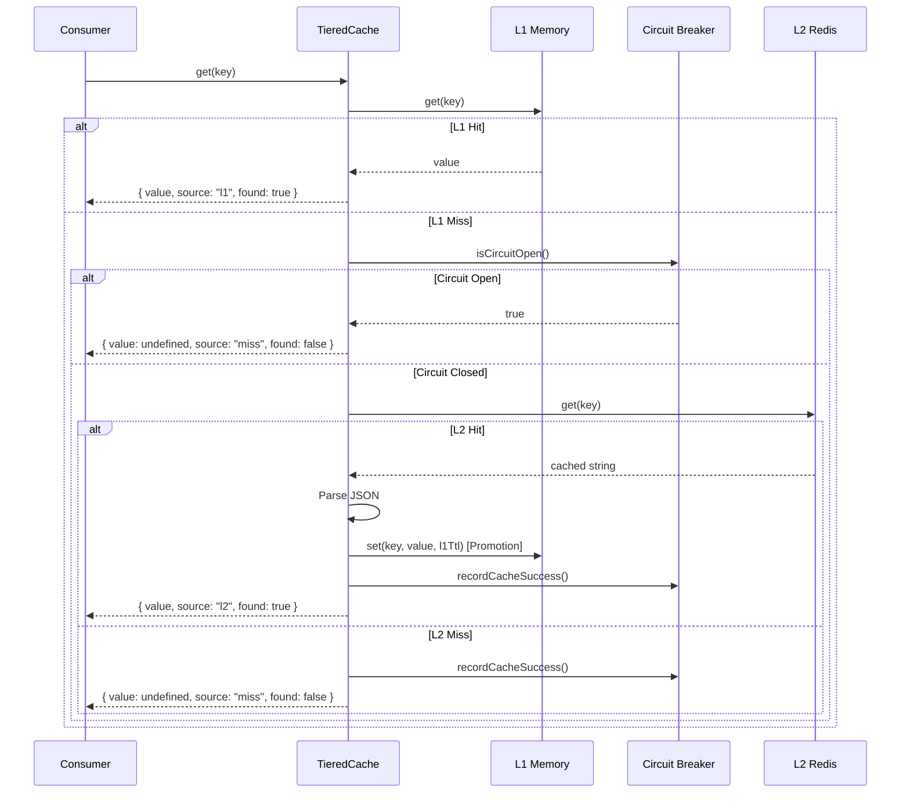
```mermaid
sequenceDiagram
    participant C as Consumer
    participant TC as TieredCache
    participant L1 as L1 Memory
    participant CB as Circuit Breaker
    participant L2 as L2 Redis

    C->>TC: get(key)
    TC->>L1: get(key)
    
    alt L1 Hit
        L1-->>TC: value
        TC-->>C: { value, source: "l1", found: true }
    else L1 Miss
        TC->>CB: isCircuitOpen()
        
        alt Circuit Open
            CB-->>TC: true
            TC-->>C: { value: undefined, source: "miss", found: false }
        else Circuit Closed
            TC->>L2: get(key)
            
            alt L2 Hit
                L2-->>TC: cached string
                TC->>TC: Parse JSON
                TC->>L1: set(key, value, l1Ttl) [Promotion]
                TC->>CB: recordCacheSuccess()
                TC-->>C: { value, source: "l2", found: true }
            else L2 Miss
                TC->>CB: recordCacheSuccess()
                TC-->>C: { value: undefined, source: "miss", found: false }
            end
        end
    end
```

### 2. Cache-Aside Strategy Flow

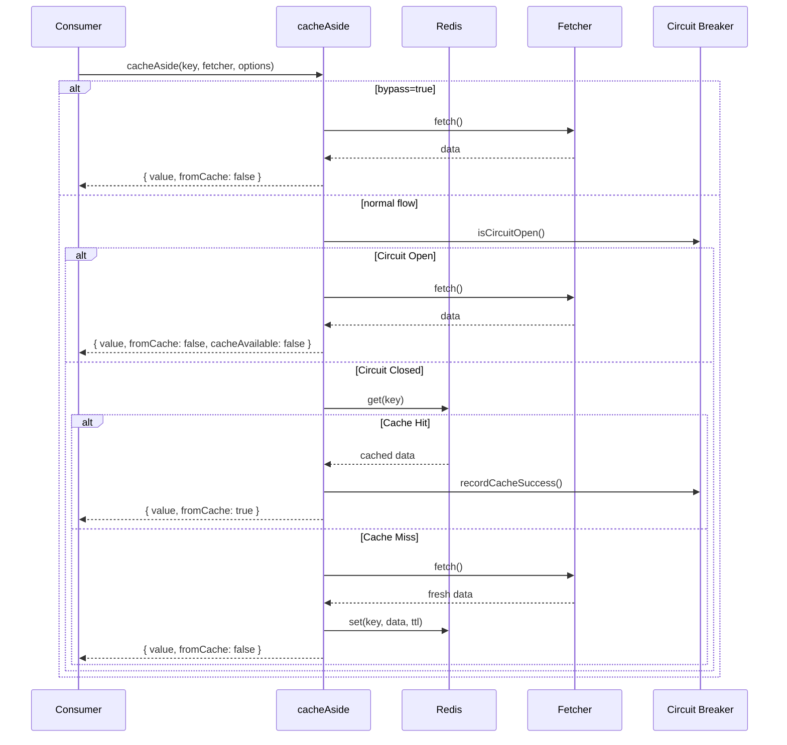
```mermaid
sequenceDiagram
    participant C as Consumer
    participant S as cacheAside
    participant Cache as Redis
    participant F as Fetcher
    participant CB as Circuit Breaker

    C->>S: cacheAside(key, fetcher, options)
    
    alt bypass=true
        S->>F: fetch()
        F-->>S: data
        S-->>C: { value, fromCache: false }
    else normal flow
        S->>CB: isCircuitOpen()
        
        alt Circuit Open
            S->>F: fetch()
            F-->>S: data
            S-->>C: { value, fromCache: false, cacheAvailable: false }
        else Circuit Closed
            S->>Cache: get(key)
            
            alt Cache Hit
                Cache-->>S: cached data
                S->>CB: recordCacheSuccess()
                S-->>C: { value, fromCache: true }
            else Cache Miss
                S->>F: fetch()
                F-->>S: fresh data
                S->>Cache: set(key, data, ttl)
                S-->>C: { value, fromCache: false }
            end
        end
    end
```

### 3. Cache Invalidation Flow

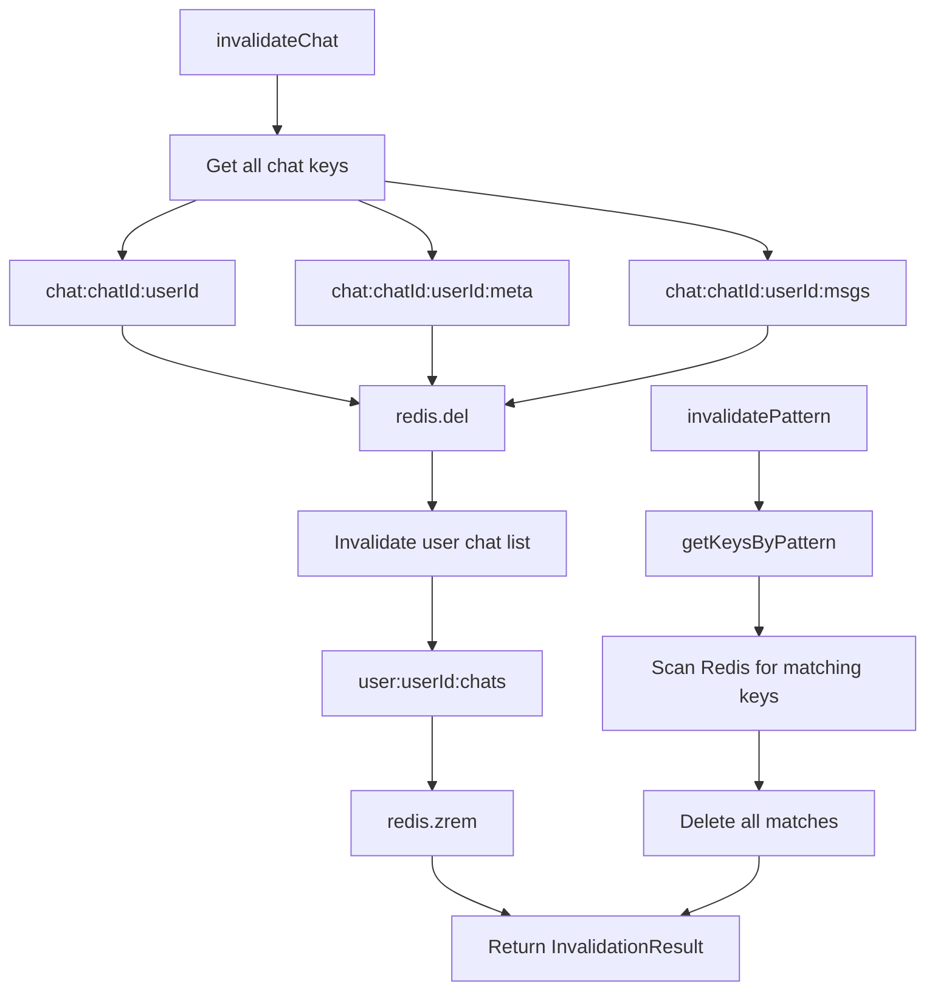
```mermaid
flowchart TD
    A[invalidateChat] --> B[Get all chat keys]
    B --> C[chat:chatId:userId]
    B --> D[chat:chatId:userId:meta]
    B --> E[chat:chatId:userId:msgs]
    
    C --> F[redis.del]
    D --> F
    E --> F
    
    F --> G[Invalidate user chat list]
    G --> H[user:userId:chats]
    H --> I[redis.zrem]
    
    I --> J[Return InvalidationResult]
    
    K[invalidatePattern] --> L[getKeysByPattern]
    L --> M[Scan Redis for matching keys]
    M --> N[Delete all matches]
    N --> J
```

### 4. Circuit Breaker Flow

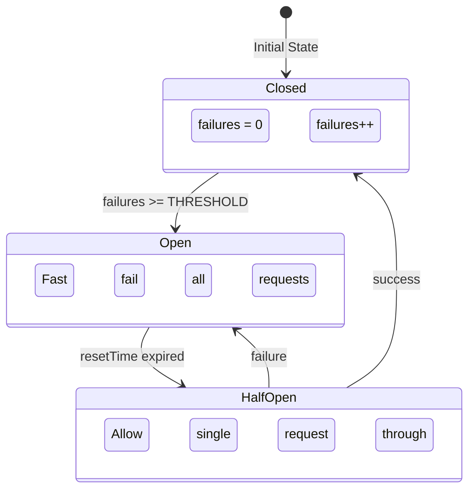
```mermaid
stateDiagram-v2
    [*] --> Closed: Initial State
    
    Closed --> Open: failures >= THRESHOLD
    Open --> HalfOpen: resetTime expired
    HalfOpen --> Closed: success
    HalfOpen --> Open: failure
    
    state Closed {
        recordSuccess: failures = 0
        recordFailure: failures++
    }
    
    state Open {
        Fast fail all requests
    }
    
    state HalfOpen {
        Allow single request through
    }
```

**Circuit Breaker Constants:**
```typescript
CIRCUIT_BREAKER_THRESHOLD = 5  // failures before opening
CIRCUIT_BREAKER_RESET_MS = 30000  // 30 seconds before trying again
```

### 5. LRU Cache Eviction Flow

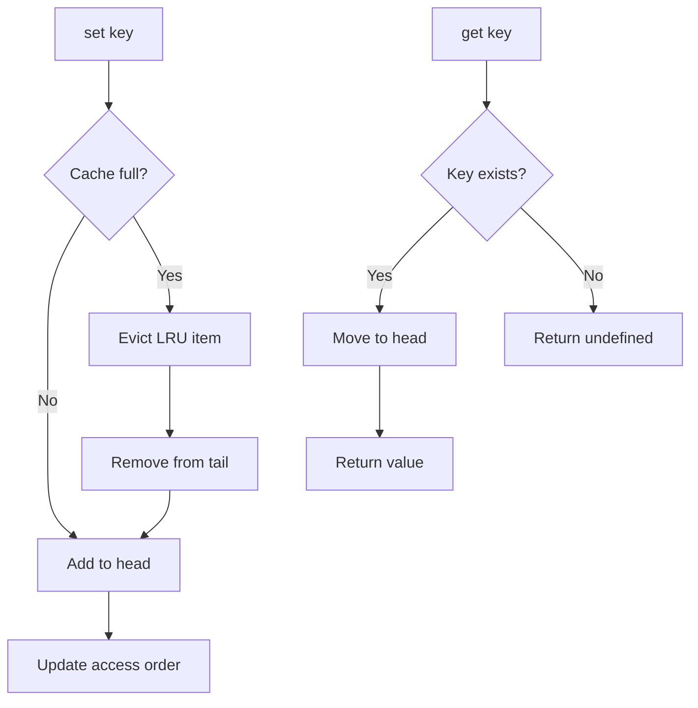
```mermaid
flowchart TD
    A[set key] --> B{Cache full?}
    
    B -->|No| C[Add to head]
    B -->|Yes| D[Evict LRU item]
    
    D --> E[Remove from tail]
    E --> C
    
    C --> F[Update access order]
    
    G[get key] --> H{Key exists?}
    
    H -->|Yes| I[Move to head]
    H -->|No| J[Return undefined]
    
    I --> K[Return value]
```

---

## Message Part Processing Flow

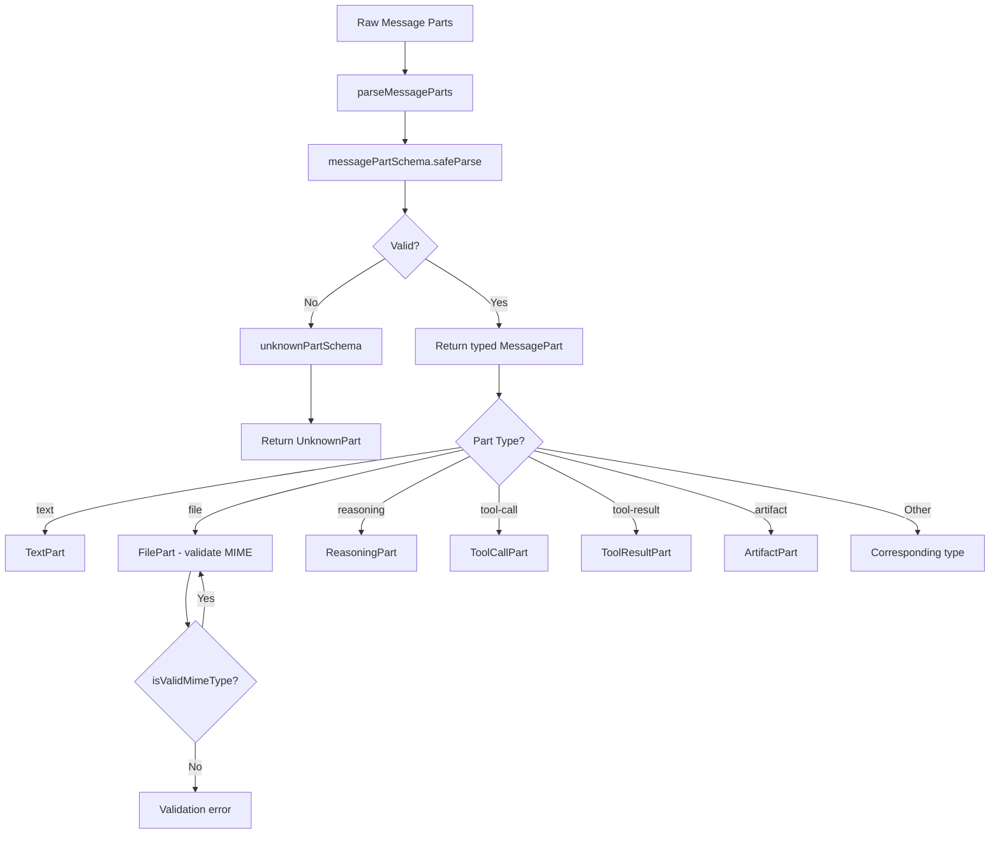
```mermaid
flowchart TD
    A[Raw Message Parts] --> B[parseMessageParts]
    B --> C[messagePartSchema.safeParse]
    
    C --> D{Valid?}
    
    D -->|Yes| E[Return typed MessagePart]
    D -->|No| F[unknownPartSchema]
    
    F --> G[Return UnknownPart]
    
    E --> H{Part Type?}
    
    H -->|text| I[TextPart]
    H -->|file| J[FilePart - validate MIME]
    H -->|reasoning| K[ReasoningPart]
    H -->|tool-call| L[ToolCallPart]
    H -->|tool-result| M[ToolResultPart]
    H -->|artifact| N[ArtifactPart]
    H -->|Other| O[Corresponding type]
    
    J --> P{isValidMimeType?}
    P -->|Yes| J
    P -->|No| Q[Validation error]
```

---

## Type Guard Flow

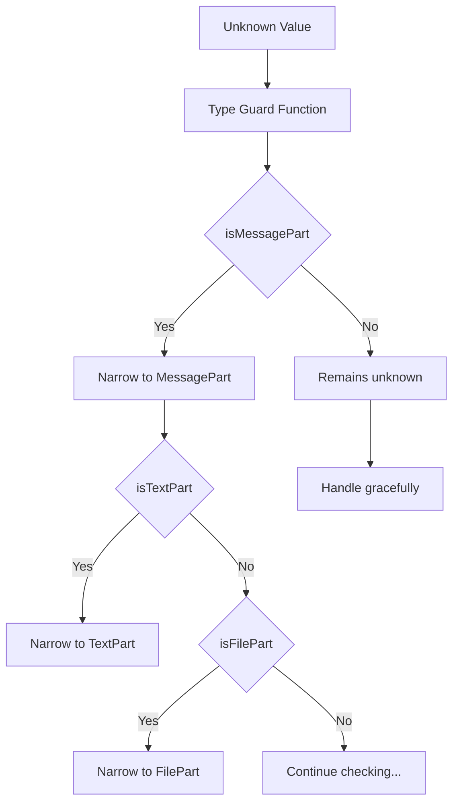
```mermaid
flowchart TD
    A[Unknown Value] --> B[Type Guard Function]
    
    B --> C{isMessagePart}
    C -->|Yes| D[Narrow to MessagePart]
    C -->|No| E[Remains unknown]
    
    D --> F{isTextPart}
    F -->|Yes| G[Narrow to TextPart]
    F -->|No| H{isFilePart}
    
    H -->|Yes| I[Narrow to FilePart]
    H -->|No| J[Continue checking...]
    
    E --> K[Handle gracefully]
```

---

## Summary: Key Flow Patterns

| Pattern | Location | Purpose |
|---------|----------|---------|
| **SSR Safety** | `useLocalStorage`, `useMediaQuery` | Check `typeof window` before browser APIs |
| **Optimistic Update** | `useChatVisibility` | Update UI before server confirmation |
| **Circuit Breaker** | `lib/cache/circuit-breaker.ts` | Protect against cascade failures |
| **Tiered Caching** | `TieredCache` | L1 (fast) + L2 (shared) with promotion |
| **Error Hierarchy** | `lib/errors/` | Typed errors with codes and messages |
| **Type Narrowing** | `lib/types/message-parts.ts` | Zod schemas + type guards |
| **Cross-Tab Sync** | `useLocalStorage` | StorageEvent dispatch/listen |
| **Request Deduplication** | `useChatVisibility` | AbortController for race conditions |