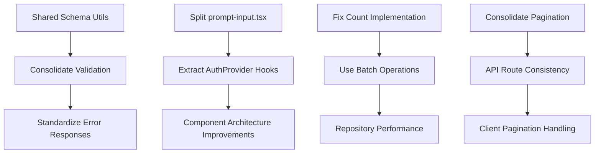

# Consolidated Findings

> All simplification opportunities merged, deduplicated, and organized by theme

**Generated:** 2026-02-18  
**Source:** 8 functional area analyses across 4 dimensions

---

## Overview

This document consolidates all 47 simplification opportunities identified across the codebase, organized by theme rather than by functional area. Cross-cutting concerns are highlighted, and related opportunities are grouped for coordinated implementation.

---

## Theme 1: Code Duplication

### 1.1 Schema/Type Duplication

**Affected Areas:** Feature Modules, API Routes, Data Layer

| Issue | Locations | Impact |
|-------|-----------|--------|
| UUID schema defined multiple times | `features/chat/schemas`, `features/artifact/schemas` | 3 duplicate definitions |
| Visibility type in 3 places | `lib/types`, `features/chat/types`, `lib/db/schema` | Type confusion |
| ArtifactKind duplicated | `features/chat/types`, `features/artifact/types` | Maintenance burden |
| PaginatedResult defined 3 times | `lib/data/repositories`, `lib/data/types`, `lib/db/pagination` | API inconsistency |

**Recommendation:** Create shared schema utilities:

```typescript
// Proposed: lib/schemas/common.ts
export const UUIDSchema = z.string().uuid();
export const VisibilitySchema = z.enum(["public", "private"]);
export const NonEmptyStringSchema = z.string().min(1);

// Proposed: lib/types/pagination.ts
export interface PaginatedResult<T> {
  items: T[];
  hasMore: boolean;
  nextCursor?: string | null;
  prevCursor?: string | null;
  totalCount?: number;
}
```

**Estimated Savings:** ~50 lines, improved consistency

---

### 1.2 Component Pattern Duplication

**Affected Areas:** Components

| Pattern | Duplicated In | Lines Duplicated |
|---------|---------------|------------------|
| Action button with tooltip | `MessageAction`, `ArtifactAction` | ~50 lines |
| Close button with X icon | `Dialog`, `ArtifactClose`, message attachments | ~30 lines |
| Empty state UI | `ConversationEmptyState`, similar patterns | ~40 lines |

**Recommendation:** Create shared UI components:

```typescript
// components/ui/action-button.tsx
export const ActionButton = ({ tooltip, icon, children, ...props }) => { ... }

// components/ui/close-button.tsx
export const CloseButton = ({ label = "Close", ...props }) => { ... }

// components/ui/empty-state.tsx
export const EmptyState = ({ icon, title, description, action }) => { ... }
```

**Estimated Savings:** ~120 lines

---

### 1.3 Validation Logic Duplication

**Affected Areas:** API Routes, Auth, Feature Modules

| Pattern | Locations | Issue |
|---------|-----------|-------|
| UUID validation | 3 different approaches | Zod, helper function, inline regex |
| Query param extraction | 6+ routes | Same pattern repeated |
| Rate limit header application | 6+ routes | Same 4 lines repeated |

**Recommendation:** Standardize validation approach:

```typescript
// lib/api/validation.ts - Use consistently
export const uuidSchema = z.string().uuid();
export const isValidUUID = (id: string) => uuidSchema.safeParse(id).success;

// lib/api/response.ts - Add helper
export function withRateLimitHeaders(
  response: Response,
  rateLimitResult: RateLimitResult
): Response { ... }
```

**Estimated Savings:** ~60 lines

---

## Theme 2: Over-Engineered Abstractions

### 2.1 Large Component Files

**Affected Areas:** Components, Feature Modules

| File | Size | Issues | Recommendation |
|------|------|--------|----------------|
| `prompt-input.tsx` | 36KB (~900 lines) | 6+ concerns mixed | Split into 6 modules |
| `sidebar.tsx` | 830 lines | 25+ compound components | Split into module directory |
| `AuthProvider` | 424 lines | 7 concerns mixed | Extract to 4 custom hooks |
| `Chat` | 538 lines | Multiple concerns | Extract to `useChatState` hook |

**Impact:** Hard to navigate, test, and tree-shake

---

### 2.2 Over-Abstracted Patterns

**Affected Areas:** Data Layer, Hooks, Cache

| Pattern | Issue | Recommendation |
|---------|-------|----------------|
| BaseRepository abstract methods | Many methods nearly identical | Configuration-based approach |
| Multiple cache strategy functions | 5 strategies, most unused | Keep `getOrSet`, document others |
| SWR for local UI state | `useScrollToBottom` uses SWR | Use simple `useState` |
| 16 type guard functions | Identical pattern repeated | Generic `isPartOfType()` function |

**Estimated Savings:** ~300 lines

---

### 2.3 Service Layer Redundancy

**Affected Areas:** Data Layer

| Issue | Example | Recommendation |
|-------|---------|----------------|
| Thin service wrappers | `getHistory()` just calls repository | Add business logic or remove |
| Query/Service overlap | `ChatService` and `ChatQueries` provide similar methods | Consolidate |

---

## Theme 3: Performance Issues

### 3.1 Inefficient Database Operations

**Affected Areas:** Data Layer

| Issue | Location | Impact | Fix |
|-------|----------|--------|-----|
| Count uses SELECT | `BaseRepository.count()` | O(n) memory | Use SQL `COUNT()` |
| Sequential batch ops | `createMany()`, `deleteMany()` | N requests | Use `batchInsert()` |
| N+1 query potential | Message loading in chats | N queries | Batch loading |

**Priority:** HIGH - Direct performance impact

---

### 3.2 Redundant Operations

**Affected Areas:** AI System, Auth

| Issue | Location | Impact | Fix |
|-------|----------|--------|-----|
| Multiple session fetches | Sequential guard calls | Redundant DB/cookie reads | Guard context caching |
| Repeated token counting | Truncation functions | Redundant computation | `TokenCounter` class |
| Model lookup O(n) | `getModelById()` | Linear search | Cached Map |

---

### 3.3 Cache Inefficiencies

**Affected Areas:** Data Layer, Cache

| Issue | Recommendation |
|-------|----------------|
| No predictive warming | Warm related data proactively |
| List cache doesn't account for filters | Use filter-specific keys |
| Two different cache result types | Unify to single `CacheResult<T>` |

---

## Theme 4: Pattern Inconsistencies

### 4.1 Error Handling Variations

**Affected Areas:** AI System, API Routes, Data Layer

| Pattern | Location | Should Be |
|---------|----------|-----------|
| `throw new Error()` | `token-counter.ts` | `throw new AppError()` |
| Manual error responses | `chat/route.ts` | Use `error()` helper |
| Raw error throws | Query layer | Wrap in `InternalServerError` |

**Recommendation:** Standardize on throw-based pattern with `AppError` hierarchy

---

### 4.2 Null vs Undefined

**Affected Areas:** AI System, Providers

| Location | Current | Should Be |
|----------|---------|-----------|
| `providers.ts` | Returns `null` for missing | Return `undefined` |
| `getProvider()` | Returns `null` | Return `undefined` |

**Recommendation:** Standardize on `undefined` for "not found"

---

### 4.3 Async Function Styles

**Affected Areas:** AI System, Feature Modules

| Style | Used In | Preference |
|-------|---------|------------|
| `export const x = async () =>` | `model-discovery.ts` | Less common |
| `export async function x()` | Most files | Preferred |

**Recommendation:** Use function declarations for exports

---

### 4.4 Pagination Interfaces

**Affected Areas:** Data Layer, API Routes

| Interface | Location | Fields |
|-----------|----------|--------|
| `PaginationParams` | Repositories | limit, startingAfter, endingBefore |
| `CursorPaginationOptions` | `pagination.ts` | limit, cursor, direction |
| `PaginatedResult` | Repositories | items, hasMore |
| `CursorPaginatedResult` | `pagination.ts` | data, nextCursor, prevCursor, hasMore, totalCount |

**Recommendation:** Consolidate to single pagination approach

---

## Theme 5: Dead Code & Unused Exports

### 5.1 Deprecated Functions

| Function | Location | Action |
|----------|----------|--------|
| `requireAuthWithSession()` | `lib/auth/guards.ts` | Remove (marked deprecated) |
| Legacy error code mapping | `lib/errors.ts` | Remove after migration |

---

### 5.2 Unused/Potentially Unused Components

| Component | Location | Action |
|-----------|----------|--------|
| `ChainOfThought` | `ai-elements/` | Audit usage |
| `Connection`, `Edge`, `Node` | `ai-elements/` | Graph viz - verify use |
| `Queue`, `Task` | `ai-elements/` | Workflow display - verify use |

**Recommendation:** Run usage audit, remove or document as "available for future"

---

### 5.3 Icon Overlaps

**Affected Areas:** Components

| Custom Icon | Lucide Equivalent | Action |
|-------------|-------------------|--------|
| `PlusIcon` | `Plus` | Consider using Lucide |
| `ChevronDownIcon` | `ChevronDown` | Consider using Lucide |
| `CopyIcon` | `Copy` | Consider using Lucide |
| `CrossIcon` | `X` | Consider using Lucide |

**Recommendation:** Audit and consolidate, keep custom icons with unique styling

---

## Theme 6: Architectural Improvements

### 6.1 Feature Module Completeness

**Issue:** Inconsistent export patterns across features

| Feature | Exports Components | Exports Hooks | Exports Actions | Exports Schemas |
|---------|-------------------|---------------|-----------------|-----------------|
| Auth | 3 | 2 | 6 | 4 |
| Chat | 10 | 7 | 8 | 10+ |
| Artifact | 4 | 2 | 10 | 15+ |
| Input | 5 | 3 | 0 | 6 |
| Settings | 5 | 4 | 6 | 8 |
| Sidebar | 6 | 2 | 3 | 0 |

**Recommendation:** Standardize all feature `index.ts` files to export all categories

---

### 6.2 Service Layer Completeness

**Issue:** Some routes still have business logic

| Logic | Current Location | Should Be |
|-------|------------------|-----------|
| `convertToUIMessages()` | `chat/route.ts` | `ChatService` or `MessageService` |
| Cursor codec | `history/route.ts` | `lib/db/pagination.ts` |

---

### 6.3 Context Propagation

**Issue:** Context passed explicitly to every repository method

```typescript
// Current
const chat = await chatRepository.findById(chatId, ctx);
const messages = await messageRepository.findByChatId(chatId, ctx);

// Alternative: Context-bound repository
const userRepo = chatRepository.withContext(ctx);
const chat = await userRepo.findById(chatId);
const messages = await userRepo.findMessages(chatId);
```

**Recommendation:** Consider for future refactoring when call sites become verbose

---

## Cross-Cutting Concerns

### Concern 1: Validation Standardization

**Touches:** API Routes, Auth, Feature Modules, Data Layer

**Current State:**
- 3 different UUID validation approaches
- Mix of Zod schemas and helper functions
- Inconsistent error messages

**Target State:**
- Single `lib/schemas/common.ts` for shared schemas
- Single `lib/api/validation.ts` for validation functions
- Consistent error format across all validation

---

### Concern 2: Error Response Format

**Touches:** API Routes, Auth, AI System

**Current State:**
- Format A: `{ success: false, error: "message" }`
- Format B: `{ success: false, error: { code, message, statusCode } }`
- Format C: `{ error: "message" }` (missing success field)

**Target State:**
- All responses use `{ success: boolean, data?: T, error?: ApiError }`
- `ApiError` always includes `code`, `message`, `statusCode`

---

### Concern 3: Pagination Standardization

**Touches:** Data Layer, API Routes

**Current State:**
- 2 different parameter interfaces
- 2 different result interfaces
- Custom implementation in ChatRepository

**Target State:**
- Single `PaginationOptions` interface
- Single `PaginationResult<T>` interface
- All repositories use generic `paginate()` utility

---

### Concern 4: Type Safety

**Touches:** AI System, Data Layer, Components

**Current State:**
- `any` type for providers
- Type assertions in model creation
- Entity types duplicate schema types

**Target State:**
- Proper provider types
- Type guards instead of assertions
- Entity types derived from schema with `$inferSelect`

---

## Technical Debt Summary

### By Category

| Category | Count | Severity | Est. Effort |
|----------|-------|----------|-------------|
| Code Duplication | 12 | Medium | 16 hrs |
| Over-Engineering | 8 | Low | 20 hrs |
| Performance | 6 | High | 12 hrs |
| Pattern Inconsistency | 10 | Medium | 14 hrs |
| Dead Code | 6 | Low | 4 hrs |
| Architecture | 5 | Medium | 12 hrs |
| **Total** | **47** | | **78 hrs** |

### By Priority

| Priority | Issues | Rationale |
|----------|--------|-----------|
| **P0 - Critical** | 4 | Performance issues affecting users |
| **P1 - High** | 12 | Significant maintainability impact |
| **P2 - Medium** | 18 | Improves consistency and reduces confusion |
| **P3 - Low** | 13 | Nice to have, limited impact |

---

## Architecture Recommendations

### Short-Term (Immediate)

1. **Create shared schema utilities** - Reduces duplication immediately
2. **Fix count implementation** - Performance win with minimal effort
3. **Standardize UUID validation** - Consistency win

### Medium-Term (Next Quarter)

1. **Split large component files** - Improves maintainability
2. **Consolidate pagination** - Single approach across codebase
3. **Extract AuthProvider hooks** - Better testability

### Long-Term (Next 6 Months)

1. **Service layer completeness** - Move business logic from routes
2. **Context binding pattern** - Reduce verbosity in repository calls
3. **Type safety improvements** - Eliminate `any` types

---

## Dependencies Between Changes



### Implementation Order Considerations

1. **Shared schemas first** - Unblocks validation consolidation
2. **Performance fixes early** - Immediate user benefit
3. **Component splits can be parallel** - Independent changes
4. **Pagination consolidation before API changes** - Foundation for routes

---

## Next Steps

1. Review [Implementation Roadmap](implementation-roadmap.md) for phased plan
2. Track progress with [Metrics Dashboard](metrics-dashboard.md)
3. Use findings to prioritize backlog items