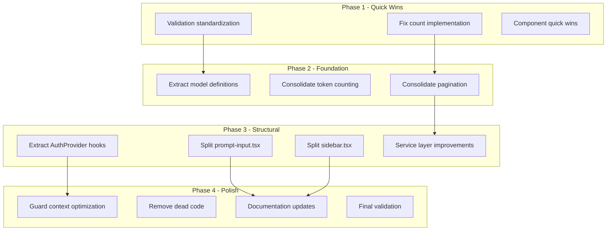

# Implementation Roadmap

> Phased implementation plan for code simplification

**Generated:** 2026-02-18  
**Total Estimated Effort:** ~78 hours across 4 phases

---

## Overview

This roadmap provides a structured approach to implementing the 47 simplification opportunities identified in the analysis. Changes are organized into phases based on priority, effort, and dependencies.

---

## Phase 1: Quick Wins (Week 1-2)

**Goal:** High-impact, low-effort improvements that provide immediate value

**Total Effort:** ~12 hours

### 1.1 Performance Quick Fixes (4 hours)

| Task | Effort | Impact | Files |
|------|--------|--------|-------|
| Fix count implementation | 1 hr | HIGH | `lib/data/repositories/*.repository.ts` |
| Use SQL COUNT() instead of SELECT + length | | | |
| Add batch operation helpers | 3 hrs | HIGH | `lib/data/repositories/base.repository.ts` |

**Implementation:**

```typescript
// Before
const result = await this.db.select({ count: chat.id }).from(chat).where(whereClause);
return result.length;

// After
import { count } from 'drizzle-orm';
const [result] = await this.db.select({ count: count() }).from(chat).where(whereClause);
return result?.count ?? 0;
```

**Validation:**
- Run existing tests
- Verify count accuracy with test data
- Check performance with large datasets

---

### 1.2 Validation Standardization (4 hours)

| Task | Effort | Impact | Files |
|------|--------|--------|-------|
| Create shared schema utilities | 2 hrs | MEDIUM | `lib/schemas/common.ts` (new) |
| Standardize UUID validation | 1 hr | MEDIUM | All API routes |
| Create withRateLimitHeaders helper | 1 hr | LOW | `lib/api/response.ts` |

**Implementation:**

```typescript
// lib/schemas/common.ts (new file)
import { z } from "zod";

export const UUIDSchema = z.string().uuid();
export const NonEmptyStringSchema = z.string().min(1, "This field is required");
export const VisibilitySchema = z.enum(["public", "private"]);
export const EmailSchema = z.string().email();

// lib/api/response.ts (addition)
export function withRateLimitHeaders(
  response: Response,
  rateLimitResult: RateLimitResult
): Response {
  const headers = createRateLimitHeaders(rateLimitResult);
  headers.forEach((value, key) => response.headers.set(key, value));
  return response;
}
```

**Validation:**
- Replace all UUID validation with `isValidUUID()`
- Run `pnpm typecheck && pnpm lint`
- Test rate limit headers in API responses

---

### 1.3 Component Quick Wins (4 hours)

| Task | Effort | Impact | Files |
|------|--------|--------|-------|
| Create ActionButton component | 2 hrs | MEDIUM | `components/ui/action-button.tsx` (new) |
| Create CloseButton component | 1 hr | LOW | `components/ui/close-button.tsx` (new) |
| Create EmptyState component | 1 hr | LOW | `components/ui/empty-state.tsx` (new) |

**Implementation:**

```typescript
// components/ui/action-button.tsx
export const ActionButton = ({ 
  tooltip, 
  icon: Icon,
  children,
  size = "icon-sm",
  variant = "ghost",
  ...props 
}: ActionButtonProps) => {
  const button = (
    <Button size={size} variant={variant} {...props}>
      {Icon ? <Icon className="size-4" /> : children}
    </Button>
  );

  if (tooltip) {
    return (
      <TooltipProvider>
        <Tooltip>
          <TooltipTrigger asChild>{button}</TooltipTrigger>
          <TooltipContent><p>{tooltip}</p></TooltipContent>
        </Tooltip>
      </TooltipProvider>
    );
  }
  return button;
};
```

**Validation:**
- Replace `MessageAction` and `ArtifactAction` usage
- Verify tooltip behavior
- Run component tests

---

## Phase 2: Foundation Improvements (Week 3-4)

**Goal:** Establish patterns and infrastructure for larger changes

**Total Effort:** ~20 hours

### 2.1 Extract Model Definitions (8 hours)

| Task | Effort | Impact | Files |
|------|--------|--------|-------|
| Create models JSON file | 2 hrs | HIGH | `lib/ai/models/curated-models.json` (new) |
| Update registry to use JSON | 4 hrs | HIGH | `lib/ai/registry.ts` |
| Add model validation | 2 hrs | MEDIUM | `lib/ai/models/validate.ts` (new) |

**Implementation:**

```typescript
// lib/ai/models/curated-models.json
[
  {
    "id": "openai:gpt-4o",
    "name": "GPT-4o",
    "provider": "openai",
    "modelId": "gpt-4o",
    "maxTokens": 16384,
    "contextWindow": 128000,
    "capabilities": { "chat": true, "vision": true, "tools": true },
    "tags": ["curated", "latest", "flagship"]
  }
  // ... other models
]

// lib/ai/registry.ts
import curatedModelsData from "./models/curated-models.json";

const curatedModels: ModelDefinition[] = curatedModelsData.map(m => ({
  ...m,
  isCurated: true,
  source: "curated" as const,
}));
```

**Validation:**
- Verify all models load correctly
- Test model selection in UI
- Ensure streaming still works

---

### 2.2 Consolidate Token Counting (4 hours)

| Task | Effort | Impact | Files |
|------|--------|--------|-------|
| Create TokenCounter class | 2 hrs | MEDIUM | `lib/ai/token-counter.ts` |
| Update truncation functions | 2 hrs | MEDIUM | `lib/ai/context-window.ts` |

**Implementation:**

```typescript
// lib/ai/token-counter.ts
export class TokenCounter {
  private cache = new Map<string, number>();
  
  constructor(private modelId: string) {}
  
  countMessage(message: ContextMessage): number {
    const key = `${message.role}:${message.content}`;
    const cached = this.cache.get(key);
    if (cached) return cached;
    
    const count = countMessageTokens(message.role, message.content, this.modelId);
    this.cache.set(key, count);
    return count;
  }
  
  countMessages(messages: ContextMessage[]): number {
    return messages.reduce((sum, m) => sum + this.countMessage(m), 0);
  }
}
```

---

### 2.3 Consolidate Pagination (8 hours)

| Task | Effort | Impact | Files |
|------|--------|--------|-------|
| Create unified pagination types | 2 hrs | MEDIUM | `lib/data/types.ts` |
| Update generic paginate utility | 2 hrs | MEDIUM | `lib/db/pagination.ts` |
| Migrate ChatRepository | 4 hrs | MEDIUM | `lib/data/repositories/chat.repository.ts` |

**Implementation:**

```typescript
// lib/data/types.ts
export interface PaginationOptions {
  limit: number;
  cursor?: string;
  direction?: 'forward' | 'backward';
  filters?: Record<string, unknown>;
}

export interface PaginationResult<T> {
  items: T[];
  hasMore: boolean;
  nextCursor: string | null;
  prevCursor: string | null;
  totalCount?: number;
}
```

---

## Phase 3: Structural Improvements (Week 5-8)

**Goal:** Major refactoring for maintainability

**Total Effort:** ~32 hours

### 3.1 Extract AuthProvider Hooks (8 hours)

| Task | Effort | Impact | Files |
|------|--------|--------|-------|
| Create useAuthBroadcastChannel | 2 hrs | HIGH | `features/auth/hooks/use-auth-broadcast.ts` |
| Create useAuthStorageSync | 2 hrs | MEDIUM | `features/auth/hooks/use-auth-storage.ts` |
| Create useAuthGuestBootstrap | 2 hrs | MEDIUM | `features/auth/hooks/use-auth-guest.ts` |
| Create useAuthWindowFocus | 1 hr | LOW | `features/auth/hooks/use-auth-focus.ts` |
| Refactor AuthProvider | 1 hr | HIGH | `features/auth/components/auth-provider.tsx` |

**Implementation:**

```typescript
// features/auth/components/auth-provider.tsx (refactored)
export function AuthProvider({ initialSession, children }) {
  const [session, setSession] = useState(initialSession);
  const [isNewSession, setIsNewSession] = useState(false);
  
  useAuthBroadcastChannel({ session, setSession });
  useAuthStorageSync({ session, setSession });
  useAuthGuestBootstrap({ session, setSession, setIsNewSession });
  useAuthWindowFocus({ setSession });
  
  const value = useMemo(() => ({
    session,
    status: session ? "authenticated" : "unauthenticated",
    isNewSession,
    setSession,
    clearNewSessionFlag: () => setIsNewSession(false),
  }), [session, isNewSession]);
  
  return <AuthContext.Provider value={value}>{children}</AuthContext.Provider>;
}
```

---

### 3.2 Split prompt-input.tsx (12 hours)

| Task | Effort | Impact | Files |
|------|--------|--------|-------|
| Create module directory structure | 1 hr | MEDIUM | `components/ai-elements/prompt-input/` |
| Extract context and hooks | 2 hrs | HIGH | `context.tsx` |
| Extract core input component | 2 hrs | HIGH | `input.tsx` |
| Extract attachment handling | 2 hrs | MEDIUM | `attachments.tsx` |
| Extract speech recognition | 2 hrs | MEDIUM | `speech.tsx` |
| Extract command palette | 2 hrs | MEDIUM | `commands.tsx` |
| Create barrel export | 1 hr | LOW | `index.ts` |

**Target Structure:**

```
components/ai-elements/prompt-input/
├── index.ts              # Barrel export
├── context.tsx           # Providers and hooks
├── input.tsx             # Core input component
├── attachments.tsx       # File attachment components
├── speech.tsx            # Speech recognition
├── commands.tsx          # Command palette
├── actions.tsx           # Action menus
└── types.ts              # Shared types
```

---

### 3.3 Split sidebar.tsx (8 hours)

| Task | Effort | Impact | Files |
|------|--------|--------|-------|
| Create module directory | 1 hr | MEDIUM | `components/ui/sidebar/` |
| Extract context | 1 hr | HIGH | `context.tsx` |
| Extract main sidebar | 2 hrs | HIGH | `sidebar.tsx` |
| Extract compound components | 3 hrs | MEDIUM | `components.tsx` |
| Extract menu components | 1 hr | LOW | `menu.tsx` |

---

### 3.4 Service Layer Improvements (4 hours)

| Task | Effort | Impact | Files |
|------|--------|--------|-------|
| Move convertToUIMessages to service | 2 hrs | MEDIUM | `lib/data/services/message.service.ts` |
| Move cursor codec to pagination | 1 hr | LOW | `lib/db/pagination.ts` |
| Add business logic to thin services | 1 hr | MEDIUM | Various services |

---

## Phase 4: Polish & Optimization (Week 9-10)

**Goal:** Clean up and optimize

**Total Effort:** ~14 hours

### 4.1 Guard Context Optimization (4 hours)

| Task | Effort | Impact | Files |
|------|--------|--------|-------|
| Create GuardContext interface | 1 hr | MEDIUM | `lib/auth/guards.ts` |
| Create getGuardContext function | 1 hr | MEDIUM | `lib/auth/guards.ts` |
| Update guards to accept context | 2 hrs | MEDIUM | `lib/auth/guards.ts` |

---

### 4.2 Remove Dead Code (2 hours)

| Task | Effort | Impact | Files |
|------|--------|--------|-------|
| Remove deprecated functions | 30 min | LOW | `lib/auth/guards.ts` |
| Audit unused AI elements | 1 hr | LOW | `components/ai-elements/` |
| Remove unused type exports | 30 min | LOW | `lib/types/` |

---

### 4.3 Documentation Updates (4 hours)

| Task | Effort | Impact | Files |
|------|--------|--------|-------|
| Update AGENTS.md with new patterns | 1 hr | MEDIUM | `AGENTS.md` |
| Add JSDoc to new components | 2 hrs | LOW | Various |
| Update architecture docs | 1 hr | MEDIUM | `.ouroboros/specs/` |

---

### 4.4 Final Validation (4 hours)

| Task | Effort | Impact | Files |
|------|--------|--------|-------|
| Run full test suite | 1 hr | HIGH | All |
| Performance benchmarking | 2 hrs | HIGH | Critical paths |
| Security review | 1 hr | HIGH | Auth changes |

---

## Dependency Graph



---

## Risk Mitigation

### High-Risk Changes

| Change | Risk | Mitigation |
|--------|------|------------|
| Model definitions to JSON | Breaking AI features | Staged rollout, validation tests |
| AuthProvider refactor | Auth flow breakage | Comprehensive auth tests |
| Pagination consolidation | API breakage | Version API, backward compat |

### Rollback Strategy

Each phase should be completed in a separate branch with:

1. Full test suite passing
2. Manual QA of affected features
3. Staged deployment (staging → production)
4. Monitoring for errors post-deployment

---

## Success Criteria

### Phase 1 Completion

- [ ] Count queries use SQL COUNT()
- [ ] All UUID validation uses `isValidUUID()`
- [ ] ActionButton component created and used
- [ ] All tests passing

### Phase 2 Completion

- [ ] Model definitions in JSON file
- [ ] TokenCounter class implemented
- [ ] Pagination types consolidated
- [ ] All tests passing

### Phase 3 Completion

- [ ] AuthProvider under 100 lines
- [ ] prompt-input split into modules
- [ ] sidebar split into modules
- [ ] All tests passing

### Phase 4 Completion

- [ ] Guard context optimized
- [ ] Dead code removed
- [ ] Documentation updated
- [ ] Performance benchmarks improved

---

## Tracking Template

| Phase | Task | Status | Assignee | Start | End | Notes |
|-------|------|--------|----------|-------|-----|-------|
| 1 | Fix count | ⬜ | | | | |
| 1 | Validation | ⬜ | | | | |
| 1 | Components | ⬜ | | | | |
| 2 | Model JSON | ⬜ | | | | |
| 2 | Token counter | ⬜ | | | | |
| 2 | Pagination | ⬜ | | | | |
| 3 | AuthProvider | ⬜ | | | | |
| 3 | prompt-input | ⬜ | | | | |
| 3 | sidebar | ⬜ | | | | |
| 3 | Services | ⬜ | | | | |
| 4 | Guard context | ⬜ | | | | |
| 4 | Dead code | ⬜ | | | | |
| 4 | Docs | ⬜ | | | | |
| 4 | Validation | ⬜ | | | | |

---

## Next Steps

1. Assign tasks to team members
2. Set up tracking in project management tool
3. Schedule Phase 1 kickoff
4. Monitor [Metrics Dashboard](metrics-dashboard.md) for progress