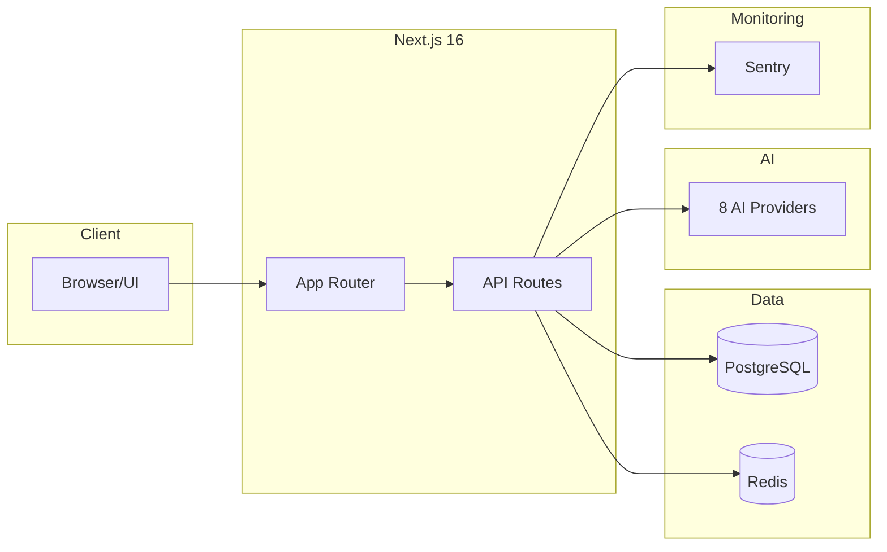

# Next.js AI Chatbot

Modern AI chat application with multi-provider support, real-time streaming, and enterprise observability.

## Quick Start

```bash
# Clone and install
git clone https://github.com/nicxkms/nextjs-ai-chatbot.git
cd nextjs-ai-chatbot
pnpm install

# Configure environment
cp .env.example .env.local
# Add required keys (see Environment Variables below)

# Start development server
pnpm dev
```

## Technology Stack

| Layer          | Technology                     |
| -------------- | ------------------------------ |
| **Framework**  | Next.js 16 with App Router     |
| **Runtime**    | React 19                       |
| **Database**   | PostgreSQL via Drizzle ORM     |
| **Cache**      | Upstash Redis                  |
| **Auth**       | Supabase JWT + Guest Sessions  |
| **AI**         | Vercel AI SDK with 8 providers |
| **Monitoring** | Sentry + OpenTelemetry         |
| **UI**         | shadcn/ui + Tailwind CSS       |



## Environment Variables

| Variable                  | Required    | Description                      |
| ------------------------- | ----------- | -------------------------------- |
| `DATABASE_URL`            | Yes         | PostgreSQL connection string     |
| `CACHE_KV_REST_API_URL`   | Yes         | Upstash Redis REST URL           |
| `CACHE_KV_REST_API_TOKEN` | Yes         | Upstash Redis token              |
| `SUPABASE_JWT_SECRET`     | Yes         | Supabase JWT verification secret |
| `GUEST_JWT_SECRET`        | Yes         | Guest session signing secret     |
| `GEMINI_API_KEY`          | Recommended | Google Gemini API key            |
| `OPENAI_API_KEY`          | Optional    | OpenAI API key                   |
| `OPENROUTER_API_KEY`      | Optional    | OpenRouter API key               |
| `SENTRY_DSN`              | Optional    | Sentry monitoring DSN            |
| `NEXT_PUBLIC_SENTRY_DSN`  | Optional    | Sentry client DSN                |

## Architecture Overview

```
┌─────────────────────────────────────────────────────────────┐
│                       Next.js App                            │
├─────────────┬─────────────┬─────────────┬──────────────────┤
│   Pages     │  Components │  API Routes │   Middleware     │
└──────┬──────┴──────┬──────┴──────┬──────┴────────┬─────────┘
       │             │             │               │
       ▼             ▼             ▼               ▼
┌─────────────────────────────────────────────────────────────┐
│                     Data Layer (lib/)                        │
├─────────────┬─────────────┬─────────────┬──────────────────┤
│  lib/data   │  lib/cache  │   lib/db    │    lib/ai        │
│  (unified)  │  (Redis)    │  (Drizzle)  │   (providers)    │
└──────┬──────┴──────┬──────┴──────┬──────┴────────┬─────────┘
       │             │             │               │
       ▼             ▼             ▼               ▼
┌─────────────┐ ┌─────────────┐ ┌─────────────┐ ┌─────────────┐
│  PostgreSQL │ │   Upstash   │ │  AI Models  │ │   Sentry    │
│   (Neon)    │ │   Redis     │ │  (8 provs)  │ │   + OTEL    │
└─────────────┘ └─────────────┘ └─────────────┘ └─────────────┘
```

## Key Features

- **Multi-Provider AI**: 30+ models from OpenAI, Google, Anthropic, DeepSeek, xAI, Meta
- **Real-time Streaming**: Server-sent events with non-blocking persistence
- **Dual User Support**: Authenticated (DB) and Guest (cache-only) users
- **Document Artifacts**: Text, code, image, and sheet generation
- **Cache-First Architecture**: Redis ZSET with Lua scripts for O(1) operations
- **Enterprise Monitoring**: Sentry error tracking with performance traces

## Documentation

| Guide                               | Description                     |
| ----------------------------------- | ------------------------------- |
| [Architecture](./architecture.md)   | System design and data flows    |
| [API Reference](./api-reference.md) | Complete endpoint documentation |
| [Database](./database.md)           | Schema and cache patterns       |
| [Deployment](./deployment.md)       | Production setup                |

## Development

```bash
pnpm dev          # Start development server
pnpm build        # Build for production
pnpm db:push      # Push schema to database
pnpm db:studio    # Open Drizzle Studio
pnpm lint         # Run linter
pnpm test         # Run tests
```

## License

MIT License - see [LICENSE](../LICENSE)
