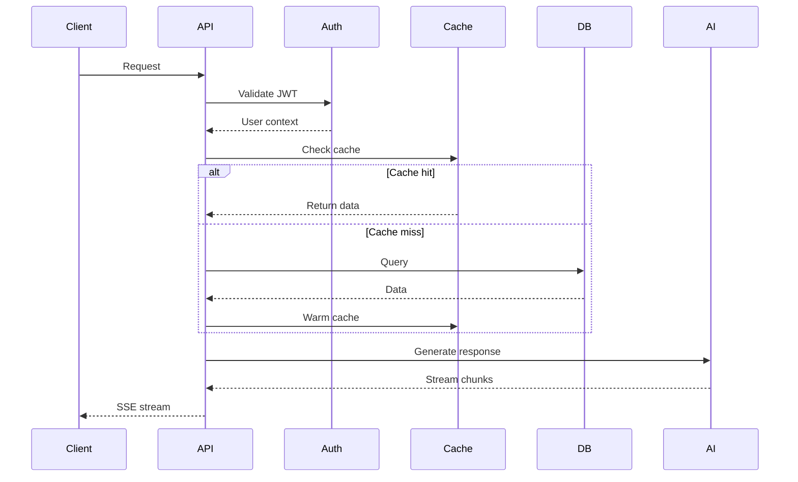

# API Reference

Complete API endpoint documentation with request/response schemas.

## Base URLs

| Environment | URL                     |
| ----------- | ----------------------- |
| Development | `http://localhost:3000` |
| Production  | Your deployment URL     |

## Authentication

### Supabase JWT (Authenticated Users)

```http
Cookie: sb-access-token=<jwt>
```

JWT verified against `SUPABASE_JWT_SECRET`.

### Guest JWT (Guest Users)

```http
Cookie: guest_token=<jwt>
```

Auto-created on first visit. 7-day TTL.

## API Flow



---

## Chat Endpoints

### POST /api/chat

Send message and receive streaming response.

**Request:**

```json
{
  "id": "chat-uuid",
  "message": {
    "role": "user",
    "content": "Hello!",
    "parts": [{ "type": "text", "text": "Hello!" }],
    "attachments": []
  },
  "selectedChatModel": "google:gemini-2.5-flash",
  "selectedVisibilityType": "private"
}
```

**Response:** Server-Sent Events stream

```
data: {"type":"text-delta","textDelta":"Hello"}
data: {"type":"text-delta","textDelta":"!"}
data: {"type":"finish","finishReason":"stop"}
```

**Event Types:**

| Type          | Description              |
| ------------- | ------------------------ |
| `text-delta`  | Incremental text         |
| `reasoning`   | Model thinking/reasoning |
| `tool-call`   | Tool invocation          |
| `tool-result` | Tool response            |
| `finish`      | Stream complete          |
| `error`       | Error occurred           |

---

### DELETE /api/chat

Delete a chat and all messages.

**Request:**

```json
{
  "id": "chat-uuid"
}
```

**Response:**

```json
{
  "success": true
}
```

---

## History Endpoints

### GET /api/history

Get paginated chat list.

**Query Parameters:**

| Parameter | Type   | Default | Description                             |
| --------- | ------ | ------- | --------------------------------------- |
| `limit`   | number | 20      | Max chats to return (1-100)             |
| `cursor`  | string | -       | Pagination cursor (updatedAt timestamp) |

**Response:**

```json
{
  "chats": [
    {
      "id": "chat-uuid",
      "title": "Chat Title",
      "visibility": "private",
      "createdAt": "2024-01-15T10:30:00Z",
      "updatedAt": "2024-01-15T11:00:00Z"
    }
  ],
  "hasMore": true,
  "nextCursor": "2024-01-14T15:20:00Z"
}
```

---

## Document Endpoints

### GET /api/document

Get document by ID.

**Query Parameters:**

| Parameter | Type   | Required |
| --------- | ------ | -------- |
| `id`      | string | Yes      |

**Response:**

```json
{
  "id": "doc-uuid",
  "title": "Document Title",
  "content": "Document content",
  "kind": "text",
  "userId": "user-uuid",
  "chatId": "chat-uuid",
  "createdAt": "2024-01-15T10:30:00Z"
}
```

### POST /api/document

Create or update document.

**Request:**

```json
{
  "id": "doc-uuid",
  "title": "Document Title",
  "content": "Document content",
  "kind": "text"
}
```

---

## File Endpoints

### POST /api/files/upload

Upload file attachment.

**Request:** `multipart/form-data`

| Field  | Type | Description      |
| ------ | ---- | ---------------- |
| `file` | File | Binary file data |

**Response:**

```json
{
  "url": "https://blob.vercel-storage.com/...",
  "pathname": "attachments/file.pdf",
  "contentType": "application/pdf"
}
```

---

## Vote Endpoints

### POST /api/vote

Vote on assistant message (authenticated only).

**Request:**

```json
{
  "chatId": "chat-uuid",
  "messageId": "message-uuid",
  "type": "up"
}
```

**Response:**

```json
{
  "success": true
}
```

---

## Suggestion Endpoints

### GET /api/suggestions

Get AI suggestions for document.

**Query Parameters:**

| Parameter    | Type   | Required |
| ------------ | ------ | -------- |
| `documentId` | string | Yes      |

---

## Health Endpoints

### GET /api/health

System health check for monitoring.

**Response (200 - Healthy):**

```json
{
  "status": "healthy",
  "timestamp": "2024-01-15T10:30:00Z",
  "uptime": 3600,
  "components": {
    "cache": { "status": "healthy" },
    "connectionPool": { "status": "healthy" }
  }
}
```

**Response (503 - Degraded):**

```json
{
  "status": "degraded",
  "timestamp": "2024-01-15T10:30:00Z",
  "components": {
    "cache": { "status": "unhealthy", "message": "Connection failed" }
  }
}
```

---

## Error Responses

### Error Format

```json
{
  "code": "rate_limit:chat:daily_limit_exceeded",
  "message": "Daily message limit exceeded",
  "statusCode": 429
}
```

### Common Error Codes

| Code                                   | Status | Description       |
| -------------------------------------- | ------ | ----------------- |
| `unauthorized:chat:missing_session`    | 401    | No valid session  |
| `forbidden:chat:owner_mismatch`        | 403    | Not chat owner    |
| `not_found:chat`                       | 404    | Chat not found    |
| `rate_limit:chat:daily_limit_exceeded` | 429    | Quota exceeded    |
| `bad_request:api:invalid_json`         | 400    | Invalid JSON body |
| `internal:database:query_failed`       | 500    | Database error    |

---

## Rate Limiting

| User Type     | Daily Limit  |
| ------------- | ------------ |
| Authenticated | 100 messages |
| Guest         | 20 messages  |

Tracked via Redis counter: `user:{userId}:msg_count:{date}`
