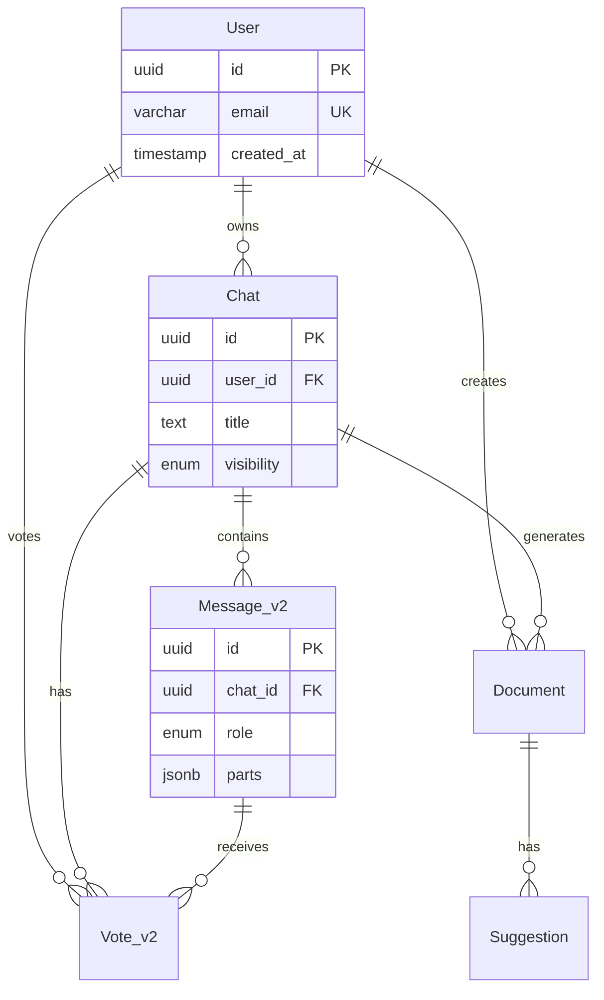

# Database & Cache Schema

PostgreSQL schema, Redis patterns, and data layer operations.

## Database Schema

### Tables Overview

| Table      | Purpose           | Primary Key                              |
| ---------- | ----------------- | ---------------------------------------- |
| User       | Application users | `id` (UUID)                              |
| Chat       | Conversations     | `id` (UUID)                              |
| Message_v2 | Chat messages     | `id` (UUID)                              |
| Vote_v2    | Message feedback  | Composite (chat_id, message_id, user_id) |
| Document   | Artifacts         | Composite (id, created_at)               |
| Suggestion | Edit suggestions  | `id` (UUID)                              |



---

### User Table

```sql
CREATE TABLE "User" (
  id UUID PRIMARY KEY DEFAULT gen_random_uuid(),
  email VARCHAR(128) UNIQUE NOT NULL,
  password_hash VARCHAR(128),
  created_at TIMESTAMP WITH TIME ZONE DEFAULT NOW() NOT NULL,
  last_login TIMESTAMP WITH TIME ZONE
);
```

**Notes:**

- Guest users created with synthetic email for FK integrity
- `password_hash` is legacy (auth via Supabase)

---

### Chat Table

```sql
CREATE TABLE "Chat" (
  id UUID PRIMARY KEY DEFAULT gen_random_uuid(),
  created_at TIMESTAMP WITH TIME ZONE DEFAULT NOW() NOT NULL,
  updated_at TIMESTAMP WITH TIME ZONE DEFAULT NOW() NOT NULL,
  title TEXT NOT NULL DEFAULT 'New Chat',
  user_id UUID NOT NULL REFERENCES "User"(id) ON DELETE CASCADE,
  visibility visibility_enum NOT NULL DEFAULT 'private',
  last_context JSONB
);

CREATE INDEX chat_user_created_idx ON "Chat"(user_id, created_at);
```

**Enums:**

- `visibility`: `public`, `private`

---

### Message_v2 Table

```sql
CREATE TABLE "Message_v2" (
  id UUID PRIMARY KEY DEFAULT gen_random_uuid(),
  chat_id UUID NOT NULL REFERENCES "Chat"(id) ON DELETE CASCADE,
  role role_enum NOT NULL,
  parts JSONB NOT NULL,
  attachments JSONB NOT NULL,
  created_at TIMESTAMP WITH TIME ZONE DEFAULT NOW() NOT NULL
);

CREATE INDEX message_chat_created_idx ON "Message_v2"(chat_id, created_at);
CREATE INDEX message_chat_created_role_idx ON "Message_v2"(chat_id, created_at, role);
```

**Enums:**

- `role`: `user`, `assistant`, `system`

**Parts Format (AI SDK):**

```json
[
  {"type": "text", "text": "Hello!"},
  {"type": "tool-call", "toolName": "weather", "args": {...}},
  {"type": "tool-result", "toolName": "weather", "result": {...}},
  {"type": "reasoning", "reasoning": "..."}
]
```

---

### Vote_v2 Table

```sql
CREATE TABLE "Vote_v2" (
  chat_id UUID NOT NULL REFERENCES "Chat"(id) ON DELETE CASCADE,
  message_id UUID NOT NULL REFERENCES "Message_v2"(id) ON DELETE CASCADE,
  user_id UUID NOT NULL REFERENCES "User"(id) ON DELETE CASCADE,
  is_upvoted BOOLEAN NOT NULL DEFAULT true,
  PRIMARY KEY (chat_id, message_id, user_id)
);
```

**Notes:**

- Database-only feature (not cached)
- Not available for guest users

---

### Document Table

```sql
CREATE TABLE "Document" (
  id UUID NOT NULL DEFAULT gen_random_uuid(),
  created_at TIMESTAMP WITH TIME ZONE DEFAULT NOW() NOT NULL,
  title TEXT NOT NULL,
  content TEXT,
  kind document_kind_enum NOT NULL DEFAULT 'text',
  user_id UUID NOT NULL REFERENCES "User"(id) ON DELETE CASCADE,
  chat_id UUID NOT NULL REFERENCES "Chat"(id) ON DELETE CASCADE,
  updated_at TIMESTAMP WITH TIME ZONE DEFAULT NOW() NOT NULL,
  PRIMARY KEY (id, created_at)
);

CREATE INDEX document_user_idx ON "Document"(user_id);
CREATE INDEX document_chat_idx ON "Document"(chat_id);
```

**Enums:**

- `kind`: `text`, `code`, `image`, `sheet`

---

### Suggestion Table

```sql
CREATE TABLE "Suggestion" (
  id UUID PRIMARY KEY DEFAULT gen_random_uuid(),
  document_id UUID NOT NULL,
  document_created_at TIMESTAMP WITH TIME ZONE NOT NULL,
  original_text TEXT NOT NULL,
  suggested_text TEXT NOT NULL,
  description TEXT,
  is_resolved BOOLEAN NOT NULL DEFAULT false,
  user_id UUID NOT NULL REFERENCES "User"(id) ON DELETE CASCADE,
  created_at TIMESTAMP WITH TIME ZONE DEFAULT NOW() NOT NULL,
  FOREIGN KEY (document_id, document_created_at) REFERENCES "Document"(id, created_at)
);

CREATE INDEX suggestion_doc_idx ON "Suggestion"(document_id);
```

---

## Redis Cache Schema

### Key Patterns

| Pattern                          | Type   | Purpose                    |
| -------------------------------- | ------ | -------------------------- |
| `chat:{chatId}:{userId}:meta`    | String | Chat metadata              |
| `chat:{chatId}:{userId}:msgs`    | ZSET   | Messages (score=timestamp) |
| `user:{userId}:chats`            | ZSET   | User's chat list           |
| `document:{docId}:{userId}`      | String | Document with versions     |
| `user:{userId}:msg_count:{date}` | String | Daily message counter      |

### Chat Metadata

```typescript
type CachedChatMeta = {
  id: string;
  userId: string;
  title: string;
  visibility: "public" | "private";
  createdAt: string; // ISO 8601
  updatedAt: string;
  lastContext: AppUsage | null;
  version: number; // Optimistic locking
};
```

### Message Storage (ZSET)

Messages stored as ZSET with timestamp scores:

```
Key: chat:{chatId}:{userId}:msgs
Score: 1704067200001 (ms timestamp + role offset)
Member: {"id":"...","role":"user","parts":[...],"createdAt":"..."}
```

**Performance:**

| Operation              | Complexity   |
| ---------------------- | ------------ |
| Append message         | O(log N)     |
| Get all messages       | O(N)         |
| Get last N             | O(log N + N) |
| Delete after timestamp | O(log N + M) |

---

## Connection Pooling

Environment-aware configuration:

```typescript
const getPoolConfig = () => {
  if (process.env.VERCEL_FLUID === "1") {
    return { max: 5, idle_timeout: 10 }; // Fluid Compute
  }
  if (process.env.NODE_ENV === "production") {
    return { max: 10, idle_timeout: 20 }; // Production
  }
  return { max: 3, idle_timeout: 30 }; // Development
};
```

**Source:** [lib/db/queries.ts](file:///f:/Study/Code/git/nextjs-ai-chatbot/lib/db/queries.ts)

---

## Cache Operations

### Atomic Lua Scripts

Used for atomic multi-key updates:

1. **Message Append** - Check existence + ZADD + update ZSET
2. **Bulk Append** - Multiple messages in single operation
3. **Metadata Update** - GET + modify + SET atomically

### Batch Operations

```typescript
await batchUpdateChatCache({
  chatId,
  userId,
  messages: [...],
  lastContext: {...},
  title: "...",
});
```

**Source:** [lib/cache/batch-operations.ts](file:///f:/Study/Code/git/nextjs-ai-chatbot/lib/cache/batch-operations.ts)

---

## Supabase Trigger

For Supabase Auth sync, apply this trigger:

```sql
-- See docs/supabase-trigger.sql
CREATE OR REPLACE FUNCTION public.handle_new_user()
RETURNS TRIGGER AS $$
BEGIN
  INSERT INTO public."User" (id, email)
  VALUES (NEW.id, NEW.email)
  ON CONFLICT (id) DO NOTHING;
  RETURN NEW;
END;
$$ LANGUAGE plpgsql SECURITY DEFINER;

CREATE TRIGGER on_auth_user_created
  AFTER INSERT ON auth.users
  FOR EACH ROW
  EXECUTE FUNCTION public.handle_new_user();
```
