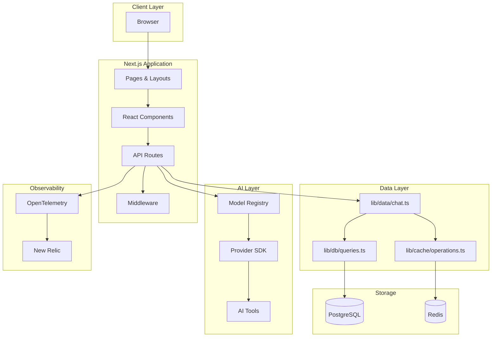
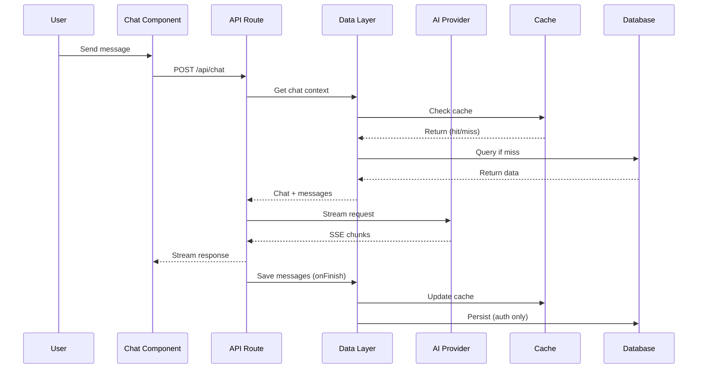

# System Architecture

System design, data flows, and component interactions.

## High-Level Architecture



## Data Flow Patterns

### Cache-First Strategy

All data access follows cache-first pattern:

```
1. Check Redis cache
2. Cache hit → Return immediately
3. Cache miss → Query PostgreSQL
4. Warm cache in background (non-blocking)
5. Return data
```

**Implementation:** [lib/data/chat.ts](file:///f:/Study/Code/git/nextjs-ai-chatbot/lib/data/chat.ts)

### Authenticated vs Guest Users

| Aspect           | Authenticated             | Guest                 |
| ---------------- | ------------------------- | --------------------- |
| User ID          | Supabase UUID             | `guest:{uuid}`        |
| Session          | Supabase JWT (via cookie) | Guest JWT (7-day TTL) |
| Chat Storage     | PostgreSQL + Redis        | Redis only            |
| Message Storage  | PostgreSQL + Redis        | Redis only            |
| Document Storage | PostgreSQL + Redis        | Redis only            |
| Voting           | Available                 | Not available         |
| Suggestions      | Available                 | Not available         |

**Implementation:** [lib/auth/session.ts](file:///f:/Study/Code/git/nextjs-ai-chatbot/lib/auth/session.ts)

## Component Architecture

### Chat Flow



### Streaming Pipeline

Non-blocking persistence with `createUIMessageStream`:

```typescript
// Simplified flow from app/(chat)/api/chat/route.ts
const stream = createUIMessageStream({
  execute: async ({ writer }) => {
    await streamText({
      model,
      messages,
      onFinish: async (result) => {
        // Non-blocking persistence
        await messageData.saveWithContext(data, ctx);
      },
    });
  },
});
```

## AI Provider Integration

### Provider Registry

Dynamic model registration based on environment:

| Provider              | Env Variable                   | Models                   |
| --------------------- | ------------------------------ | ------------------------ |
| OpenAI                | `OPENAI_API_KEY`               | GPT-4o, o3-mini, GPT-4.1 |
| Google                | `GOOGLE_GENERATIVE_AI_API_KEY` | Gemini 3.0, 2.5 family   |
| OpenRouter            | `OPENROUTER_API_KEY`           | Claude, DeepSeek, Qwen   |
| Cloudflare Workers    | `CLOUDFLARE_API_KEY`           | Llama 3.3                |
| Cloudflare AI Gateway | `CLOUDFLARE_AI_GATEWAY_*`      | Multi-provider fallback  |
| Vercel Gateway        | `AI_GATEWAY_API_KEY`           | Routed models            |

**Implementation:** [lib/ai/model-registry.ts](file:///f:/Study/Code/git/nextjs-ai-chatbot/lib/ai/model-registry.ts)

### Reasoning Model Support

Models with thinking/reasoning extract chain-of-thought:

| Reasoning Type       | Providers    | Tag Name     |
| -------------------- | ------------ | ------------ |
| `openai-thinking`    | OpenAI o1/o3 | `<think>`    |
| `anthropic-thinking` | Claude       | `<thinking>` |
| `gemini-thinking`    | Gemini       | `<think>`    |
| `deepseek-thinking`  | DeepSeek R1  | `<think>`    |

**Implementation:** [lib/ai/providers.ts](file:///f:/Study/Code/git/nextjs-ai-chatbot/lib/ai/providers.ts)

## Error Handling

### Structured Error Codes

Format: `{type}:{surface}:{reason}`

| Type           | HTTP Status | Description      |
| -------------- | ----------- | ---------------- |
| `bad_request`  | 400         | Invalid input    |
| `unauthorized` | 401         | Missing auth     |
| `forbidden`    | 403         | Access denied    |
| `not_found`    | 404         | Resource missing |
| `rate_limit`   | 429         | Quota exceeded   |
| `internal`     | 500         | Server error     |

| Surface    | Description      |
| ---------- | ---------------- |
| `chat`     | Chat operations  |
| `auth`     | Authentication   |
| `database` | DB operations    |
| `api`      | API validation   |
| `stream`   | Streaming errors |

**Implementation:** [lib/errors.ts](file:///f:/Study/Code/git/nextjs-ai-chatbot/lib/errors.ts)

## Performance Optimizations

| Optimization        | Impact             | Location                        |
| ------------------- | ------------------ | ------------------------------- |
| Redis ZSET messages | O(log N) append    | `lib/cache/operations.ts`       |
| Lua scripts         | Atomic operations  | `lib/cache/operations.ts`       |
| Batch cache updates | Single round-trip  | `lib/cache/batch-operations.ts` |
| Connection pooling  | Environment-aware  | `lib/db/queries.ts`             |
| Static tool imports | Faster first token | `app/(chat)/api/chat/route.ts`  |
| Suspense boundaries | Non-blocking UI    | `app/(chat)/`                   |
