# Authenticated Chat Data Flow (isGuest === false)

This reference drills into every client, server, database, and cache touchpoint involved when an authenticated (non-guest) user sends a chat message and receives the streamed model response. File citations follow the `@filepath#lineStart-lineEnd` format.

---

## 1. Identity, session, and entitlement context

1. **Supabase Auth**: Email/password login and registration are handled client-side via `supabase.auth.signInWithPassword` and `supabase.auth.signUp`. On success, the access token is POSTed to `/api/auth/exchange`, which stores it in the `sb-access-token` httpOnly cookie. `getSupabaseSessionFromCookies()` decodes this JWT into an `AppSession` with `session.user` annotated as `{ id, type: "regular", email }`. @app/(auth)/login/page.tsx#12-47@app/(auth)/register/page.tsx#12-53@app/api/auth/exchange/route.ts#1-35@lib/auth/session.ts#64-118
   - **Expected latency:** One Supabase Auth round trip for login plus a lightweight `/api/auth/exchange` call; both are HTTP-only and independent of the app’s Postgres instance. @app/(auth)/login/page.tsx#28-47
   - **Compute requirements:** O(1) JWT verification and cookie serialization; no bcrypt work or user-table lookups are necessary during authentication. @lib/auth/session.ts#64-118
2. **Session to DataContext**: `createContext(session)` produces `{ userId: session.user.id, isGuest: false }`, forming the foundation for all DAL invocations. @lib/data/base.ts#30-39
   - **Expected latency:** Synchronous object construction; effectively zero additional latency. @lib/data/base.ts#30-39
   - **Compute requirements:** O(1) property mapping. @lib/data/base.ts#30-39
3. **Entitlements**: `entitlementsByUserType.regular` grants `maxMessagesPerDay = 100` and exposes all registered chat models (`listChatModels()`), shaping quota enforcement later. @lib/ai/entitlements.ts#11-31
   - **Expected latency:** Direct constant-time lookup from in-memory configuration. @lib/ai/entitlements.ts#11-31
   - **Compute requirements:** O(1) property access; no dynamic computation. @lib/ai/entitlements.ts#11-31
4. **Redis optionality**: Auth flows continue even if `isRedisAvailable()` resolves false—DB fallbacks supply data, though cache acceleration is preferred. @app/(chat)/api/chat/route.ts#134-140
   - **Expected latency:** `isRedisAvailable()` may execute a Redis PING (single RTT) when availability is unknown; otherwise resolves immediately. @app/(chat)/api/chat/route.ts#134-140
   - **Compute requirements:** O(1) boolean check and promise resolution. @app/(chat)/api/chat/route.ts#134-140

---

## 2. Client component initialization (shared foundation)

### 2.1. Base component wiring

Identical to the guest flow:

| Concern | Hook/Component | Notes | Expected Latency | Compute Characteristics |
|---------|----------------|-------|------------------|-------------------------|
| Props | `Chat` component receives chat metadata, messages, visibility, models, votes. @components/chat.tsx#40-58 | Provided via server-rendered payload; hydration aligns client state. | No additional latency after SSR; props already embedded in HTML/JSON payload. | O(1) prop read during render; cost proportional to number of initial messages already deserialized server-side. @components/chat.tsx#40-58 |
| Visibility state | `useChatVisibility` manages optimistic visibility toggles, using SWR internally. @components/chat.tsx#59-62 | | Hook init synchronous; SWR revalidation triggers HTTP GET with latency equal to API round trip. | O(1) hook setup; revalidation JSON parse scales with number of visibility fields returned (constant). @components/chat.tsx#59-62 |
| Streaming artifacts | `useDataStream` provides context for streaming tool output. @components/chat.tsx#64-65@components/data-stream-provider.tsx#18-32 | | Context lookup synchronous; SSE chunk latency bound by network streaming cadence. | O(1) context retrieval; per-chunk processing constant time. @components/data-stream-provider.tsx#18-32 |
| Settings | `useSettingsSnapshot` surfaces sampling + reasoning toggles. @components/chat.tsx#65-66 | | Snapshot read synchronous; negligible latency. | O(1) shallow copy of settings object. @components/chat.tsx#65-66 |
| Optimistic list | `useOptimisticChats` manages optimistic chat entries. @components/chat.tsx#67-70@hooks/use-optimistic-chats.tsx#30-87 | | Context subscription synchronous; optimistic updates execute within React event cycle. | O(1) hook init; list mutations iterate over chats (O(n_chats)). @hooks/use-optimistic-chats.tsx#30-87 |
| Local UI state | `input`, `usage`, `showCreditCardAlert`, `currentModelId`, `currentModelIdRef`. @components/chat.tsx#72-107 | | State initialization occurs during render; updates propagate on subsequent renders. | O(1) state/ref allocations; updates involve string copies proportional to input length. @components/chat.tsx#72-107 |

### 2.2. Transport, throttling, and side effects

Authenticated flows reuse the identical `useChat` setup documented for guests, with the following latency and compute guarantees: @components/chat.tsx#108-235

1. `optimalThrottle` memoizes transport pacing based on `navigator.connection.effectiveType`. @components/chat.tsx#108-120
   - **Expected latency:** Pure computation in the browser; resolves immediately without I/O. @components/chat.tsx#108-120
   - **Compute requirements:** O(1) branching across connection types. @components/chat.tsx#108-120
2. `useChat<ChatMessage>` initialization loads `initialMessages`, derives transport references, and wires handlers. @components/chat.tsx#122-235
   - **Expected latency:** Hook initialization occurs during render; no asynchronous work until the first `sendMessage` call. @components/chat.tsx#122-235
   - **Compute requirements:** O(n_initial_messages)` to clone initial state (already deserialized server-side), plus constant-time registration of callbacks. @components/chat.tsx#122-235
3. `DefaultChatTransport` with `fetchWithErrorHandlers` and `prepareSendMessagesRequest` orchestrates network calls. @components/chat.tsx#128-143@lib/utils.ts#40-72
   - **Expected latency:** Object construction synchronous; outbound request latency equals HTTPS round trip plus server processing. Error handler adds negligible overhead before delegating to `fetch`. @lib/utils.ts#40-72
   - **Compute requirements:** O(1) instantiation; request preparation walks only the most recent message (O(parts_count)). Error handling parses JSON payloads proportional to response size on failure. @components/chat.tsx#132-140
4. Side effects (`useEffect` synchronizing optimistic chats, query bootstrapping, vote fetching) mirror the guest flow. @components/chat.tsx#237-282
   - **Expected latency:** Effects execute after render; network-bound effects (votes SWR) incur single GET request with latency equal to API RTT. @components/chat.tsx#272-282
   - **Compute requirements:** Mostly O(1) array updates; SWR response handling parses JSON proportional to number of votes. @components/chat.tsx#272-282

Authenticated users benefit from DB-backed `initialMessages`, but the client-side work remains identical to the guest pathway.

### 2.3. Multimodal input + message assembly

Unchanged from guest documentation: attachments, local storage draft caching, message submission, and file upload pipeline. @components/multimodal-input.tsx#49-239@lib/types.ts#11-53

---

## 3. API intake (`POST /api/chat`)

### 3.1. Validation and session enforcement

1. Parse JSON, validate with `postRequestBodySchema`, handle malformed payloads via `ChatSDKError("bad_request:api:invalid_json")`. @app/(chat)/api/chat/route.ts#97-107
   - **Expected latency:** Single event-loop operation; JSON parse cost is proportional to payload size before any external I/O occurs. @app/(chat)/api/chat/route.ts#97-107
   - **Compute requirements:** O(payload_bytes) JSON decode plus schema traversal touching every message part. @app/(chat)/api/chat/schema.ts#1-48
2. Pull `id`, `message`, `selectedChatModel`, `selectedVisibilityType`. @app/(chat)/api/chat/route.ts#108-119
   - **Expected latency:** Synchronous destructuring; negligible. @app/(chat)/api/chat/route.ts#108-119
   - **Compute requirements:** O(1) property extraction. @app/(chat)/api/chat/route.ts#108-119
3. Run `auth()`; absence yields `unauthorized:chat:missing_session`. @app/(chat)/api/chat/route.ts#123-129
   - **Expected latency:** Depends on session storage; usually one database or Redis lookup plus JWT verification. Latency equals backing store round trip. @app/(chat)/api/chat/route.ts#123-129
   - **Compute requirements:** O(1) token verification/bcrypt comparisons, plus constant-time cookie parsing. @app/(chat)/api/chat/route.ts#123-129
4. Build `ctx = createContext(session)` setting `isGuest: false`. @app/(chat)/api/chat/route.ts#131-133@lib/data/base.ts#30-39
   - **Expected latency:** Synchronous object creation; negligible. @lib/data/base.ts#30-39
   - **Compute requirements:** O(1) property mapping. @lib/data/base.ts#30-39
5. Redis availability guard is skipped because authenticated users can fall back to Postgres.

### 3.2. Prefetch tasks and entitlement gate

Executed in parallel: @app/(chat)/api/chat/route.ts#142-148

| Task | Implementation | Purpose | Expected Latency | Compute Characteristics |
|------|----------------|---------|------------------|-------------------------|
| Message quota check | `getMessageCountByUserId({ id: session.user.id, differenceInHours: 24 })` counts user messages joined through `chat` ownership. @lib/db/queries.ts#136-168 | Ensures daily volume within `entitlementsByUserType.regular.maxMessagesPerDay` (100). | Single SQL query transiting the Postgres connection; latency equals one DB round trip and depends on row count filtered by the 24-hour window. @lib/db/queries.ts#136-168 | Database performs COUNT with joins; cost proportional to number of qualifying messages (O(n_recent_messages)). Server-side overhead limited to awaiting the query. @lib/db/queries.ts#136-168 |
| Chat retrieval | `chatData.getWithMessages(chatId, ctx)` | Retrieves chat + messages from cache or DB fallback (detailed below). | Cache hit: one Redis GET (single RTT). Cache miss: DB query (chat table) + message fetch (ordered select) followed by optional asynchronous cache warm. @lib/data/chat.ts#149-220 | Cache hit cost O(n_cached_messages) to deserialize JSON. Cache miss involves O(1) chat lookup + O(n_messages_db) to materialize rows; optional cache warm serializes messages once. @lib/data/chat.ts#149-220 |

If quota exceeded, respond with `rate_limit:chat:daily_limit_exceeded`. @app/(chat)/api/chat/route.ts#150-160
  - **Compute requirements:** O(1) comparison of integer counts before returning error response. @app/(chat)/api/chat/route.ts#150-160

### 3.3. Chat retrieval with DB fallback

`chatData.getWithMessages(chatId, ctx)` steps: @lib/data/chat.ts#149-220

1. If Redis available:
   - `getChatFromCache(chatId, ctx.userId)` obtains cached metadata + messages.
   - On hit, convert cached timestamps -> `Date` and return immediately.
     - **Expected latency:** Single Redis GET (~one RTT) plus JSON parse. @lib/data/chat.ts#154-200
     - **Compute requirements:** O(n_cached_messages) to coerce timestamps and build return objects. @lib/data/chat.ts#154-200
2. If cache miss and user is authenticated:
   - Query `chat` table for matching `id`.
   - If not found, return `null`.
   - Query `message` table for all messages within the chat, ordered ascending by `createdAt`.
   - If Redis available and chat belongs to user, call `warmChatCache(chatId, ctx.userId, chatFromDb, messagesFromDb)` asynchronously to populate cache.
     - **Expected latency:** Two DB queries (chat row + ordered messages); latency equals sum of query execution times over Postgres connection. Asynchronous cache warm happens in background without blocking response. @lib/data/chat.ts#200-220
     - **Compute requirements:** DB performs O(1) primary-key lookup and O(n_messages_db) ordered select; server maps rows to objects and schedules optional cache warm (serialization O(n_messages_db)). @lib/data/chat.ts#200-220

### 3.4. Ownership and new-chat branching

1. If `chat` exists but `chat.userId !== session.user.id`, abort with `forbidden:chat:owner_mismatch`. @app/(chat)/api/chat/route.ts#169-174
   - **Expected latency:** Synchronous conditional check; negligible latency. @app/(chat)/api/chat/route.ts#169-174
   - **Compute requirements:** O(1) UUID/string comparison. @app/(chat)/api/chat/route.ts#169-174
2. If `chat` missing:
   - Build `placeholderTitle` from user message text (same logic as guest). @app/(chat)/api/chat/route.ts#176-188
     - **Expected latency:** Pure string manipulation; no I/O. @app/(chat)/api/chat/route.ts#176-188
     - **Compute requirements:** O(len(text_first_part)) trimming and slicing. @app/(chat)/api/chat/route.ts#176-188
   - Invoke `chatData.create({ id, title, visibility: selectedVisibilityType, skipCache: true }, ctx)`:
     * Assemble `newChat` with timestamps + metadata.
     * Insert into `chat` table (`db.insert(chat).values(newChat)`).
     * Conditional cache write (skipped here because `skipCache: true`).
     * Return the created chat; capture `chatCreatedAt` for later persistence.
     @app/(chat)/api/chat/route.ts#191-203@lib/data/chat.ts#378-425
     - **Expected latency:** One Postgres insert (single RTT); no cache writes because `skipCache: true`. @lib/data/chat.ts#378-425
     - **Compute requirements:** O(1) server object construction; database handles insert with cost proportional to log writing/index updates. @lib/data/chat.ts#378-425
   - Set `isNewChat = true`.
     - **Expected latency:** Single assignment; negligible. @app/(chat)/api/chat/route.ts#207
     - **Compute requirements:** O(1) flag set. @app/(chat)/api/chat/route.ts#207

### 3.5. Context assembly for model invocation

Same as guest flow—`convertToUIMessages`, `geolocation`, optional title generation, metadata + tool preparation. @app/(chat)/api/chat/route.ts#209-328@lib/utils.ts#131-143

---

## 4. Streaming execution (shared pipeline)

`createUIMessageStream`, `streamTextOptions`, tool enablement, provider options, telemetry, and SSE piping are identical to the guest process (see guest document §6 for per-step latency and compute analysis). @app/(chat)/api/chat/route.ts#224-522@lib/ai/providers.ts#39-94

---

## 5. Completion processing and persistence

### 5.1. Message normalization

`onFinish` constructs `userMessage` + assistant messages with appended `{ type: "model", id: selectedModelId }`, assigns `createdAt`, and collects them into `messagesToSave`, same as guest flow. @app/(chat)/api/chat/route.ts#439-495
  - **Expected latency:** Synchronous object transforms executed immediately after stream completion; latency scales with number of streamed assistant messages. @app/(chat)/api/chat/route.ts#439-495
  - **Compute requirements:** O(total_messages × parts_count)` for appending metadata; identical to guest flow mechanics. @app/(chat)/api/chat/route.ts#439-495

### 5.2. Invoking `messageData.saveWithContext`

Call signature mirrors guest flow but adds durable persistence: @app/(chat)/api/chat/route.ts#497-509

```ts
await messageData.saveWithContext(
  {
    messages: messagesToSave,
    chatId: id,
    lastContext: finalMergedUsage,
    isNewChat,
    title: finalTitle,
    visibility: selectedVisibilityType,
    createdAt: chatCreatedAt,
  },
  ctx,
);
```

Errors during persistence log warnings but do not bubble (to preserve streaming UX). @app/(chat)/api/chat/route.ts#510-515
  - **Expected latency:** Database insert and update occur before response resolves; latency equals Redis round trips (if available) plus Postgres insert/update duration. @lib/data/chat.ts#870-983
  - **Compute requirements:** DB writes scale with number of messages (batch insert O(n_messages)); cache update duplicates guest flow cost. Additional CPU for serializing messages to Redis + applying Drizzle queries. @lib/data/chat.ts#870-983

---

## 6. Authenticated persistence internals (`messageData.saveWithContext`)

`messageData.saveWithContext` branches when `ctx.isGuest === false`: @lib/data/chat.ts#870-983

1. Convert each message to `CachedMessage` (string timestamps) for eventual cache writes. @lib/data/chat.ts#893-903
   - **Expected latency:** Synchronous mapping executed before DB/cache operations; latency scales with number of messages. @lib/data/chat.ts#893-903
   - **Compute requirements:** O(n_messages × parts_count) to clone attachments and serialize timestamps. @lib/data/chat.ts#893-903
2. Build `dbPromises` array:
   - `db.insert(message).values(messages).onConflictDoNothing({ target: message.id })` persists each message row exactly once. @lib/data/chat.ts#932-936
     - **Expected latency:** Batched insert executes in one SQL statement; completion time depends on number of rows and database load. @lib/data/chat.ts#932-936
     - **Compute requirements:** Database handles insert O(n_messages) with index maintenance; application CPU limited to preparing query payload. @lib/data/chat.ts#932-936
   - If `lastContext` provided, `db.update(chat).set({ lastContext, updatedAt: new Date() }).where(eq(chat.id, chatId))`. @lib/data/chat.ts#938-945
     - **Expected latency:** Single UPDATE statement; latency equals one DB round trip. @lib/data/chat.ts#938-945
     - **Compute requirements:** O(1) database update touching indexed primary key; negligible application CPU. @lib/data/chat.ts#938-945
3. Compute `cachePromise` when Redis available:
   - If `isNewChat` and metadata present, call `createOrUpdateChatWithMessages` with `createdAt`; this both inserts metadata and messages into cache. @lib/data/chat.ts#949-963@lib/cache/batch-operations.ts#69-124
     - **Expected latency:** Pipeline of Redis commands; typically a single round trip encompassing set operations. @lib/cache/batch-operations.ts#69-124
     - **Compute requirements:** O(n_messages)` JSON serialization and metadata merge before sending to Redis. @lib/cache/batch-operations.ts#69-124
   - Else `batchUpdateChatCache` merges messages, updates `lastContext`, optional `title`. @lib/data/chat.ts#963-971@lib/cache/batch-operations.ts#18-62
     - **Expected latency:** Redis GET + pipeline SET; latency dominated by cache RTT. @lib/cache/batch-operations.ts#18-62
     - **Compute requirements:** O(n_messages)` to append arrays and serialize payload for Redis. @lib/cache/batch-operations.ts#18-62
4. Await `Promise.all([...dbPromises, cachePromise])` to ensure DB write and cache update complete before returning. @lib/data/chat.ts#975-976
   - **Expected latency:** Wall-clock duration equals the slowest of DB insert/update or Redis operations; typically DB insert with many rows. @lib/data/chat.ts#975-976
   - **Compute requirements:** Promise coordination O(1); heavy computation delegated to database and Redis engines. @lib/data/chat.ts#975-976

As a result, authenticated chats are durably stored in Postgres while maintaining cache coherence.

---

## 7. Additional DAL capabilities (authenticated only)

| Capability | Description | Reference |
|------------|-------------|-----------|
| Cache warm-up | `chatData.get` and `chatData.getWithMessages` fetch DB records on cache miss and warm Redis asynchronously (only when user owns chat). | @lib/data/chat.ts#90-121@lib/data/chat.ts#207-215 |
| Chat listing | `chatData.list` executes paginated DB queries (with optional cursor filters) returning sorted chats; results optionally exceed limit (limit+1) to compute `hasMore`. | @lib/data/chat.ts#297-357 |
| Title update | `chatData.updateTitle` updates cache then DB (`updatedAt` timestamp). | @lib/data/chat.ts#538-569 |
| Visibility update | `chatData.updateVisibility` syncs cache + DB. | @lib/data/chat.ts#572-607 |
| Usage context update | `chatData.updateContext` writes to cache and DB (with defensive logging). | @lib/data/chat.ts#610-647 |
| Delete single chat | `chatData.delete` removes votes, messages, and chat rows from DB plus cache invalidation. | @lib/data/chat.ts#446-472 |
| Delete all chats | `chatData.deleteAll` enumerates DB chats and deletes associated votes/messages, returning count. | @lib/data/chat.ts#500-529 |
| Prune trailing messages | `messageData.deleteAfterTimestamp` deletes votes + messages ≥ timestamp from DB and cache. | @lib/data/chat.ts#994-1041 |

These operations ensure authenticated users have full CRUD support spanning both persistence layers.

---

## 8. Resume streaming endpoint (`GET /api/chat/[id]/stream`)

1. Requires authenticated session; otherwise `unauthorized:chat:missing_session`. @app/(chat)/api/chat/[id]/stream/route.ts#19-25
2. `createContext(session)` ensures `isGuest: false`.
3. Fetch chat via `chatData.getWithMessages(chatId, ctx)` (benefiting from cache/DB fallback). @app/(chat)/api/chat/[id]/stream/route.ts#27-45
4. Reject requests when chat visibility is private and user is not owner (`chat.userId !== session.user.id`). @app/(chat)/api/chat/[id]/stream/route.ts#46-48
5. Determine `mostRecentMessage = messages.at(-1)`; accept only if it exists, has role `"assistant"`, and is ≤15 seconds old. @app/(chat)/api/chat/[id]/stream/route.ts#50-82
6. If conditions met, build `createUIMessageStream` that emits a `data-appendMessage` event for the last assistant message (with `transient: true`). Otherwise return empty SSE stream. @app/(chat)/api/chat/[id]/stream/route.ts#82-95

This allows authenticated users to resume (or reconstruct) the tail of recent assistant responses after reconnecting.

---

## 9. Client stream handling and UI updates

Shared with guest flow:

1. `onData` processes SSE deltas (`dataStream`, `usage`, `chatTitle`, `appendMessage`). @components/chat.tsx#144-179
2. `onError` handles ChatSDKError, billing prompts, logging, toast notifications, and optimistic cleanup. @components/chat.tsx#182-235
3. UI components refresh with updated props (`Messages`, `MultimodalInput`, `Artifact`, alerts). @components/chat.tsx#296-381

Authenticated UI also benefits from persisted `initialMessages` retrieved server-side (DB-backed) when the page loads.

---

## 10. Error propagation chain

1. Client transport surfaces network/HTTP errors via `fetchWithErrorHandlers` (with offline detection). @lib/utils.ts#40-72
2. Server catch block distinguishes:
   - `ChatSDKError` → direct response.
   - Vercel AI Gateway credit-card requirement → `bad_request:activate_gateway` (for gateway models) or logged anomaly otherwise.
   - All other errors logged via `logError("Unhandled error in chat API", ...)` and surfaced as `offline:chat:unhandled`.
   @app/(chat)/api/chat/route.ts#524-562

---

## 11. Comparison snapshot

| Stage | Authenticated behavior | Guest contrast |
|-------|------------------------|----------------|
| Session source | Credential login (`user.type = "regular"`). | Guest credential provider (`user.type = "guest"`). |
| Redis dependency | Optional; DB fallback always available. | Mandatory; absence returns error. |
| Chat fetch | Cache-first, DB fallback + warm-up. | Cache-only; miss ⇒ null. |
| New chat creation | Inserts into `chat` table (skip cache). | No DB insert; cache seeded later. |
| Message persistence | DB insert + cache update via `saveWithContext`. | Cache-only via `saveWithContext`. |
| CRUD capabilities | Full DB-backed list/update/delete/prune operations. | Cache-only operations. |
| Resume stream | Supported with ownership + freshness checks. | Rejected (no authenticated session). |

---

## 12. End-to-end summary (authenticated)

1. **Client** builds multi-part messages and streams responses using `useChat`, identical to guest flow.
2. **Server** validates payloads, enforces quotas, ensures user owns target chat, and creates missing chats in Postgres.
3. **Data retrieval** uses cache when available but falls back to Postgres seamlessly.
4. **Persistence** writes messages (and usage metadata) to both DB and cache, ensuring durability and fast subsequent reads.
5. **Additional operations** (listing, updates, deletions, resume streaming) leverage DB-backed state while keeping Redis consistent.

Authenticated flows therefore deliver persistent chat histories with cache acceleration, providing a superset of guest capabilities while sharing the same streaming UX.

---

## 13. Latency & Compute Flow Map (Authenticated)

| Flow Chain | Expected Latency | Compute Load |
|------------|------------------|--------------|
| 1 ➜ Credential login | Auth POST plus indexed user lookup; bcrypt comparison cost dominates CPU, one DB RTT. | O(1) SQL select; bcrypt complexity tied to hash factor. |
| 2 ➜ Session → DataContext | Synchronous object formation. | O(1) property mapping. |
| 3 ➜ Entitlements lookup | Immediate configuration read. | O(1) property access. |
| 4 ➜ Redis optionality check | Either cached result or single Redis PING RTT. | O(1) boolean branch. |
| 5 ➜ SSR props hydration into `Chat` | Delivered with HTML payload; no extra client wait. | O(n_initial_messages) React render. |
| 6 ➜ `useChatVisibility` | Hook init synchronous; SWR fetch latency equals API RTT. | O(1) init; JSON parse proportional to payload. |
| 7 ➜ `useDataStream` | Context attach instantaneous; SSE cadence dictates delays. | O(1) per chunk merge. |
| 8 ➜ `useSettingsSnapshot` | Synchronous snapshot retrieve. | O(1) shallow copy. |
| 9 ➜ `useOptimisticChats` | Immediate context subscription; optimistic updates run post-event. | O(n_chats) per optimistic mutation. |
| 10 ➜ Local UI state refs | Render-time initialization. | O(1) allocations; updates O(len(input)). |
| 11 ➜ `optimalThrottle` | Pure client computation. | O(1) branching. |
| 12 ➜ `useChat` initialization | No async work; handles preloaded history. | O(n_initial_messages) clone. |
| 13 ➜ `DefaultChatTransport` setup | Synchronous instantiation; fetch latency incurred later. | O(parts_count) request staging. |
| 14 ➜ Side-effect syncs (optimistic, SWR votes) | Mirror guest timings; vote fetch incurs API RTT. | O(1) array ops; O(votes) JSON parse. |
| 15 ➜ Multimodal input events | Client-only operations. | O(1) per keystroke/attachment update. |
| 16 ➜ File uploads | HTTPS upload plus storage pipeline cost. | O(file_size) multipart encoding. |
| 17 ➜ `sendMessage` metadata injection | Runs locally before network dispatch. | O(parts_count) merges. |
| 18 ➜ `prepareSendMessagesRequest` | Synchronous object compose. | O(1) object spread. |
| 19 ➜ `fetchWithErrorHandlers` | Adds negligible overhead; request RTT dominates. | O(1) promise chain; JSON parse on errors. |
| 20 ➜ Server JSON parse + schema validation | Single event-loop cycle proportional to payload. | O(payload_bytes + parts + attachments). |
| 21 ➜ Field extraction | Immediate destructuring. | O(1) assignments. |
| 22 ➜ `auth()` session verification | Cookie decode plus optional DB/Redis RTT. | O(1) token check; DB read when session not cached. |
| 23 ➜ Build DataContext | Synchronous. | O(1) mapping. |
| 24 ➜ Prefetch message quota | One SQL COUNT; latency = Postgres RTT. | O(n_recent_messages) aggregation. |
| 25 ➜ `chatData.getWithMessages` | Cache hit: Redis GET RTT; miss: DB chat + messages queries. | O(n_cached_messages) parse or O(n_messages_db) DB materialization plus optional cache warm serialization. |
| 26 ➜ Ownership validation | Instant equality check. | O(1) string/UUID compare. |
| 27 ➜ Placeholder title build | Pure string manipulation. | O(len(first_text_part)). |
| 28 ➜ `chatData.create` (new chat) | One DB insert RTT while `skipCache` avoids Redis. | O(1) insert with index maintenance. |
| 29 ➜ Mark `isNewChat` | Immediate assignment. | O(1). |
| 30 ➜ Convert history → UI messages | Linear pass across message history. | O(n_messages). |
| 31 ➜ Append current message | Array push. | O(1). |
| 32 ➜ Geolocation hint extraction | Util reads edge metadata instantly. | O(1) access. |
| 33 ➜ Title generation promise (if new) | Additional AI call executed alongside stream; latency = provider response. | Provider compute; local O(1) promise management. |
| 34 ➜ Model metadata lookup | Immediate registry lookup. | O(1) map access. |
| 35 ➜ Provider option assembly | Synchronous configuration. | O(1) branching. |
| 36 ➜ Tool discovery/import | Optional dynamic import; latency depends on module cache. | O(k_tools) instantiation and prep. |
| 37 ➜ Convert UI → model messages | Runs locally; linear in messages × parts. | O(n_messages × parts_count). |
| 38 ➜ Configure `streamText` | Pure object composition. | O(1). |
| 39 ➜ `createUIMessageStream` execution | Waits for model first chunk; provider RTT dominates. | O(1) orchestration. |
| 40 ➜ SSE stream consumption | Per chunk arrival equals upstream pacing. | O(1) per chunk merge. |
| 41 ➜ `JsonToSseTransformStream` | Minimal buffering overhead. | O(1) per chunk serialization. |
| 42 ➜ `onFinish` normalization | Linear in user + assistant messages aggregated. | O(total_messages × parts_count). |
| 43 ➜ `messageData.saveWithContext` dispatch | DB insert + optional update + Redis writes; latency equals slowest operation (DB usually). | O(n_messages) serialization plus DB/Redis workloads. |
| 44 ➜ `db.insert` (messages) | Single batched SQL insert. | O(n_messages) at DB layer. |
| 45 ➜ `db.update` chat context | Single update round trip. | O(1) at DB. |
| 46 ➜ `createOrUpdateChatWithMessages` (if new) | Redis pipeline RTT. | O(n_messages) JSON serialization. |
| 47 ➜ `batchUpdateChatCache` (existing) | Redis GET + pipeline SET (two RTTs). | O(n_messages) array append. |
| 48 ➜ Await `Promise.all` | Wall time equals max(DB insert, Redis ops). | O(1) coordination. |
| 49 ➜ `onData` client handling | Processed inline with SSE arrival. | O(1) branching per event. |
| 50 ➜ `onError` client handling | Immediate toast/log. | O(1) cleanup. |
| 51 ➜ UI rerender | React reconciliation on next frame. | O(#messages_displayed) diffing. |
| 52 ➜ Resume stream eligibility check | Route fetch: Redis/DB as needed; extra SSE if last assistant msg ≤15 s. | O(1) if cached; O(n_messages_db) to fetch sorted rows. |
| 53 ➜ DAL list/update/delete ops | Each triggers relevant DB + Redis operations; latency varies by operation type. | O(n_chats) for list/delete loops; O(1) for single updates. |
| 54 ➜ Error logging & propagation | Runs only on failure; log I/O asynchronous. | O(1) formatting. |

**Total steps: 54**

---

## 14. Execution Flowchart (Authenticated)

```mermaid
flowchart TB
  A["<b>1. Credentials verified</b><br/><br/>Latency: Auth POST + bcrypt<br/>Compute: O(1) SQL + hash compare"]
  A --> B["<b>2. Hydrate SSR props into `Chat`</b><br/><br/>Latency: None (SSR)<br/>Compute: O(n_initial_messages) render"]
  B --> C["<b>3. Compose outbound message</b><br/><br/>Latency: Client event loop<br/>Compute: O(parts + text_length)"]
  C --> D["<b>4. Prepare request body & trigger transport</b><br/><br/>Latency: Pre-fetch stage<br/>Compute: O(parts_count) merge"]
  D --> E["<b>5. POST /api/chat handler</b><br/><br/>Latency: HTTPS RTT begins<br/>Compute: Server request init"]
  E --> F["<b>6. Parse JSON, validate schema, run `auth()`</b><br/><br/>Latency: JSON parse + session lookup<br/>Compute: O(payload + schema)"]
  F --> G{"<b>7. Prefetch fan-out</b><br/><br/>Latency: Dispatch<br/>Compute: O(1) branch"}

  subgraph PrefetchTasks["Prefetch Tasks (parallel)"]
    direction LR
    G --> H["<b>7a. `getMessageCountByUserId`</b><br/><br/>Latency: Postgres RTT<br/>Compute: O(n_recent_messages)"]
    G --> I["<b>7b. `chatData.getWithMessages`</b><br/><br/>Latency: Redis GET ➜ DB fallback<br/>Compute: O(n_cached_messages) or O(n_messages_db)"]
  end

  H --> J["<b>8. Merge quota + chat snapshot</b><br/><br/>Latency: Immediate<br/>Compute: O(1)"]
  I --> J
  J --> K{"<b>9. Quota satisfied & ownership confirmed?</b><br/><br/>Latency: Immediate<br/>Compute: O(1) compare"}
  K -->|No| Kx["<b>Error response</b><br/><br/>Latency: Immediate<br/>Compute: O(1)"]
  K -->|Yes| L["<b>10. Assemble context (placeholder title, model, tools)</b><br/><br/>Latency: In-process<br/>Compute: O(len(first_text_part)) + config"]

  subgraph StreamingPipeline["Streaming Pipeline (parallel)"]
    direction LR
    L --> M["<b>11a. Optional `generateTitleFromUserMessage`</b><br/><br/>Latency: AI call (≤500 ms)<br/>Compute: Provider-side"]
    L --> N["<b>11b. `streamText` execution</b><br/><br/>Latency: Model response time<br/>Compute: Provider-side tokens"]
  end

  M --> O["<b>12. Await title (≤500 ms) or fallback</b><br/><br/>Latency: ≤500 ms timeout<br/>Compute: O(1) promise"]
  N --> P["<b>12. Stream merges via `createUIMessageStream`</b><br/><br/>Latency: Matches SSE cadence<br/>Compute: O(1) per chunk"]
  O --> Q["<b>13. `onFinish` normalize user + assistant messages</b><br/><br/>Latency: Post-stream sync<br/>Compute: O(total_messages × parts)"]
  P --> Q
  Q --> R{"<b>14. Persistence fan-out</b><br/><br/>Latency: Dispatch DB + cache<br/>Compute: O(1) coordination"}

  subgraph PersistenceTasks["Persistence Tasks (parallel)"]
    direction LR
    R --> S["<b>14a. `db.insert(message)` batch</b><br/><br/>Latency: Postgres RTT<br/>Compute: O(n_messages) insert"]
    R --> T["<b>14b. `db.update(chat)` (lastContext)</b><br/><br/>Latency: Postgres RTT<br/>Compute: O(1) update"]
    R --> U["<b>14c. Redis cache sync</b><br/><br/>Latency: Redis pipeline RTT<br/>Compute: O(n_messages) serialization"]
  end

  S --> V["<b>15. Await `Promise.all` for DB + Redis</b><br/><br/>Latency: Max(DB, Redis)<br/>Compute: O(1) wait"]
  T --> V
  U --> V
  V --> W["<b>16. SSE events consumed in client (`onData`/`onError`)</b><br/><br/>Latency: Network delivery<br/>Compute: O(1) handler"]
  W --> X["<b>17. React state reconciliation & UI refresh</b><br/><br/>Latency: React scheduling<br/>Compute: O(#messages)"]
```


