# Guest Chat Data Flow (isGuest === true)

This document enumerates every component, hook, helper, cache operation, and data structure touched when a **guest** user sends a chat message and receives the streamed assistant response. Each subsection references the canonical implementation using `@filepath#lineStart-lineEnd` citations.

---

## 1. Identity, session, and entitlement context

1. **Guest JWT cookie**: When an anonymous user first visits the app, the client-side `AuthProvider` calls `POST /api/auth/guest` to issue a signed guest JWT (`guest_token`) with a 7-day TTL. The resulting `AppSession` carries `session.user` as `{ id: "guest:<uuid>", type: "guest" }`. On the server, `getAppSession()` simply reads either a Supabase or guest session from cookies. @lib/auth/session.ts#160-200@components/auth-provider.tsx#40-80
   - **Expected latency:** No database or Redis round-trips; guest IDs are minted and stored purely in cookies, so latency is limited to synchronous JWT signing and cookie serialization. @lib/auth/session.ts#120-160
   - **Compute requirements:** O(1) random UUID generation and HMAC signing; independent of database size or cache state. @lib/auth/session.ts#81-93
2. **Session → DataContext translation** occurs through `createContext(session)`, shaping `{ userId: session.user.id, isGuest: session.user.type === "guest" }`. This context flows through every data-layer call. @lib/data/base.ts#30-39
   - **Expected latency:** Synchronous in-process object construction; effectively negligible latency beyond JavaScript execution time. @lib/data/base.ts#30-39
   - **Compute requirements:** O(1) property mapping; no allocations beyond a plain object literal. @lib/data/base.ts#30-39
3. **Entitlements lookup** uses `entitlementsByUserType.guest`, defining `maxMessagesPerDay` (=20) and the set of allowed model IDs (all models returned by `listChatModels()`). @lib/ai/entitlements.ts#11-31
   - **Expected latency:** Direct constant-time read from compiled configuration; no I/O. @lib/ai/entitlements.ts#11-31
   - **Compute requirements:** O(1) property access on a static object; no dynamic computation. @lib/ai/entitlements.ts#11-31
4. **Cache requirement**: guest flows abort if `isRedisAvailable()` resolves to `false`, because Redis stores **all** guest chat state. @app/(chat)/api/chat/route.ts#134-140
   - **Expected latency:** Single feature flag check wrapping `isRedisAvailable()` promise (itself a Redis PING); latency equals one Redis RTT when the helper contacts Redis, otherwise synchronous when cached. @app/(chat)/api/chat/route.ts#134-140
   - **Compute requirements:** O(1) boolean check; no additional CPU beyond evaluating the promise resolution. @app/(chat)/api/chat/route.ts#134-140

---

## 2. Client component initialization

### 2.1. `Chat` component props and state

_Server-provided props_ include `id`, `initialMessages`, `initialChatModel`, `initialVisibilityType`, `isReadonly`, `initialLastContext`, `availableModels`, and `initialVotes`. @components/chat.tsx#40-58

_Derived state and helpers:_

| Concern              | Hook/Source                                                                                                                              | Purpose                                                                                                                                                      | Expected Latency                                                                                                                                            | Compute Characteristics                                                                                                                                       |
| -------------------- | ---------------------------------------------------------------------------------------------------------------------------------------- | ------------------------------------------------------------------------------------------------------------------------------------------------------------ | ----------------------------------------------------------------------------------------------------------------------------------------------------------- | ------------------------------------------------------------------------------------------------------------------------------------------------------------- |
| Visibility           | `useChatVisibility({ chatId: id, initialVisibilityType })`                                                                               | Synchronizes visibility with server + optimistic updates. @components/chat.tsx#59-62                                                                         | Hook initialization is synchronous; subsequent SWR fetch performs a single HTTP GET whose latency equals the network round-trip to the visibility endpoint. | O(1) hook setup; background SWR revalidation performs JSON parse of the returned payload with work proportional to message count. @components/chat.tsx#59-62  |
| Data stream          | `useDataStream()`                                                                                                                        | Provides `[dataStream, setDataStream]` used to surface streamed tool outputs/artifacts. @components/chat.tsx#64-65@components/data-stream-provider.tsx#18-32 | Context subscription is synchronous; streaming events reuse the existing SSE channel so latency is bound by server push cadence and network RTT.            | O(1) context value retrieval; SSE handling enqueues lightweight object merges per chunk (constant work per event). @components/data-stream-provider.tsx#18-32 |
| Settings             | `useSettingsSnapshot()`                                                                                                                  | Supplies reactive UI sampling + reasoning settings. @components/chat.tsx#65-66                                                                               | Reads recoil-like snapshot synchronously with no network I/O.                                                                                               | O(1) state snapshot copy; CPU usage confined to cloning the shallow settings object. @components/chat.tsx#65-66                                               |
| Optimistic chat list | `useOptimisticChats()`                                                                                                                   | Gives `addOptimisticChat`, `updateOptimisticChatTitle`, `removeOptimisticChat`. @components/chat.tsx#67-70@hooks/use-optimistic-chats.tsx#30-87              | Context hook resolves synchronously; subsequent optimistic mutations run inside React event cycle with latency bounded by render scheduling.                | O(1) initial hook cost; each optimistic update iterates over the in-memory chat array (O(n_chats)). @hooks/use-optimistic-chats.tsx#30-87                     |
| Input + usage        | `useState` for `input`, `usage`, `showCreditCardAlert`, `currentModelId`; `useRef` mirrors `currentModelId`. @components/chat.tsx#72-107 | State initialization occurs during render; updates propagate on the next render tick, bounded by React's scheduling.                                         | O(1) allocations per state/ref; updates involve shallow merges and string copies proportional to message length. @components/chat.tsx#72-107                |

### 2.2. Adaptive throttling and transport preparation

1. `optimalThrottle` memoizes a throttle interval by probing `navigator.connection.effectiveType` (50ms for 4g/5g, 150ms for 3g, else 100ms). @components/chat.tsx#108-120
   - **Expected latency:** Purely synchronous calculation; relies on `navigator.connection` which resolves immediately on supported browsers. @components/chat.tsx#108-120
   - **Compute requirements:** O(1) conditionals; negligible CPU beyond conditional comparisons. @components/chat.tsx#108-120
2. `useChat<ChatMessage>(...)` initialization passes:

   - `id` and `messages: initialMessages` to seed conversation state. @components/chat.tsx#122-126
   - `experimental_throttle: optimalThrottle` for streaming back-pressure. @components/chat.tsx#122-127
   - `generateId: generateUUID` (crypto-based fallback). @components/chat.tsx#127-128@lib/utils.ts#81-94
   - `transport: new DefaultChatTransport({ ... })` where:
     - `api` points to `/api/chat`.
     - `fetch` is `fetchWithErrorHandlers` (adds offline + redirect handling).
     - `prepareSendMessagesRequest` merges chat metadata into the outgoing body.
       @components/chat.tsx#128-143@lib/utils.ts#40-72
     * **Expected latency:** Object construction is synchronous; actual network latency begins when `transport` issues `fetch`, governed by HTTPS RTT (typically 100–300 ms public internet). @components/chat.tsx#128-143
     * **Compute requirements:** O(1) instantiation; later request preparation iterates only over last submitted message (O(parts_count)). @components/chat.tsx#128-140

3. `useChat` also registers `onData`, `onError`, `sendMessage`, `setMessages`, `stop`, `regenerate`, `status`, and `messages` references used downstream. @components/chat.tsx#122-235
   - **Expected latency:** Hook registration is synchronous; event callbacks execute inside React render cycle with microsecond overhead until invoked. @components/chat.tsx#122-235
   - **Compute requirements:** O(1) closures capturing component scope; no eager computation beyond references. @components/chat.tsx#122-235

### 2.3. UI side effects and optimistic behavior

1. `useEffect` keeps `currentModelIdRef` in sync with `currentModelId`. @components/chat.tsx#104-107
   - **Expected latency:** Effect callback runs after render on the same tick; no I/O. @components/chat.tsx#104-107
   - **Compute requirements:** O(1) assignment; negligible CPU. @components/chat.tsx#104-107
2. `useEffect` on `status === "submitted"` adds an optimistic chat only when the first message is sent to an empty history. @components/chat.tsx#237-252
   - **Expected latency:** Executes immediately after status change; optimistic chat insertion updates local array synchronously. @components/chat.tsx#237-252
   - **Compute requirements:** Iterates over existing optimistic chats to check presence (O(n_chats)), typically small; no network. @components/chat.tsx#237-252
3. Search query bootstrapping: if the URL includes `?query=...`, `sendMessage` is invoked once to seed the conversation, then `history.replaceState` cleans the URL. @components/chat.tsx#255-270
   - **Expected latency:** Single effect execution plus one client-side `sendMessage` call; latency determined by ensuing `/api/chat` POST initiated through transport. @components/chat.tsx#255-270
   - **Compute requirements:** O(1) string checks and state updates before delegating to transport logic. @components/chat.tsx#255-270
4. `useSWR` optionally fetches votes if not provided at render time and at least two messages exist. @components/chat.tsx#272-282
   - **Expected latency:** Deferred HTTP request whose RTT matches the `/api/chats/[id]/votes` endpoint; SWR caches results to avoid repeated fetches. @components/chat.tsx#272-282
   - **Compute requirements:** O(1) hook overhead plus JSON parsing cost proportional to vote payload size. @components/chat.tsx#272-282

---

## 3. Message composition on the client

### 3.1. Multimodal input ergonomics

1. `MultimodalInput` maintains controlled `input` state (shared with parent) and `attachments` (file metadata). @components/multimodal-input.tsx#49-83
   - **Expected latency:** Purely client-side state updates executed during input events; no external I/O. @components/multimodal-input.tsx#49-83
   - **Compute requirements:** O(1) state updates per keystroke; React re-render work scales with input length but remains linear in number of characters. @components/multimodal-input.tsx#49-83
2. `textareaRef` auto-resizes via `adjustHeight`/`resetHeight` to keep UI polished. @components/multimodal-input.tsx#84-104
   - **Expected latency:** DOM measurements (`scrollHeight`) occur instantly after layout; effect finishes within the same frame. @components/multimodal-input.tsx#84-104
   - **Compute requirements:** O(1) DOM reads/writes per resize, bounded by browser layout cost; no loops. @components/multimodal-input.tsx#84-104
3. Local storage sync ensures draft persistence (key: "input"). @components/multimodal-input.tsx#105-125
   - **Expected latency:** `localStorage` reads/writes are synchronous; latency tied to browser storage speed (usually sub-millisecond). @components/multimodal-input.tsx#105-125
   - **Compute requirements:** O(1) JSON serialization/deserialization of short strings. @components/multimodal-input.tsx#105-125
4. `submitForm()` composes the user message: file attachments become `parts` entries `{ type: "file", url, name, mediaType }`, followed by `{ type: "text", text: input }`. @components/multimodal-input.tsx#133-150
   - **Expected latency:** Synchronous assembly; total latency scales with number of attachments but remains in-memory until `sendMessage` triggers network call. @components/multimodal-input.tsx#133-150
   - **Compute requirements:** Iterates through selected attachments and stringifies text (O(parts_count + len(text))). @components/multimodal-input.tsx#133-150
5. After `sendMessage`, attachments reset, local storage cleared, input blanked, URL sanitized, and focus restored on desktop. @components/multimodal-input.tsx#151-170
   - **Expected latency:** Executes within submit handler; DOM focus call completes in same event loop tick. @components/multimodal-input.tsx#151-170
   - **Compute requirements:** O(1) state resets; work proportional only to number of attachments removed. @components/multimodal-input.tsx#151-170
6. File uploads post to `/api/files/upload`, returning `{ url, pathname, contentType, filename }` for inclusion in future messages. @components/multimodal-input.tsx#172-239
   - **Expected latency:** Network latency equals upload duration (file size / uplink bandwidth) plus server processing time for storage provider; includes single HTTPS request. @components/multimodal-input.tsx#172-239
   - **Compute requirements:** Client performs multipart form construction (linear in file count/size); server-side cost includes streaming bytes to storage backend. @components/multimodal-input.tsx#172-239

### 3.2. `ChatMessage` structure

_Definition_: `ChatMessage = UIMessage<MessageMetadata, CustomUIDataTypes, ChatTools>` where `MessageMetadata` enforces a `createdAt` string and `CustomUIDataTypes` enumerates event payload types (textDelta, appendMessage, usage, etc.). @lib/types.ts#11-47

_Runtime composition_:

- `sendMessage` (from `useChat`) automatically assigns `message.id` (uuid), `role: "user"`, `parts` from `submitForm`, and attaches `metadata.createdAt` client-side.
  - **Expected latency:** Runs synchronously within the browser event loop; only after this step does the network call begin. @components/chat.tsx#122-148
  - **Compute requirements:** O(1) UUID creation via `crypto.randomUUID()` plus shallow object merges proportional to part count. @components/chat.tsx#127-140
- `prepareSendMessagesRequest` later extracts the last message (`request.messages.at(-1)`) to forward to the API. @components/chat.tsx#132-140
  - **Expected latency:** Executes just before `fetch` invocation; latency equivalent to local JavaScript execution. @components/chat.tsx#132-140
  - **Compute requirements:** O(1) array access and object assembly combining metadata/settings. @components/chat.tsx#132-140

---

## 4. Outbound request assembly

1. `prepareSendMessagesRequest` returns `{ body: { id, message, selectedChatModel: currentModelIdRef.current, selectedVisibilityType: visibilityType, settings, ...request.body } }`. @components/chat.tsx#132-140
   - **Expected latency:** Synchronous merge; no network yet. @components/chat.tsx#132-140
   - **Compute requirements:** O(1) object spread plus cloning of small settings object (bounded by property count). @components/chat.tsx#132-140
2. `fetchWithErrorHandlers` wraps the actual fetch call, returning the raw `Response` object (not parsed). It:
   - Throws `ChatSDKError` when status not OK, reading `{ code, cause }` from response JSON.
   - Executes redirect logic for `not_found:auth:user` and `not_found:chat` codes (affecting window.location).
   - Re-throws network errors; if offline, raises `ChatSDKError("offline:chat")` to trigger UI messaging.
     @lib/utils.ts#40-72
   - **Expected latency:** Adds negligible overhead (<1 ms) before delegating to the browser fetch; overall latency equals HTTPS RTT plus server processing. @lib/utils.ts#40-72
   - **Compute requirements:** O(1) promise wrappers; response handling includes `await response.json()` with cost proportional to payload size during error paths. @lib/utils.ts#40-72
3. Request body must pass `postRequestBodySchema`, verifying:
   - `id` and `message.id` are UUIDs.
   - Each text part includes `text` (1-2000 chars).
   - Each file part contains `mediaType` (validated via `isAllowedAttachmentMimeType`), `name`, and `url`.
   - `selectedChatModel` is non-empty string.
   - `selectedVisibilityType` ∈ {"public","private"}.
   - Optional `settings` object includes `sampling` (temperature, topP, maxOutputTokens bounds), `systemPrompt`, `enableReasoning`, `streamArtifacts`, `autoScroll`.
     @app/(chat)/api/chat/schema.ts#1-48
   - **Expected latency:** Zod validation runs server-side immediately after parsing; latency is CPU-bound and scales with message size and attachment count. @app/(chat)/api/chat/schema.ts#1-48
   - **Compute requirements:** Schema traversal touches every message part and optional setting (O(parts_count + attachment_count)); uses string regex and array validations. @app/(chat)/api/chat/schema.ts#1-48

---

## 5. Server request handling (`POST /api/chat`)

### 5.1. Request verification

1. Parse JSON (await `request.json()`), feed to `postRequestBodySchema.parse`; rejects trigger `bad_request:api:invalid_json` via `ChatSDKError.toResponse()`. @app/(chat)/api/chat/route.ts#97-106
   - **Expected latency:** Dominated by server-side JSON parse time, proportional to payload size; executes inside a single event loop tick before any external calls. @app/(chat)/api/chat/route.ts#97-106
   - **Compute requirements:** O(payload_bytes) for JSON decoding plus schema traversal (already detailed). @app/(chat)/api/chat/route.ts#97-106
2. Extract `id`, `message`, `selectedChatModel`, `selectedVisibilityType` from the parsed payload. @app/(chat)/api/chat/route.ts#108-119
   - **Expected latency:** Synchronous property access; negligible. @app/(chat)/api/chat/route.ts#108-119
   - **Compute requirements:** O(1) destructuring assignments. @app/(chat)/api/chat/route.ts#108-119
3. Invoke `auth()` (NextAuth server helper). Missing session is reported as `unauthorized:chat:missing_session`. @app/(chat)/api/chat/route.ts#123-129
   - **Expected latency:** Single NextAuth session lookup which may involve decrypting cookies and optional database read; typically one Redis/DB lookup if session not cached. @app/(chat)/api/chat/route.ts#123-129
   - **Compute requirements:** O(1) token verification, hashing comparisons, and potential DB query proportional to session size. @app/(chat)/api/chat/route.ts#123-129
4. Convert session to data context `ctx`. @app/(chat)/api/chat/route.ts#131-133@lib/data/base.ts#30-39
   - **Expected latency:** Synchronous object creation; negligible. @lib/data/base.ts#30-39
   - **Compute requirements:** O(1) mapping. @lib/data/base.ts#30-39
5. **Guest-specific guard**: if `ctx.isGuest` and `!isRedisAvailable()`, respond with `bad_request:api:guest_requires_cache` and explanatory message. @app/(chat)/api/chat/route.ts#134-140
   - **Expected latency:** Depends on `isRedisAvailable()` check (one Redis PING when not memoized); otherwise immediate branch. @app/(chat)/api/chat/route.ts#134-140
   - **Compute requirements:** O(1) conditional and promise resolution. @app/(chat)/api/chat/route.ts#134-140

### 5.2. Parallel prefetch

`Promise.all` kicks off two tasks: @app/(chat)/api/chat/route.ts#142-148

| Task                     | Implementation                                                            | Result                                                                                                                            | Expected Latency                                                                                                                                                        | Compute Characteristics                                                                                                                                                                                                             |
| ------------------------ | ------------------------------------------------------------------------- | --------------------------------------------------------------------------------------------------------------------------------- | ----------------------------------------------------------------------------------------------------------------------------------------------------------------------- | ----------------------------------------------------------------------------------------------------------------------------------------------------------------------------------------------------------------------------------- |
| Daily user message count | `getMessageCountByUserId({ id: session.user.id, differenceInHours: 24 })` | Number of `message` rows with `message.role === "user"` linked to chats owned by the user in last 24h. @lib/db/queries.ts#136-168 | One SQL query over indexed columns; latency equals single Postgres round trip (depends on network + query planning, typically milliseconds). @lib/db/queries.ts#136-168 | Executes a COUNT-like aggregation with WHERE + JOIN filters; complexity proportional to number of recent messages (O(n_recent_messages)). Uses Drizzle to emit SQL but CPU dominated by database engine. @lib/db/queries.ts#136-168 |
| Chat snapshot            | `chatData.getWithMessages(id, ctx)`                                       | Cached chat metadata + messages (guest cache only). @lib/data/chat.ts#149-220                                                     | Single Redis GET (if cache hit) or immediate return `null`; latency equals Redis RTT.                                                                                   | O(1) cache retrieval; on miss returns without DB access for guests. CPU limited to JSON parse of cached payload (linear in stored message count). @lib/data/chat.ts#149-220                                                         |

Both tasks proceed concurrently; aggregate latency equals the slower of the two operations. If `messageCount` > `entitlementsByUserType.guest.maxMessagesPerDay`, return `rate_limit:chat:daily_limit_exceeded`. @app/(chat)/api/chat/route.ts#150-160

- **Compute requirements:** Comparison of integers (O(1)) followed by early HTTP response assembly. @app/(chat)/api/chat/route.ts#150-160

### 5.3. Chat validation

1. `chatWithMessages?.chat` retrieved from cache if present.
2. Ownership: if cached chat exists but `chat.userId !== session.user.id`, respond `forbidden:chat:owner_mismatch`. @app/(chat)/api/chat/route.ts#169-174
   - **Expected latency:** Conditional check executes synchronously; no I/O. @app/(chat)/api/chat/route.ts#169-174
   - **Compute requirements:** O(1) comparison of two strings/UUIDs. @app/(chat)/api/chat/route.ts#169-174
3. If no chat found:
   - Derive `placeholderTitle` from the user message’s first text part (trim + fallback to "New Chat"). @app/(chat)/api/chat/route.ts#176-189
     - **Expected latency:** Pure string operations; negligible latency. @app/(chat)/api/chat/route.ts#176-189
     - **Compute requirements:** O(len(text_first_part)) trimming and slicing. @app/(chat)/api/chat/route.ts#176-189
   - Skip DB creation entirely (branch within `if (!ctx.isGuest)` not executed). @app/(chat)/api/chat/route.ts#191-205
     - **Expected latency:** Immediate branch exit; no persistence calls. @app/(chat)/api/chat/route.ts#191-205
     - **Compute requirements:** None beyond branch evaluation. @app/(chat)/api/chat/route.ts#191-205
   - Mark `isNewChat = true`. @app/(chat)/api/chat/route.ts#207
     - **Expected latency:** Single assignment; negligible. @app/(chat)/api/chat/route.ts#207
     - **Compute requirements:** O(1) flag set. @app/(chat)/api/chat/route.ts#207

### 5.4. Context assembly for model invocation

1. `messagesFromDb` (actually from cache) passed to `convertToUIMessages` producing `ChatMessage[]` (ensures roles typed, IDs validated). @app/(chat)/api/chat/route.ts#209-210@lib/utils.ts#131-143
   - **Expected latency:** Pure in-memory transformation executed synchronously; cost dominated by iterating existing messages. @lib/utils.ts#131-143
   - **Compute requirements:** O(n_messages) mapping converting DB rows to UI shape; per-message operations include string coercion and metadata merge. @lib/utils.ts#131-143
2. Append `message` (user message) to produce `uiMessages` forwarded to the AI SDK.
   - **Expected latency:** Array push in memory; negligible. @app/(chat)/api/chat/route.ts#209-213
   - **Compute requirements:** O(1) push plus potential shallow copy depending on implementation; no I/O. @app/(chat)/api/chat/route.ts#209-213
3. `geolocation(request)` (Vercel edge helper) extracts `longitude`, `latitude`, `city`, `country`; stored in `requestHints` for the prompt. @app/(chat)/api/chat/route.ts#211-218
   - **Expected latency:** Uses Vercel edge hints available on the request object; synchronous access with negligible latency. @app/(chat)/api/chat/route.ts#211-218
   - **Compute requirements:** O(1) property reads and object assembly. @app/(chat)/api/chat/route.ts#211-218
4. `generatedTitlePromise` is created if `isNewChat`: `generateTitleFromUserMessage({ message })` uses the title model to synthesize a short title; when resolved, writes `data-chatTitle` to the stream. Errors log warnings and fall back to `placeholderTitle`. @app/(chat)/api/chat/route.ts#220-246 @app/(chat)/actions.ts#8-42
   - **Expected latency:** Asynchronous model invocation; latency equals one additional AI completion request executed in parallel with main stream (dependent on provider SLA). @app/(chat)/actions.ts#8-42
   - **Compute requirements:** Server delegates heavy compute to the provider; local CPU cost limited to awaiting promise resolution and emitting SSE event. @app/(chat)/api/chat/route.ts#220-246
5. `selectedModel = getModelById(selectedChatModel)` fetches metadata (capabilities, reasoning budgets). @app/(chat)/api/chat/route.ts#226-227
   - **Expected latency:** Constant-time lookup from in-memory registry; negligible. @app/(chat)/api/chat/route.ts#226-227
   - **Compute requirements:** O(1) map access. @app/(chat)/api/chat/route.ts#226-227
6. `providerOptions` map vendor-specific reasoning settings (OpenAI/Anthropic/Gemini/DeepSeek/internal). @app/(chat)/api/chat/route.ts#253-298
   - **Expected latency:** Synchronous configuration assembly; no external calls. @app/(chat)/api/chat/route.ts#253-298
   - **Compute requirements:** O(1) branching based on provider type; constructs small option objects. @app/(chat)/api/chat/route.ts#253-298
7. `enabledTools = getEnabledTools(selectedModel)` determines whether to load optional tool factories. If non-empty, lazily import tool modules (`getWeather`, `createDocument`, etc.) and instantiate them with `{ session, dataStream, chatId }` (for document tools). @app/(chat)/api/chat/route.ts#300-328
   - **Expected latency:** May incur dynamic `import()` of tool bundles; latency depends on module cache state and filesystem access (typically milliseconds in Node.js). @app/(chat)/api/chat/route.ts#300-328
   - **Compute requirements:** O(k_tools) instantiation where k equals enabled tool count; includes preparing dataStream references but no heavy CPU unless tool factories perform additional setup. @app/(chat)/api/chat/route.ts#300-328

---

## 6. Streaming and AI invocation

### 6.1. Configuring `streamText`

1. `streamTextOptions` includes:

   - `model`: `myProvider.languageModel(selectedChatModel)` which may wrap reasoning extraction via `wrapLanguageModel` + `extractReasoningMiddleware`. @app/(chat)/api/chat/route.ts#330-332@lib/ai/providers.ts#39-94
     - **Expected latency:** Provider selection is synchronous; subsequent model inference latency is dictated by upstream AI provider response time, typically the dominant component (hundreds of milliseconds to seconds depending on prompt/model). @lib/ai/providers.ts#39-94
     - **Compute requirements:** Local CPU cost is O(1) for composing provider wrapper; remote compute performed by provider infrastructure. @lib/ai/providers.ts#39-94
   - `system`: prompt constructed via `systemPrompt({ selectedChatModel, requestHints, selectedModel, userSystemPrompt })`. @app/(chat)/api/chat/route.ts#332-337
     - **Expected latency:** Prompt assembly runs synchronously; no external I/O. @app/(chat)/api/chat/route.ts#332-337
     - **Compute requirements:** O(n_prompt_sections) string concatenation; linear in number of prompt fragments. @app/(chat)/api/chat/route.ts#332-337
   - `messages`: `convertToModelMessages(uiMessages)` (AI SDK helper to transform UI messages to provider format). @app/(chat)/api/chat/route.ts#338
     - **Expected latency:** Executes in-memory; latency scales with quantity of messages included. @app/(chat)/api/chat/route.ts#338
     - **Compute requirements:** O(n_messages × n_parts) mapping to provider schema. @app/(chat)/api/chat/route.ts#338
   - `stopWhen: stepCountIs(5)` to limit multi-step tool loops. @app/(chat)/api/chat/route.ts#339
     - **Expected latency:** Configuration only; no direct latency effect beyond limiting potential tool cycles (bounds streaming duration to ≤5 tool steps). @app/(chat)/api/chat/route.ts#339
     - **Compute requirements:** O(1) predicate creation. @app/(chat)/api/chat/route.ts#339
   - `experimental_activeTools`: list of enabled tool IDs.
   - `experimental_transform: smoothStream({ delayInMs: 2, chunking: "word" })` smoothing output.
   - Telemetry toggled by `isProductionEnvironment` flag. @app/(chat)/api/chat/route.ts#340-352
   - Optional sampling overrides `temperature`, `topP`, `maxOutputTokens` from request settings. @app/(chat)/api/chat/route.ts#352-355
   - `providerOptions` for reasoning budgets (if non-empty). @app/(chat)/api/chat/route.ts#356-363
   - `onFinish(callResult)` to enrich usage metrics (TokenLens `getUsage`) and push `data-usage`. @app/(chat)/api/chat/route.ts#364-424
     - **Expected latency:** `onFinish` runs after upstream stream completion; latency adds constant post-processing time (TokenLens usage extraction) before persistence. @app/(chat)/api/chat/route.ts#364-424
     - **Compute requirements:** O(n_messages_streamed) to aggregate usage stats and construct SSE payloads; TokenLens usage parsing executes locally but scales with token count. @app/(chat)/api/chat/route.ts#364-424

2. `createUIMessageStream({ execute, generateId, onFinish, onError })` sets up the streaming harness:

   - `execute` obtains `result = streamText<Partial<ToolSetShape>>(streamTextOptions)`.
   - `result.consumeStream()` is called to begin streaming provider chunks.
   - `dataStream.merge(result.toUIMessageStream({ sendReasoning: true }))` merges provider output into UI-specific SSE events.
   - `generateId: generateUUID` ensures stream chunk IDs are unique.
   - `onFinish` (outer) persists chat data (section 7).
   - `onError` returns a fallback message "Oops, an error occurred!".
     @app/(chat)/api/chat/route.ts#224-520
   - **Expected latency:** Stream startup latency equals the time until the provider emits first chunk; SSE piping adds negligible overhead. @app/(chat)/api/chat/route.ts#224-520
   - **Compute requirements:** Event handling per chunk is O(1); merging streams incurs constant-time operations for each SSE frame. @app/(chat)/api/chat/route.ts#224-520

3. `Response` is constructed from the stream piped through `JsonToSseTransformStream`, matching the interface expected by `useChat`. @app/(chat)/api/chat/route.ts#521-522
   - **Expected latency:** Transform stream introduces minimal buffering (dependent on chunk size, configured 2 ms smoothing); overall latency dominated by upstream chunks. @app/(chat)/api/chat/route.ts#521-522
   - **Compute requirements:** O(1) per chunk JSON serialization; cost linear in total number of streamed events. @app/(chat)/api/chat/route.ts#521-522

### 6.2. Stream payload semantics

- AI SDK events map to `DataUIPart<CustomUIDataTypes>` and are processed client-side:
  - `type: "response"` chunks deliver incremental assistant text (`textDelta`).
  - Tool invocations/resolutions appear as `tool-call`/`tool-result` uiparts (consumed by the `Artifact` panel through `dataStream`).
  - Custom events emitted by server (`data-chatTitle`, `data-usage`, `data-appendMessage`) are directly handled in `onData`.
    @components/chat.tsx#144-179@lib/types.ts#33-47
  - **Expected latency:** Client receives chunks as soon as SSE delivers them; per-event handling occurs within same animation frame, bounded by browser event loop responsiveness. @components/chat.tsx#144-179
  - **Compute requirements:** O(1) processing per event: JSON parse plus targeted state updates keyed by event type. @components/chat.tsx#144-179

---

## 7. Completion hook: message normalization and persistence

### 7.1. Normalizing outgoing messages

Inside `onFinish({ messages })` (AI SDK callback): @app/(chat)/api/chat/route.ts#439-517

1. Capture `finalTitle`: if `isNewChat`, await `generatedTitlePromise` with a 500ms timeout fallback to `placeholderTitle`. @app/(chat)/api/chat/route.ts#441-457
   - **Expected latency:** Depends on auxiliary title model response; capped by 500 ms timeout, after which fallback applies. @app/(chat)/api/chat/route.ts#441-457
   - **Compute requirements:** O(1) promise management; heavy compute occurs in external model call already accounted for in §5.4. @app/(chat)/api/chat/route.ts#441-457
2. Construct `userMessage` object:
   - `id: message.id` (from request).
   - `role: "user"`.
   - `parts`: original parts plus `{ type: "model", id: selectedModelId }` to capture which model handled the turn.
   - `createdAt: new Date()`.
   - `attachments: []` (attachments tracked in parts already).
   - `chatId: id`.
     @app/(chat)/api/chat/route.ts#462-473
   - **Expected latency:** Synchronous object construction; negligible. @app/(chat)/api/chat/route.ts#462-473
   - **Compute requirements:** O(1) for each property assignment; attaches a single additional part to existing array (O(parts_count + 1)). @app/(chat)/api/chat/route.ts#462-473
3. Transform each assistant message emitted by the stream (AI SDK `messages`) into DB-ready shape: ensure `role` typed, append the same `{ type: "model", id: selectedModelId }` part, assign `createdAt`, empty `attachments`, and `chatId`. @app/(chat)/api/chat/route.ts#475-495
   - **Expected latency:** Iterates through streamed messages synchronously after stream completion. Latency proportional to number of assistant chunks aggregated. @app/(chat)/api/chat/route.ts#475-495
   - **Compute requirements:** O(n_assistant_messages × parts_count) for array manipulations; each append duplicates constant metadata. @app/(chat)/api/chat/route.ts#475-495
4. Build `messagesToSave = [userMessage, ...assistantMessages]`.
   - **Expected latency:** Array concatenation executed immediately; negligible. @app/(chat)/api/chat/route.ts#495-496
   - **Compute requirements:** O(total_messages) due to shallow copy when constructing the new array. @app/(chat)/api/chat/route.ts#495-496

### 7.2. Invoking `messageData.saveWithContext`

1. Call `messageData.saveWithContext({ messages: messagesToSave as DBMessage[], chatId: id, lastContext: finalMergedUsage, isNewChat, title: finalTitle, visibility: selectedVisibilityType, createdAt: chatCreatedAt }, ctx)`. @app/(chat)/api/chat/route.ts#497-509
   - **Expected latency:** Two Redis operations (GET + SET) when cache present plus asynchronous `batchUpdateChatCache`/`createOrUpdateChatWithMessages`; overall latency driven by Redis command RTTs. No database interaction occurs in guest flow. @lib/cache/batch-operations.ts#18-124
   - **Compute requirements:** Server serializes message array to JSON (linear in message count) before sending to Redis. Guest branch avoids DB writes, keeping CPU bounded to serialization and promise orchestration. @lib/data/chat.ts#905-926
2. Errors during persistence are logged with `logWarn("Unable to persist messages and context for chat", { chatId, error })`; guest flow continues even if cache write fails. @app/(chat)/api/chat/route.ts#510-515

---

## 8. Guest persistence internals (`messageData.saveWithContext`)

1. Convert each DBMessage into cache representation `CachedMessage = { id, chatId, role, parts, attachments, createdAtISOString }`. @lib/data/chat.ts#893-903
   - **Expected latency:** Synchronous array map executed prior to Redis writes; latency scales with number of messages being persisted. @lib/data/chat.ts#893-903
   - **Compute requirements:** O(n_messages × parts_count) to serialize metadata and coerce timestamps to ISO strings. @lib/data/chat.ts#893-903
2. Branch on `ctx.isGuest` (true):
   - **New chat** (`isNewChat && title && visibility`): call `createOrUpdateChatWithMessages({ chatId, userId: ctx.userId, title, visibility, messages: cachedMessages, lastContext, createdAt })` which:
     - Checks if chat already cached via `getChatFromCache`.
     - If missing: `setChatInCache` with metadata `{ id, userId, title, visibility, createdAt?, updatedAt: now, lastContext, messages, version: 1 }`.
     - If present: append messages, override title/context when provided, bump `updatedAt` and `version`.
       @lib/data/chat.ts#905-917@lib/cache/batch-operations.ts#18-124
     * **Expected latency:** Executes as a single Redis pipeline operation (multi-set), bounded by one network round trip; ancillary `getChatFromCache` adds another RTT when used. @lib/cache/batch-operations.ts#18-124
     * **Compute requirements:** O(n_messages)` JSON serialization plus metadata merges; Redis handles storage, minimizing server CPU. @lib/cache/batch-operations.ts#18-124
   - **Existing chat**: `batchUpdateChatCache({ chatId, userId: ctx.userId, messages: cachedMessages, lastContext, title })` which:
     - Loads cached chat.
     - Appends messages array (if non-empty).
     - Updates `lastContext`, `title`, `updatedAt`, increments `version`.
     - Persists via `setChatInCache`.
       @lib/data/chat.ts#918-926@lib/cache/batch-operations.ts#18-62
     * **Expected latency:** Two Redis calls (GET + pipeline SET) when cache available; round-trip latency dominates. @lib/cache/batch-operations.ts#18-62
     * **Compute requirements:** O(n_messages)` to merge arrays; operations remain linear in message count. @lib/cache/batch-operations.ts#18-62
3. Function returns `void`; **no database access** occurs for guests. Error paths log via `logError("Redis batchUpdateChatCache error", error)` or `logError("Redis createOrUpdateChatWithMessages error", error)` but do not escalate. @lib/cache/batch-operations.ts#58-61@lib/cache/batch-operations.ts#124-128
   - **Expected latency:** Logging occurs only on failure; console/monitoring I/O is asynchronous. @lib/cache/batch-operations.ts#58-61
   - **Compute requirements:** Error serialization O(1) relative to stack size; no retries executed. @lib/cache/batch-operations.ts#58-61

Supporting cache helpers referenced in guest flow:

| Helper                                            | Responsibility                                                                                           |
| ------------------------------------------------- | -------------------------------------------------------------------------------------------------------- |
| `getChatFromCache(chatId, userId)`                | Fetches denormalized chat (metadata + messages) for a user-specific cache key. @lib/data/chat.ts#154-176 |
| `appendMessagesToCache(chatId, userId, messages)` | Appends message array to cached chat using Redis List RPUSH - O(1) operation. @lib/data/chat.ts#758-846  |
| `CacheKeys.chatMeta(chatId, userId)`              | Constructs namespaced Redis key for chat metadata. @lib/cache/types.ts                                   |
| `CacheKeys.chatMessages(chatId, userId)`          | Constructs namespaced Redis key for messages list. @lib/cache/types.ts                                   |

---

## 9. Client-side stream consumption (guest)

1. `onData(dataPart)` executes for each SSE chunk: @components/chat.tsx#144-179
   - Stores artifact data when `settings.streamArtifacts` and `dataPart` applies.
   - Updates `usage` on `data-usage` events (sets `AppUsage` state displayed in footer).
   - Updates optimistic chat title via `updateOptimisticChatTitle(id, dataPart.data)` on `data-chatTitle` events.
   - Handles `data-appendMessage` by:
     - Accepting string payloads -> `JSON.parse` -> append when `id` & `role` exist.
     - Accepting already-parsed object -> push to `messages` state.
     - Logging parse failures with `logWarn` but continuing stream.
2. `onError(error)` removes optimistic chat, identifies credit-card billing errors (looking for substring), logs using `logError`, and surfaces user-facing toasts. @components/chat.tsx#182-235
3. UI components respond:
   - `Messages` displays conversation (`messages`, `status`, `regenerate`, votes). @components/chat.tsx#296-307
   - Sticky footer hosts `MultimodalInput` (with stop button, attachments, model selector) or is hidden when read-only. @components/chat.tsx#308-327
   - `Artifact` panel mirrors the same props, enabling artifact generation or regeneration. @components/chat.tsx#331-348
   - Credit-card alert dialog toggles on `showCreditCardAlert`. @components/chat.tsx#350-381

---

## 10. Guest-only pathways and limitations

| Feature                                  | Behavior for guests                                                                                                                         |
| ---------------------------------------- | ------------------------------------------------------------------------------------------------------------------------------------------- |
| Chat listing (`chatData.list`)           | Reads user’s chat IDs from Redis ZSET via `getUserChatsFromCache`, MGETs metadata, and never touches DB. @lib/data/chat.ts#241-295          |
| Chat deletion (`chatData.delete`)        | Removes chat from cache only; DB deletion skipped. @lib/data/chat.ts#446-455                                                                |
| Bulk deletion (`chatData.deleteAll`)     | Iterates cached chat list and deletes each key; DB untouched. @lib/data/chat.ts#488-505                                                     |
| Resume SSE (`GET /api/chat/[id]/stream`) | Refuses request because `auth()` must return session → `unauthorized:chat:missing_session`. @app/(chat)/api/chat/[id]/stream/route.ts#19-25 |

Guest chats therefore disappear if Redis flushes or evicts data; no fallback exists.

---

## 11. Error propagation and logging chain

1. Client transports surface errors via `fetchWithErrorHandlers`; offline detection (via `navigator.onLine`) raises `ChatSDKError("offline:chat")`. @lib/utils.ts#40-71
2. UI `onError` (section 9) logs and toasts accordingly. @components/chat.tsx#182-235
3. Server-level exceptions:
   - Known `ChatSDKError`s use `.toResponse()` (preserving code/cause) for consistent client handling.
   - Vercel AI Gateway billing errors produce `bad_request:activate_gateway` for gateway models; otherwise logged as anomalies.
   - Unhandled errors recorded via `logError("Unhandled error in chat API", ...)` and returned as `offline:chat:unhandled`.
     @app/(chat)/api/chat/route.ts#524-562

---

## 12. End-to-end summary (guest)

1. **Client** builds message → `useChat` attaches metadata → SSE stream consumed.
2. **Server** validates payload → enforces session, Redis availability, message quotas.
3. **Data retrieval** relies solely on Redis (`chatData.getWithMessages`), never hitting Postgres.
4. **AI pipeline** uses `streamText` with optional tools + reasoning wrappers, streaming usage + title events.
5. **Persistence** writes exclusively to Redis cache (create/update chat records, append messages, update usage metadata).
6. **UI** receives incremental updates, updates optimistic chat state, and surfaces errors.

Because the guest flow never interacts with the database, **every** chat artifact (metadata, messages, usage context) is ephemeral to Redis. Alignment between request payloads, cache operations, and UI updates ensures no component or helper is omitted in this walkthrough.

---

## 13. Latency & Compute Flow Map

| Flow Chain                                       | Expected Latency                                                             | Compute Load                                           |
| ------------------------------------------------ | ---------------------------------------------------------------------------- | ------------------------------------------------------ |
| 1 ➜ Guest credential provider                    | Auth POST plus single Postgres round trip; no Redis dependency.              | O(1) insert and UUID/JWT serialization.                |
| 2 ➜ Session → DataContext translation            | Synchronous object creation in the Next.js runtime.                          | O(1) property mapping.                                 |
| 3 ➜ Entitlements lookup                          | Immediate in-memory configuration read.                                      | O(1) property access.                                  |
| 4 ➜ Redis availability guard                     | Resolves immediately when cached; otherwise incurs one Redis PING RTT.       | O(1) boolean branch on promise resolution.             |
| 5 ➜ Hydrated props into `Chat`                   | Delivered with SSR payload; no additional client delay.                      | O(n_initial_messages) render of pre-fetched data.      |
| 6 ➜ `useChatVisibility` hook                     | Hook init is synchronous; SWR fetch latency equals visibility API RTT.       | O(1) init; JSON parse proportional to payload size.    |
| 7 ➜ `useDataStream` subscription                 | Context attach is instant; streaming cadence driven by SSE network timing.   | O(1) per chunk merge into context state.               |
| 8 ➜ `useSettingsSnapshot` read                   | Immediate synchronous snapshot.                                              | O(1) shallow copy.                                     |
| 9 ➜ `useOptimisticChats` registration            | Synchronous context lookup; optimistic updates execute on next render.       | O(n_chats) array scans during optimistic mutations.    |
| 10 ➜ Local chat/input state refs                 | Render-time initialization; no async work.                                   | O(1) allocation per state/ref; updates O(len(input)).  |
| 11 ➜ `optimalThrottle` calculation               | Pure browser computation of connection hints.                                | O(1) conditional comparisons.                          |
| 12 ➜ `useChat` initialization                    | Runs during render with existing history; no I/O.                            | O(n_initial_messages) cloning of message array.        |
| 13 ➜ `DefaultChatTransport` configuration        | Instantiated synchronously; network latency incurred later.                  | O(parts_count) to prepare final request body.          |
| 14 ➜ Sync `currentModelIdRef` effect             | Runs post-render in same tick.                                               | O(1) assignment.                                       |
| 15 ➜ Optimistic chat insertion effect            | Executes after status change; no network.                                    | O(n_chats) to check existing optimistic entries.       |
| 16 ➜ Query bootstrap `sendMessage`               | Immediately triggers transport; latency inherits from `/api/chat` POST RTT.  | O(len(query)) string slicing and state updates.        |
| 17 ➜ Votes `useSWR` fetch                        | Deferred GET to votes endpoint; RTT bound by API latency.                    | O(votes) JSON parse and merge.                         |
| 18 ➜ Multimodal input state updates              | Client-side keystroke handling only.                                         | O(1) per keystroke re-render.                          |
| 19 ➜ Textarea auto-resize                        | DOM measurement per frame, microseconds.                                     | O(1) read/write of element height.                     |
| 20 ➜ Local storage draft sync                    | `localStorage` access is synchronous and fast.                               | O(1) serialization for short strings.                  |
| 21 ➜ `submitForm` message assembly               | In-memory concatenation; no I/O.                                             | O(parts + text_length) array build.                    |
| 22 ➜ Post-submit cleanup                         | Executes in same event loop tick.                                            | O(#attachments) state resets and DOM focus.            |
| 23 ➜ File upload POST                            | HTTPS upload plus storage processing time (size/bandwidth dependent).        | O(file_size) multipart encoding and stream forwarding. |
| 24 ➜ `sendMessage` metadata enrich               | Synchronous augmentation prior to network send.                              | O(parts_count) shallow merges.                         |
| 25 ➜ `prepareSendMessagesRequest` staging        | Executed just before `fetch`; no network yet.                                | O(1) object spread and reference capture.              |
| 26 ➜ `fetchWithErrorHandlers` wrapper            | Adds negligible overhead before browser fetch; RTT dominated by `/api/chat`. | O(1) promise chaining; JSON parse cost on error paths. |
| 27 ➜ Server JSON parse + Zod validation          | Single event-loop cycle proportional to payload size.                        | O(payload_bytes + parts + attachments).                |
| 28 ➜ Field extraction from payload               | Instantaneous destructuring.                                                 | O(1) assignments.                                      |
| 29 ➜ `auth()` session lookup                     | Depends on session backing store (cookie decode + optional DB/Redis RTT).    | O(1) token verification and optional DB read.          |
| 30 ➜ Server `createContext`                      | Synchronous object creation.                                                 | O(1) mapping.                                          |
| 31 ➜ Guest Redis guard                           | Resolves immediately if memoized; otherwise one Redis RTT.                   | O(1) conditional branch.                               |
| 32 ➜ Prefetch daily message count                | Single SQL call subject to Postgres RTT.                                     | O(n_recent_messages) COUNT aggregation.                |
| 33 ➜ Prefetch chat snapshot                      | Cache hit: one Redis GET RTT; miss returns null.                             | O(n_cached_messages) JSON parsing to typed objects.    |
| 34 ➜ Rate-limit comparison                       | Immediate integer comparison.                                                | O(1) evaluation.                                       |
| 35 ➜ Ownership verification                      | Pure synchronous check when cache hit.                                       | O(1) equality test.                                    |
| 36 ➜ Placeholder title derivation                | In-memory string trimming and fallback.                                      | O(len(first_text_part)).                               |
| 37 ➜ Mark `isNewChat`                            | Immediate flag assignment.                                                   | O(1) state flip.                                       |
| 38 ➜ Convert history to UI messages              | Linear pass over cached history.                                             | O(n_messages) mapping.                                 |
| 39 ➜ Append current message to UI messages       | Immediate push into array.                                                   | O(1) append.                                           |
| 40 ➜ Extract geolocation hints                   | Edge helper reads request metadata instantly.                                | O(1) property access.                                  |
| 41 ➜ Start title generation promise              | Additional AI call executed in parallel (tens to hundreds of ms).            | Provider-side compute; local O(1) promise management.  |
| 42 ➜ Lookup model metadata                       | Constant-time registry access.                                               | O(1) map lookup.                                       |
| 43 ➜ Build provider options                      | Synchronous configuration assembly.                                          | O(1) branching per provider.                           |
| 44 ➜ Discover & import tools                     | Optional dynamic import; latency depends on module cache (~milliseconds).    | O(k_tools) instantiation and setup.                    |
| 45 ➜ `convertToModelMessages`                    | Runs in memory; linear in messages × parts.                                  | O(n_messages × parts_count).                           |
| 46 ➜ Finalize `streamText` options               | Pure configuration (stopWhen, transforms, telemetry, sampling).              | O(1) object composition.                               |
| 47 ➜ `createUIMessageStream` execution           | Waits for model’s first chunk; dominated by provider latency.                | O(1) orchestration.                                    |
| 48 ➜ Consume stream & merge to UI channel        | Per chunk arrival matches SSE cadence.                                       | O(1) per chunk enqueue/merge.                          |
| 49 ➜ `JsonToSseTransformStream` piping           | Adds minimal buffering before response.                                      | O(1) per chunk serialization.                          |
| 50 ➜ Await title promise in `onFinish`           | <=500 ms timeout bounds wait.                                                | O(1) promise resolution/timeout handler.               |
| 51 ➜ Build persisted user message                | Immediate object construction.                                               | O(1) field assignments.                                |
| 52 ➜ Normalize assistant messages                | Linear in assistant message count.                                           | O(n_assistant_messages × parts_count).                 |
| 53 ➜ Aggregate `messagesToSave` array            | Immediate spread into new array.                                             | O(total_messages) shallow copy.                        |
| 54 ➜ Invoke `messageData.saveWithContext`        | Guest branch performs Redis GET/SET pair (RTT bound).                        | O(n_messages) JSON serialization before write.         |
| 55 ➜ Convert DBMessages → cache payload          | Linear in message count before cache write.                                  | O(n_messages × parts_count).                           |
| 56 ➜ `createOrUpdateChatWithMessages` (new chat) | Single Redis pipeline RTT when chat is new.                                  | O(n_messages) cache write with metadata merge.         |
| 57 ➜ `batchUpdateChatCache` (existing chat)      | Redis GET + pipeline SET; RTT-dominated.                                     | O(n_messages) append and metadata updates.             |
| 58 ➜ Cache error logging fallback                | Async log emission if Redis write fails.                                     | O(1) error serialization.                              |
| 59 ➜ Client `onData` SSE handling                | Per event handled within same frame as arrival.                              | O(1) branching and state updates per event.            |
| 60 ➜ Client `onError` handling                   | Immediate toast/log emission on failure.                                     | O(1) string checks and state cleanup.                  |
| 61 ➜ UI component rerender                       | Occurs on next React reconciliation cycle.                                   | O(#messages_displayed) diffing/render.                 |
| 62 ➜ Cache-only guest list/delete paths          | Triggered when listing/deleting; Redis RTT per call.                         | O(n_chats) ZSET scans and key deletions.               |
| 63 ➜ Error propagation logging (server catch)    | Only runs on exceptions; response sent immediately after log.                | O(1) log formatting and console output.                |

**Total steps: 63**

---

## 14. Execution Flowchart

```mermaid
flowchart TB
  A["<b>1. Guest credentials issued</b><br/><br/>Latency: Auth POST + DB RTT<br/>Compute: O(1) insert & session"]
  A --> B["<b>2. Hydrate `Chat` props from SSR payload</b><br/><br/>Latency: None (SSR)<br/>Compute: O(n_initial_messages) render"]
  B --> C["<b>3. Compose message via MultimodalInput</b><br/><br/>Latency: Client event loop<br/>Compute: O(parts + text_length)"]
  C --> D["<b>4. Package request & trigger transport</b><br/><br/>Latency: Begins before fetch<br/>Compute: O(parts_count) merge"]
  D --> E["<b>5. POST /api/chat handler</b><br/><br/>Latency: HTTPS RTT start<br/>Compute: Server request init"]
  E --> F["<b>6. Parse body, validate schema, run `auth()`</b><br/><br/>Latency: JSON parse + session lookup<br/>Compute: O(payload + schema)"]
  F --> G{"<b>7. Prefetch fan-out</b><br/><br/>Latency: Branch setup<br/>Compute: O(1) dispatch"}

  subgraph PrefetchTasks["Prefetch Tasks (parallel)"]
    direction LR
    G --> H["<b>7a. `getMessageCountByUserId`</b><br/><br/>Latency: One Postgres RTT<br/>Compute: O(n_recent_messages)"]
    G --> I["<b>7b. `chatData.getWithMessages`</b><br/><br/>Latency: Redis GET RTT<br/>Compute: O(n_cached_messages)"]
  end

  H --> J["<b>8. Join prefetched results</b><br/><br/>Latency: Synchronous join<br/>Compute: O(1)"]
  I --> J
  J --> K{"<b>9. Within quota & owns chat?</b><br/><br/>Latency: Immediate<br/>Compute: O(1) compare"}
  K -->|No → rate limit / forbidden| Kx["<b>Error response</b><br/><br/>Latency: Immediate<br/>Compute: O(1)"]
  K -->|Yes| L["<b>10. Assemble context & placeholder title</b><br/><br/>Latency: In-process<br/>Compute: O(len(first_text_part))"]

  subgraph StreamingPipeline["Streaming Pipeline (parallel)"]
    direction LR
    L --> M["<b>11a. `generatedTitlePromise`</b><br/><br/>Latency: AI call (≤500 ms)<br/>Compute: Provider-side"]
    L --> N["<b>11b. `streamText` execution</b><br/><br/>Latency: Model response time<br/>Compute: Provider-side tokens"]
  end

  M --> O["<b>12. Await title</b><br/><br/>Latency: ≤500 ms or fallback<br/>Compute: O(1) promise"]
  N --> P["<b>12. Stream merged via `createUIMessageStream`</b><br/><br/>Latency: Matches SSE cadence<br/>Compute: O(1) per chunk"]
  O --> Q["<b>13. `onFinish` normalize messages</b><br/><br/>Latency: Post-stream sync<br/>Compute: O(total_messages × parts)"]
  P --> Q
  Q --> R["<b>14. Redis persistence</b><br/><br/>Latency: Redis GET/SET RTT<br/>Compute: O(n_messages) serialization"]
  R --> S["<b>15. Client receives SSE events</b><br/><br/>Latency: Network delivery<br/>Compute: O(1) handler"]
  S --> T["<b>16. Optimistic reconciliation & render</b><br/><br/>Latency: React scheduling<br/>Compute: O(#messages)"]
```

