# Architecture Overhaul Diagrams

> Source: [Architecture Overhaul Design Document](../../.ouroboros/specs/architecture-overhaul/design.md)

---

## Table of Contents

1. [High-Level Architecture](#1-high-level-architecture)
2. [Runtime Boundary Model](#2-runtime-boundary-model)
3. [Module Dependency Rules](#3-module-dependency-rules)
4. [Provider Hierarchy](#4-provider-hierarchy)
5. [Chat Component Tree](#5-chat-component-tree)
6. [Read Flow](#6-read-flow)
7. [Write Flow](#7-write-flow)
8. [Streaming Flow](#8-streaming-flow)
9. [Bundle Distribution](#9-bundle-distribution)
10. [Cache Layers](#10-cache-layers)
11. [Error Boundaries](#11-error-boundaries)
12. [Migration Timeline](#12-migration-timeline)

---

## 1. High-Level Architecture

Four-layer architecture: Presentation, Feature Modules, Core, and Shared layers.

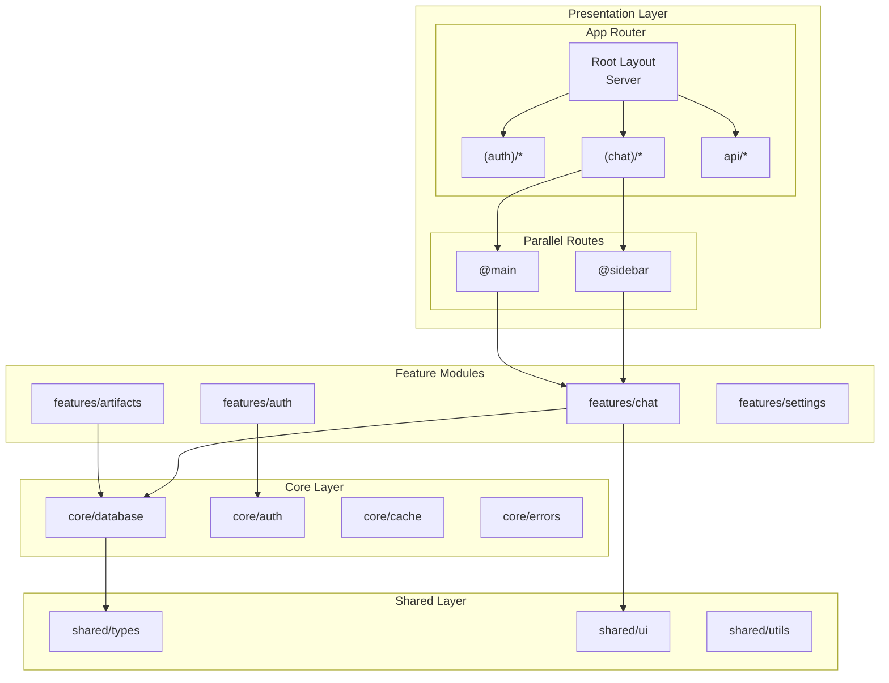

---

## 2. Runtime Boundary Model

Server/Client/Edge runtime separation showing what runs where.

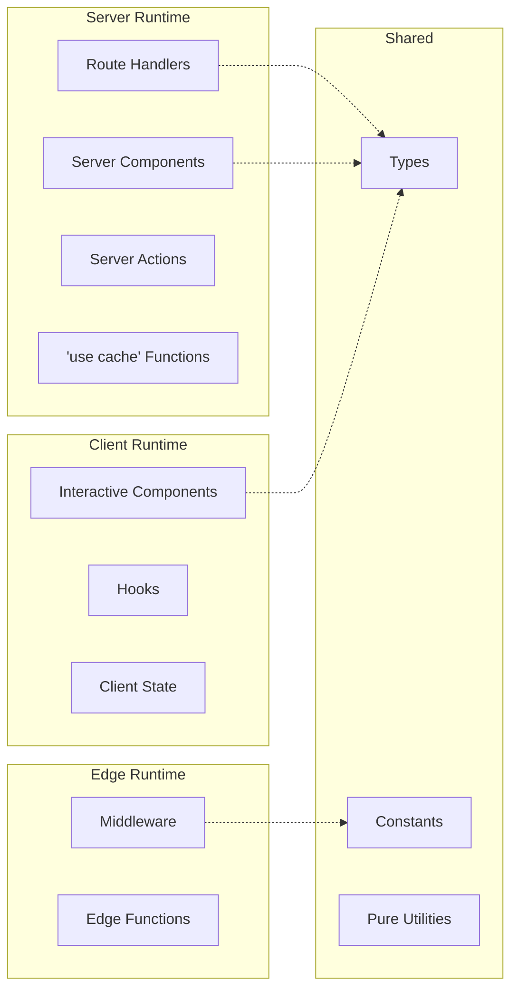

---

## 3. Module Dependency Rules

Dependency direction rules and forbidden imports between layers.

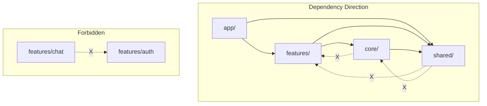

---

## 4. Provider Hierarchy

Flattened 4-level provider structure (down from 9 levels).

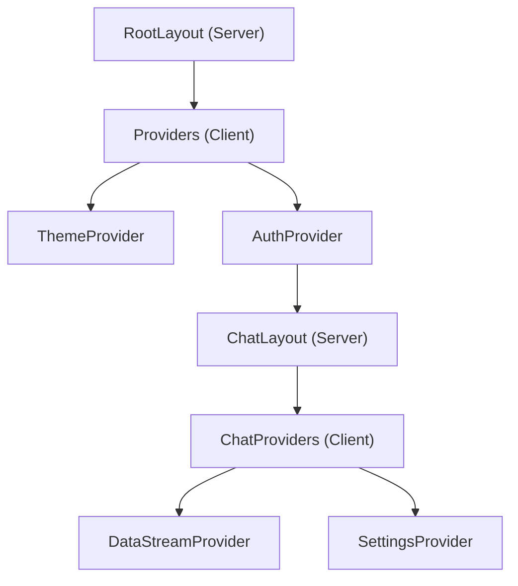

---

## 5. Chat Component Tree

Server/Client component breakdown for chat feature.

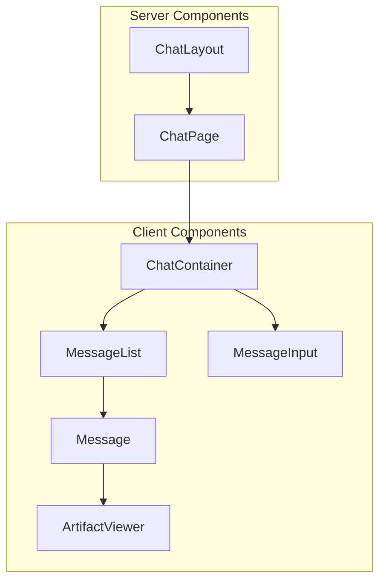

---

## 6. Read Flow

Browser → Server → Cache → Database data fetching flow.

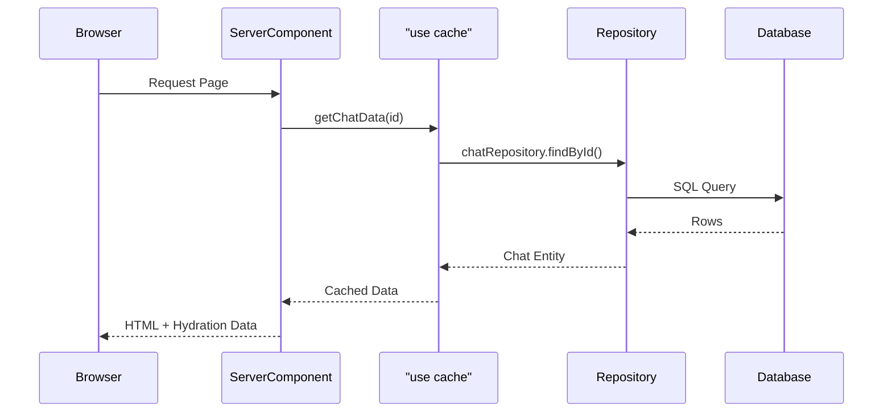

---

## 7. Write Flow

Optimistic updates with Server Actions.

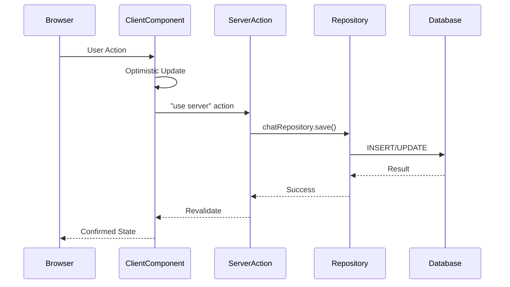

---

## 8. Streaming Flow

AI response streaming via SSE.

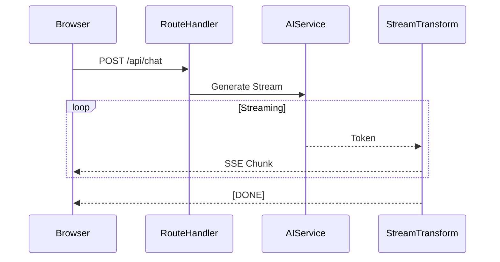

---

## 9. Bundle Distribution

Target bundle split percentages.

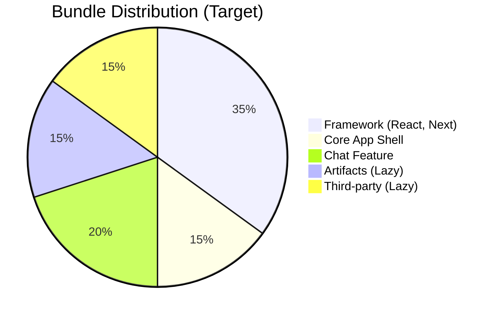

---

## 10. Cache Layers

Next.js + Application + Browser caching hierarchy.

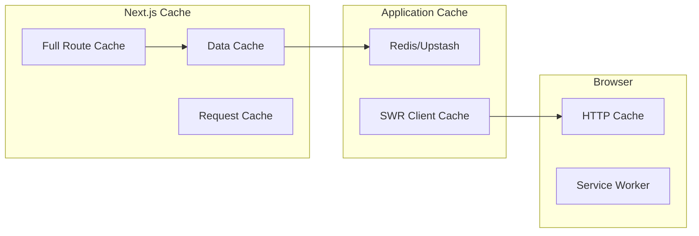

---

## 11. Error Boundaries

error.tsx cascade through route groups.

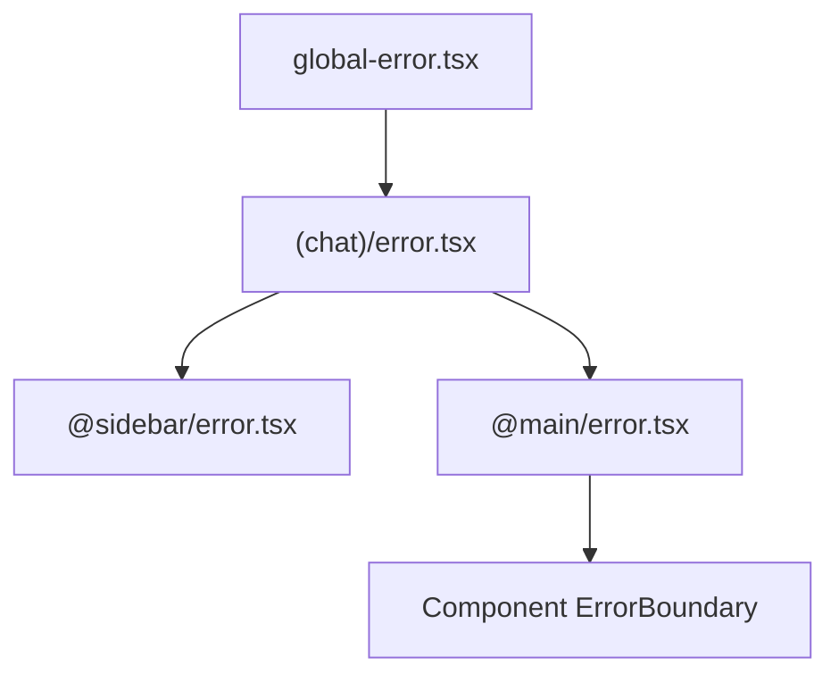

---

## 12. Migration Timeline

Phase timeline for architecture migration.

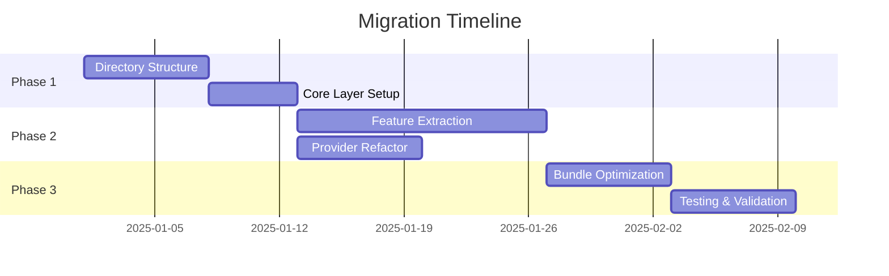
