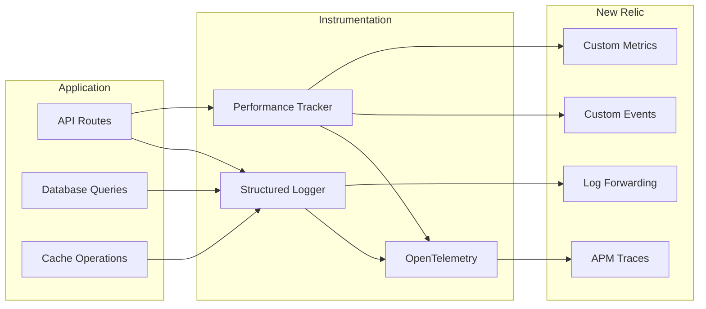

# New Relic Monitoring Guide

Complete observability setup with New Relic APM, structured logging, and performance tracking.

## Overview

The application includes comprehensive monitoring infrastructure:

| Component        | Location                        | Purpose            |
| ---------------- | ------------------------------- | ------------------ |
| New Relic Config | `newrelic.js`                   | APM configuration  |
| OpenTelemetry    | `instrumentation.ts`            | Trace collection   |
| Logger           | `lib/monitoring/logger.ts`      | Structured logging |
| Performance      | `lib/monitoring/performance.ts` | Route timing       |
| Dashboard        | `lib/monitoring/dashboard.ts`   | Health metrics     |
| Pool Monitor     | `lib/db/pool-monitor.ts`        | DB connections     |
| Cache Metrics    | `lib/cache/metrics.ts`          | Hit/miss tracking  |



---

## Setup

### Environment Variables

```bash
# Required
NEW_RELIC_LICENSE_KEY="your-license-key"
NEW_RELIC_APP_NAME="ai-assistant"

# Logging (required for Vercel - read-only filesystem)
NEW_RELIC_LOG="stdout"
NEW_RELIC_LOG_LEVEL="info"  # trace, debug, info, warn, error

# Optional: Security agent (disabled by default)
NEW_RELIC_SECURITY_ENABLED="false"
```

> **Important for Vercel**: The `NEW_RELIC_LOG=stdout` environment variable must be set in your Vercel project settings. Without this, New Relic will attempt to write to a log file, which fails on Vercel's read-only filesystem.

### Configuration

The `newrelic.js` file configures:

```javascript
exports.config = {
  app_name: [process.env.NEW_RELIC_APP_NAME],
  license_key: process.env.NEW_RELIC_LICENSE_KEY,

  // Log forwarding enabled
  application_logging: {
    enabled: true,
    forwarding: { enabled: true, max_samples_stored: 10_000 },
    metrics: { enabled: true },
  },

  // Distributed tracing
  distributed_tracing: { enabled: true },

  // Transaction tracing
  transaction_tracer: {
    enabled: true,
    record_sql: "obfuscated",
    explain_threshold: 500,
  },

  // Error collection
  error_collector: {
    enabled: true,
    ignore_status_codes: [404],
    expected_status_codes: [400, 401, 403],
  },
};
```

---

## Structured Logging

### Logger API

```typescript
import { logger } from '@/lib/monitoring/logger';

// Log levels (trace, debug, info, warn, error, perf)
logger.info('User logged in', { userId: '123', method: 'oauth' });
logger.warn('Rate limit approaching', { userId, remaining: 5 });
logger.error('Database query failed', error, { query: 'getUser' });

// Performance logging
logger.perf('ChatCompletion', durationMs, { model: 'gpt-4', tokens: 150 });

// Trace async function
const result = await logger.traceAsync('fetchUserData', async () => {
  return await db.query(...);
});

// Manual timer
const endTimer = logger.startTimer('operation', { chatId });
// ... do work ...
endTimer({ success: true });
```

### Log Format

```json
{
  "timestamp": "2024-01-15T10:30:00.000Z",
  "level": "INFO",
  "message": "User logged in",
  "userId": "123",
  "method": "oauth"
}
```

### Sensitive Data Redaction

Automatically redacts: `password`, `token`, `secret`, `apiKey`, `authorization`, `cookie`

---

## Performance Tracking

### Route Wrapper

```typescript
import { withPerformanceTracking } from "@/lib/monitoring/performance";

export const POST = withPerformanceTracking(
  "POST /api/chat",
  async (request: Request) => {
    // Handler code
    return NextResponse.json({ success: true });
  }
);
```

### Operation Tracking

```typescript
import { measureAsync, trackQuery, trackCacheOp, trackAICompletion } from '@/lib/monitoring/performance';

// Generic async measurement
const { result, duration } = await measureAsync('operation', async () => {
  return await doWork();
});

// Database query tracking
await trackQuery('getUserById', async () => {
  return await db.select().from(users).where(...);
});

// Cache operation tracking
await trackCacheOp('get', 'chat:123:user', async () => {
  return await redis.get(key);
});

// AI completion tracking
await trackAICompletion('gpt-4', async () => {
  return await generateText({ model, prompt });
}, { tokens: 150 });
```

---

## Database Monitoring

### Connection Pool Monitor

Tracks pool health automatically:

```typescript
import { poolMonitor } from "@/lib/db/pool-monitor";

// Get current stats
const stats = poolMonitor.getPoolStats();
// { idle: 3, active: 2, waiting: 0, max: 10, total: 5 }

// Get health status
const health = poolMonitor.getHealthStatus();
// { status: 'healthy', utilizationPercent: 20, warnings: {...} }

// Check for connection leaks
const leaks = poolMonitor.checkForLeaks();
// [{ id: 'conn_123', duration: 6000, query: 'SELECT...' }]
```

### Query Tracking

```typescript
import { withQueryTracking } from "@/lib/db/query-tracking";

const users = await withQueryTracking(
  "getUsers",
  async () => {
    return await db.select().from(user);
  },
  { limit: 10 }
);
```

Automatically logs:

- Query duration
- Slow queries (>500ms warning)
- Query failures

---

## Cache Metrics

### Hit/Miss Tracking

```typescript
import { CacheMetrics, withCacheMetrics } from "@/lib/cache/metrics";

// Automatic tracking
const chat = await withCacheMetrics("getChatById", async () => {
  return await redis.get(key);
});

// Get metrics
const summary = CacheMetrics.getSummary();
// { getChatById: { hits: 95, misses: 5, hitRate: 0.95, avgLatencyMs: 12 } }

// Overall hit rate
const hitRate = CacheMetrics.getOverallHitRate(); // 0.92
```

---

## Health Endpoint

### GET /api/health

Returns system health for load balancers:

```json
{
  "status": "healthy",
  "timestamp": "2024-01-15T10:30:00Z",
  "uptime": 3600,
  "components": {
    "cache": {
      "status": "healthy",
      "details": { "latencyMs": 12, "hitRate": 0.92 }
    },
    "connectionPool": {
      "status": "healthy",
      "details": { "utilizationPercent": 20 }
    }
  },
  "metrics": {
    "database": { "totalQueries": 1000, "averageQueryDuration": 45 },
    "cache": { "hitRate": 0.92, "avgLatencyMs": 12 }
  }
}
```

**Status Codes:**

- `200` - Healthy
- `503` - Degraded or critical

---

## Custom Events & Metrics

### Record Custom Event

```typescript
import { trackEvent, trackMetric } from "@/lib/monitoring/dashboard";

// Custom event (queryable in New Relic)
trackEvent("UserAction", {
  action: "create_chat",
  userId: "123",
  model: "gpt-4",
  success: true,
});

// Custom metric
trackMetric("ChatCompletion", 1500); // 1500ms
trackMetric("TokensUsed", 150, "tokens");
```

---

## NRQL Query Examples

### Performance Queries

```sql
-- Average response time by endpoint
SELECT average(duration) FROM Transaction
WHERE appName = 'ai-assistant'
FACET name SINCE 1 hour ago

-- Slow transactions
SELECT * FROM Transaction
WHERE duration > 2
ORDER BY duration DESC
LIMIT 20

-- Error rate by endpoint
SELECT percentage(count(*), WHERE error IS true)
FROM Transaction
FACET name SINCE 1 hour ago
```

### Custom Event Queries

```sql
-- Chat completions by model
SELECT count(*) FROM ApplicationLog
WHERE operation LIKE 'AICompletion%'
FACET model SINCE 1 day ago

-- Cache hit rate over time
SELECT average(hitRate) FROM ApplicationLog
WHERE operation = 'CacheMetrics'
TIMESERIES 1 hour SINCE 1 day ago

-- Slow database queries
SELECT * FROM ApplicationLog
WHERE duration > 500 AND operation LIKE 'DB:%'
ORDER BY duration DESC
```

### Health Monitoring

```sql
-- Health check status
SELECT count(*) FROM ApplicationLog
WHERE operation = 'HealthCheck'
FACET status SINCE 1 hour ago

-- Connection pool utilization
SELECT average(utilizationPercent) FROM ApplicationLog
WHERE operation = 'PoolMonitor'
TIMESERIES 5 minutes
```

---

## Alerting Configuration

Pre-configured alert conditions are available in `lib/monitoring/alerts.nrql.json`.

### Alert Conditions Summary

| Alert                    | Condition           | Threshold        | Severity |
| ------------------------ | ------------------- | ---------------- | -------- |
| High Error Rate          | Error %             | > 5% for 5 min   | Critical |
| Slow Response            | Avg duration        | > 2s for 5 min   | Warning  |
| AI Completion Failures   | Failed completions  | > 10 for 5 min   | Critical |
| High AI Latency          | Avg completion time | > 10s for 5 min  | Warning  |
| Cache Degradation        | Hit rate            | < 70% for 10 min | Warning  |
| Pool Exhaustion          | Utilization         | > 80% for 5 min  | Critical |
| Health Check Failing     | Non-healthy status  | > 2 for 2 min    | Critical |
| Rate Limiting Triggered  | 429 responses       | > 50 for 5 min   | Warning  |
| Slow Time to First Token | Streaming TTFT      | > 2s for 5 min   | Warning  |
| Database Query Errors    | DB error logs       | > 5 for 5 min    | Critical |
| High Token Usage         | Total tokens/hour   | > 1M for 1 hour  | Warning  |
| Apdex Score Drop         | Apdex score         | < 0.85 for 5 min | Warning  |

### Setting Up Alerts

1. Navigate to New Relic > Alerts & AI > Alert Policies
2. Create a new policy or use existing
3. Add NRQL conditions from `alerts.nrql.json`
4. Configure notification channels (Slack, PagerDuty, Email)

### Example: Creating an Alert via API

```bash
# Create alert condition using New Relic API
curl -X POST 'https://api.newrelic.com/v2/alerts_nrql_conditions.json' \
  -H 'Api-Key: YOUR_API_KEY' \
  -H 'Content-Type: application/json' \
  -d '{
    "nrql_condition": {
      "type": "static",
      "name": "High Error Rate",
      "enabled": true,
      "terms": [{
        "threshold": 5,
        "threshold_duration": 300,
        "operator": "above",
        "priority": "critical"
      }],
      "nrql": {
        "query": "SELECT percentage(count(*), WHERE error IS true) FROM Transaction WHERE appName = '\''ai-assistant'\''"
      },
      "policy_id": YOUR_POLICY_ID
    }
  }'
```

---

## AI/LLM Metrics

The application tracks comprehensive AI completion metrics:

### Tracked Metrics

| Metric                         | Type   | Description                |
| ------------------------------ | ------ | -------------------------- |
| `AICompletion`                 | Event  | Each AI model completion   |
| `AIStreamingCompletion`        | Event  | Streaming-specific metrics |
| `Custom/AI/CompletionDuration` | Metric | Total completion time (ms) |
| `Custom/AI/TotalTokens`        | Metric | Token count per completion |
| `Custom/AI/TimeToFirstToken`   | Metric | Streaming TTFT (ms)        |

### NRQL Queries for AI Metrics

```sql
-- Average completion time by model
SELECT average(durationMs) FROM AICompletion FACET model SINCE 1 hour ago

-- Token usage over time
SELECT sum(totalTokens) FROM AICompletion TIMESERIES 1 hour

-- Time to first token distribution
SELECT percentile(firstTokenMs, 50, 95, 99) FROM AIStreamingCompletion SINCE 1 hour ago

-- Success rate by provider
SELECT percentage(count(*), WHERE success = true) FROM AICompletion FACET provider
```
