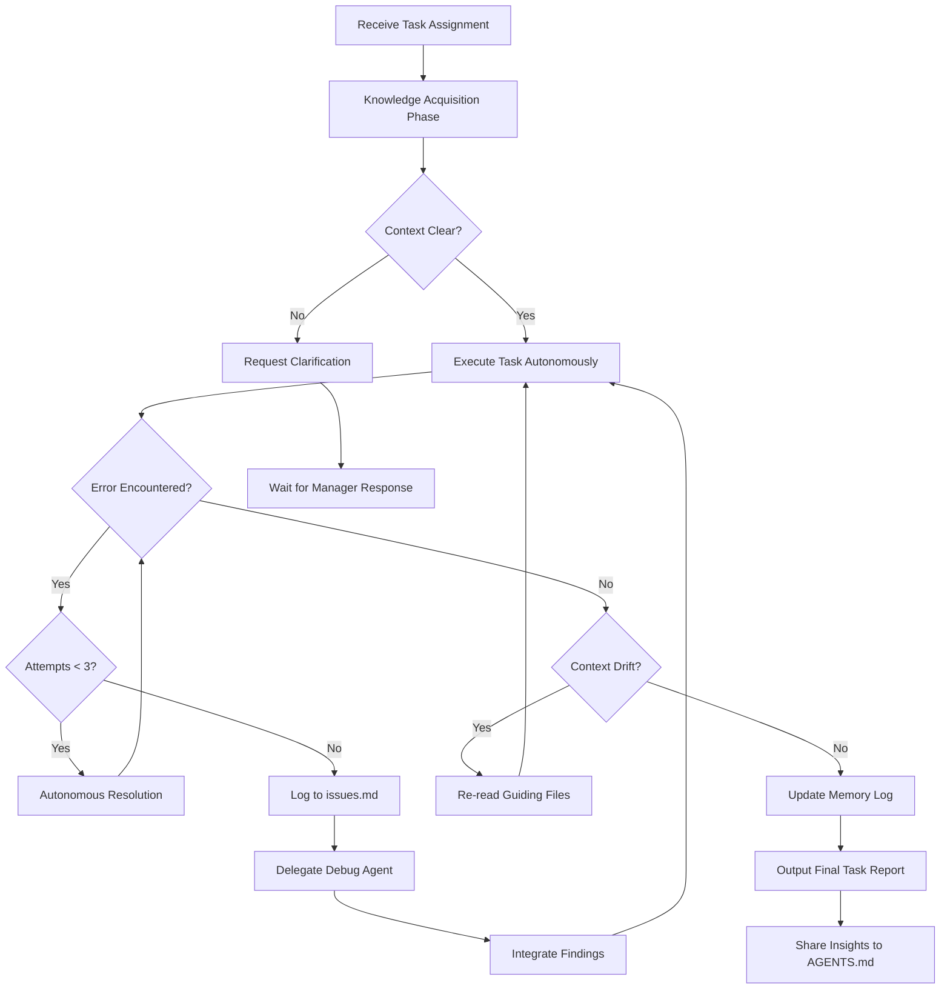
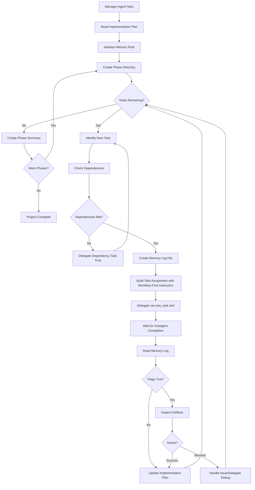

# APM Autonomous Workflow Adaptation Plan

## Overview

This document describes the adaptation of the standard APM workflows to support **fully autonomous, user-free subtask execution** using KiloCode's `new_task` tool for automatic delegation.

## Created Files

### Primary Outputs
1. **[`.kilocode/workflows/apm-3-initiate-implementation-autonomous.md`](.kilocode/workflows/apm-3-initiate-implementation-autonomous.md)** - Autonomous implementation agent workflow
2. **[`.kilocode/workflows/apm-2-initiate-manager-autonomous.md`](.kilocode/workflows/apm-2-initiate-manager-autonomous.md)** - Autonomous manager agent workflow with auto-delegation

## Key Adaptations

### 1. Knowledge Acquisition Phase (NEW - Section 1)

**Purpose**: Ensure comprehensive context ingestion before any implementation work.

**Protocol**:
1. Read Task Assignment Prompt completely
2. Read Implementation Plan for task context
3. Read dependency outputs when `dependency_context: true`
4. Read source reference files (e.g., `archive/oldapp/`)
5. Read architecture specs from `.ouroboros/specs/`
6. Read recent Memory Logs from dependent tasks

**Output**: Brief confirmation before proceeding to implementation

### 2. Autonomous Execution Patterns (MODIFIED - Section 2)

**Single-Step Tasks**:
- Execute all subtasks in one response
- No user confirmation required
- Self-validate outputs against deliverables

**Multi-Step Tasks** (Key Change):
- Execute ALL steps in sequence WITHOUT user confirmation
- Self-validation checkpoints between steps
- Continuous execution flow until completion

**Dependency Context Integration**:
- Complete integration steps AND main task in continuous flow
- No pause between integration and execution

### 3. Error Handling & Autonomous Debug (MODIFIED - Section 4)

**Autonomous Resolution Protocol**:
1. Analyze error type (Syntax/Dependency/Configuration/Logic/External)
2. Attempt resolution based on error type
3. Validate fix
4. Document in Memory Log

**Debug Attempt Limit**: 3 attempts maximum (unchanged)

**NEW - Issue Logging**:
- Log significant issues to global `issues.md`
- Include: Agent, Task, Error Type, Description, Attempts, Status, Context

### 4. Context Drift Detection & Recovery (NEW - Section 5)

**Drift Indicators**:
- Uncertainty about current task
- Missing dependency context
- Identity confusion
- Progress amnesia
- File path uncertainty

**Recovery Protocol**:
1. STOP current work
2. Re-read guiding files in order:
   - `apm-2-initiate-manager.md`
   - `apm-3-initiate-implementation-autonomous.md`
   - `Implementation_Plan.md`
   - Current Task Assignment Prompt
   - Recent Memory Logs
3. Validate recovery
4. Resume from last known good state

### 5. Knowledge Sharing Protocol (NEW - Section 6)

**AGENTS.md Contributions**:
- Append generalizable insights to `AGENTS.md` in project root
- Categories: Architecture Patterns, Common Pitfalls, Efficient Approaches, Integration Points, Configuration Tips, Debug Shortcuts
- Contribute when discovering patterns that would help other agents

### 6. Final Task Report (MODIFIED - Section 8)

**Enhanced Report Format**:
```markdown
**TASK COMPLETION REPORT**
**Task**: [ID] - [Title]
**Agent**: [Name]
**Status**: [Completed|Partial|Blocked|Delegated]
**Execution Summary**: [1-2 sentences]
**Deliverables**: [File list]
**Key Findings**: [Discoveries]
**Issues Encountered**: [Blockers]
**Delegations**: [Details]
**Memory Log**: [Path]
**Flags**: [important_findings, compatibility_issues, ad_hoc_delegation]
**Next Action Request**: [Continue/Follow-up/Manager decision]
```

## Manager Agent Adaptations

### 7. Automatic Subtask Delegation (NEW - Section 6)

**Purpose**: Replace user-pasting workflow with automatic `new_task` tool delegation.

**Key Changes**:
- Manager uses `new_task` tool to spawn Implementation Agent subtasks
- No user copy-paste required between agents
- Subagents receive complete Task Assignment Prompt via `message` parameter

**Delegation Protocol**:
1. Identify next ready task from Implementation Plan
2. Create empty Memory Log file
3. Build Task Assignment Prompt per Task_Assignment_Guide.md
4. Call `new_task(mode: "code", message: <prompt>, todos: <optional>)`
5. Wait for subagent completion
6. Read and evaluate Memory Log

### 8. Workflow-First Instruction (NEW)

**Purpose**: Ensure subagents read implementation workflow before executing.

**Pre-Execution Requirements in every Task Assignment**:
```markdown
## Pre-Execution Requirements
**MANDATORY**: Before starting this task, you MUST:
1. Read `.kilocode/workflows/apm-3-initiate-implementation-autonomous.md`
2. Complete the Knowledge Acquisition Phase defined in Section 1
3. Confirm your understanding before proceeding to implementation
```

### 9. Subagent Mode Selection

| Task Type | Recommended Mode |
|-----------|-----------------|
| Code implementation | `code` |
| Debugging | `debug` |
| Research/Analysis | `ask` |
| Architecture design | `architect` |
| Code review | `review` |

### 10. Continuous Delegation Loop

```
while (tasks remain in Implementation Plan):
    1. Identify next ready task (dependencies satisfied)
    2. Create Memory Log file
    3. Delegate via new_task with workflow-first instruction
    4. Wait for subagent completion
    5. Read and evaluate Memory Log
    6. Update Implementation Plan if needed
    7. Continue or handle issues
```

## Comparison: Standard vs Autonomous

### Implementation Agent

| Feature | Standard Workflow | Autonomous Workflow |
|---------|------------------|---------------------|
| Multi-step execution | Pause for user confirmation between steps | Execute all steps without pausing |
| Knowledge acquisition | Implicit, ad-hoc | Mandatory explicit phase |
| Error resolution | Request user guidance | Autonomous resolution with logging |
| Context drift | Not addressed | Detection and recovery protocol |
| Knowledge sharing | Not included | AGENTS.md contributions |
| Issue tracking | Memory Log only | Memory Log + global issues.md |
| User interaction | Required for confirmations | Eliminated except critical ambiguity |

### Manager Agent

| Feature | Standard Workflow | Autonomous Workflow |
|---------|------------------|---------------------|
| Task delegation | User pastes prompts between agents | Automatic via `new_task` tool |
| Subagent instruction | Assumes workflow knowledge | Explicit workflow-first instruction |
| Initialization | Awaits user confirmation | Proceeds autonomously |
| Phase management | User-triggered | Automatic phase transitions |

## Workflow Diagrams

### Implementation Agent Flow



### Manager Agent Delegation Flow



## Implementation Notes

### For Manager Agents
When issuing Task Assignment Prompts for autonomous implementation:
1. Ensure all context is provided in the prompt
2. Include explicit file paths for dependencies
3. Set clear success criteria
4. Trust agent to execute without confirmation

### For Implementation Agents
When operating in autonomous mode:
1. Always complete knowledge acquisition first
2. Execute continuously without waiting for confirmation
3. Self-validate between steps
4. Log issues and share insights proactively
5. Detect and recover from context drift

## Files to Create at Project Root

When using this autonomous workflow, ensure these files exist:

1. **`issues.md`** - Global issue tracking
   ```markdown
   # Project Issues Log
   
   ## [Timestamp] - [Issue Title]
   - **Agent**: [Name]
   - **Task**: [Reference]
   - **Error Type**: [Type]
   - **Description**: [Description]
   - **Attempts Made**: [Count]
   - **Status**: [Status]
   - **Context**: [Details]
   ```

2. **`AGENTS.md`** - Knowledge sharing between agents
   ```markdown
   # Agent Knowledge Base
   
   ## [Date] - [Insight Title] - [Agent Name]
   
   ### Context
   [Where discovered]
   
   ### Insight
   [The knowledge]
   
   ### Application
   [How to apply]
   ---
   ```

## Next Steps

1. **Review** the adapted workflow file
2. **Create** `issues.md` and `AGENTS.md` in project root
3. **Test** with a pilot task execution
4. **Refine** based on observed behavior

## Approval Request

Please review this adaptation plan and the created workflow file. 

**Options**:
- ✅ **Approve** - Proceed with autonomous workflow
- 🔄 **Modify** - Request changes to specific sections
- ❓ **Questions** - Clarify aspects before approval
